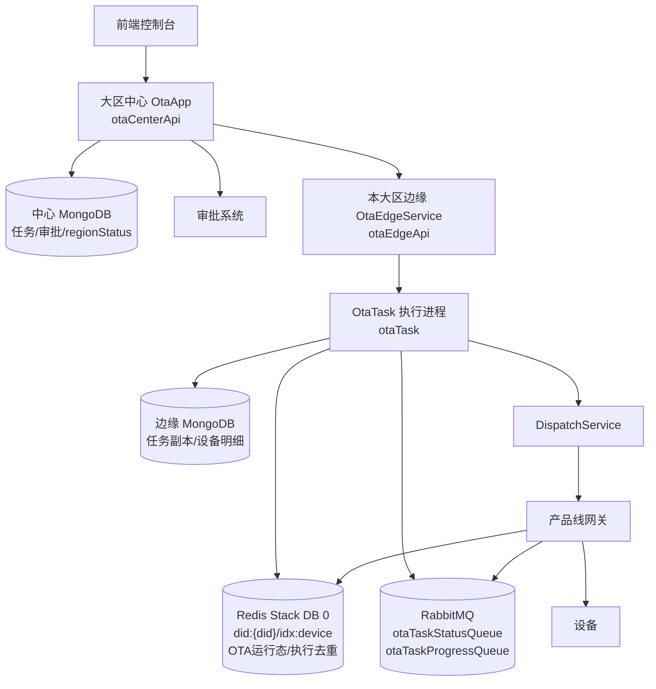
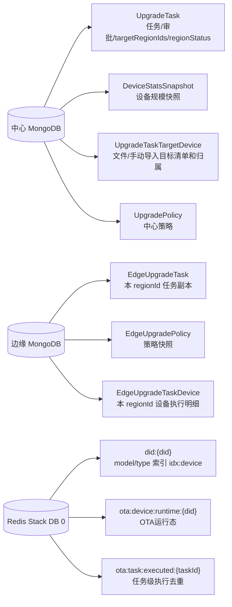
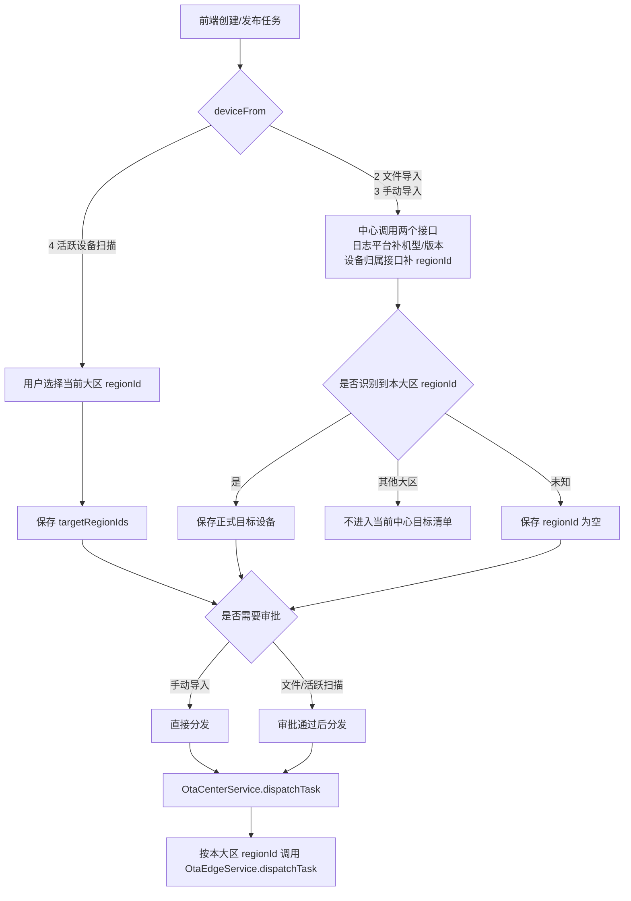
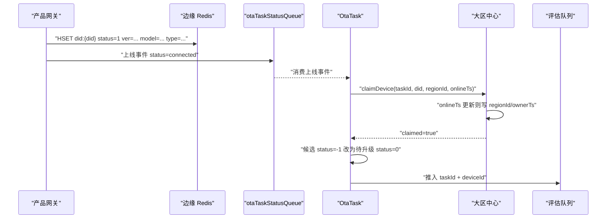
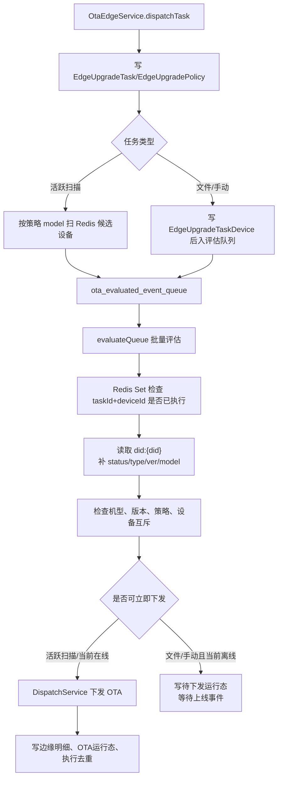
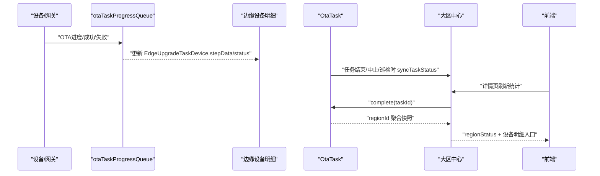
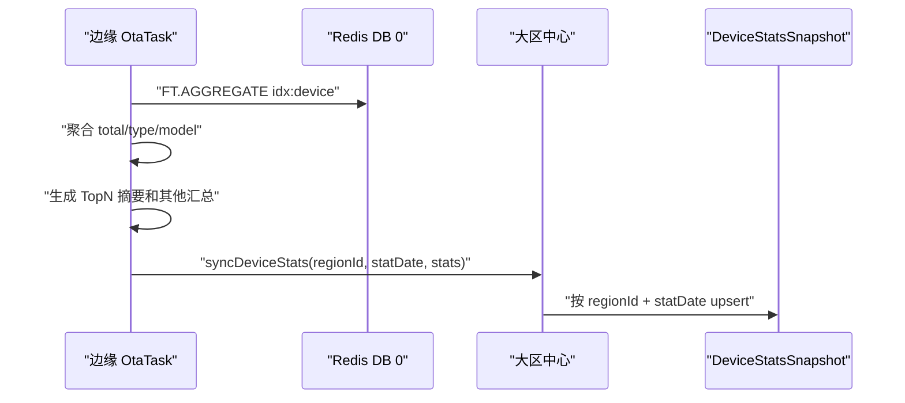
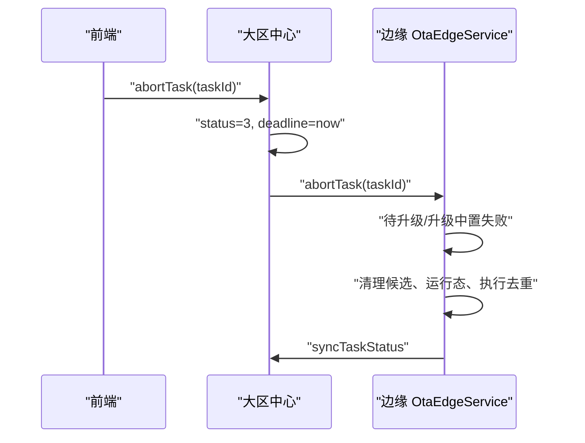

# OTA2.0 技术方案

## 1. 架构图

一个中心 API 只管理一个大区。当前中心所属大区由配置顶层 `regionId` 推导，`node_api` 中其他大区节点会被过滤。

| 大区 | 中心管理的 regionId |
| --- | --- |
| 中国 `1` | 杭州 `1`、杭州低功耗 `150`、深圳 `100`、成都 `101`、上海 `160` |
| 亚洲 `2` | 亚洲 `2` |
| 北美 `3` | 北美 `3` |
| 欧洲 `4` | 欧洲 `4` |
| 开发模拟 `5` | 按中国大区处理 |

## 2. 服务边界

| 模块 | 入口 | 职责 |
| --- | --- | --- |
| 大区中心 API | `bin/otaCenterApi.js` | 前端接口、任务创建、审批、分发、聚合统计 |
| 边缘 API | `bin/otaEdgeApi.js` | 接收中心任务包，给中心查询本 regionId 统计和设备明细 |
| 边缘执行 | `bin/otaTask.js` | 消费 MQ/Redis 事件，评估设备，下发 OTA，更新边缘明细 |
| 产品网关 | 产品线服务 | 写 Redis 设备状态，上报上线和 OTA 进度，接收 OTA 指令 |

中心只保存 regionId 级统计，不保存设备执行明细。设备明细和进度保存在边缘，需要查看时由中心透传到对应 regionId。

## 3. 数据边界

## 4. 任务创建与分发

规则：

*   活跃设备扫描只选择当前大区 regionId。
    
*   文件/手动导入不让用户选择 regionId。中心调用日志平台 `listByDidList` 查询机型/版本，调用 `api.device_api + /api/v1/devices/batch-query-attribution` 查询归属 regionId。
    
*   设备归属接口响应里 OTA 只使用 `did/regionId`，不使用 `cluster`；目标清单里的机型/版本来自日志平台。
    
*   创建任务阶段不预判设备机型是否匹配，最终以边缘评估读取到的 `did:{did}.model/ver` 为准。
    
*   已知归属但属于其他大区的设备不进入当前大区任务。
    
*   未知归属设备只在当前大区广播候选记录 `status=-1`。
    
*   文件/手动导入如果没有本中心可下发目标设备，发布失败；手动导入分发失败回滚到待发布，审批任务分发失败置失败。
    
*   审批回调按任务状态幂等处理，只有审批中的任务能被审批通过/拒绝/过期改变状态。
    

## 5. 候选认领

只有创建时未知归属的设备会走候选认领。中心按最新 `onlineTs` 判断归属，任务过期或已结束后不再认领。

## 6. 边缘执行

关键点：

*   评估队列消息必须携带 `taskId`。
    
*   活跃扫描启动时只按 `model` 入队；评估出队时读取 `did:{did}`，当前不是 `status=1` 的设备直接丢弃。
    
*   文件/手动导入的目标设备必须进入评估队列；消息里的 `ver` 优先使用目标清单 `versionOld`，没有 `ver` 时再从 Redis `did:{did}.ver` 读取。
    
*   文件/手动导入设备如果 `ver` 推导出的 `model` 不属于当前 `taskId` 策略，边缘直接把该设备写为失败，原因是“设备机型不匹配”。
    
*   只有策略 `conditions` 存在地区、国家、省市、经销商等过滤要求时，评估队列才调用日志平台补充条件资料；无条件任务只靠 Redis 版本、机型、在线态和策略版本规则即可下发。
    
*   文件/手动导入设备如果当前离线，边缘写 `status=0` 明细和 `ota:device:runtime:{did}` 待下发运行态，上线事件触发后第一时间下发。
    
*   同机型多个任务可以同时存在，任务缓存按 `taskId` 隔离。
    
*   `max_upgrade_num` 按 `taskId + model` 生效。
    
*   `single_max_upgrade_num` 按 `taskId + model + versionOld` 生效。
    
*   同一任务内，设备只要进入过下发链路，失败后再次上线也不会重复下发。
    

## 7. 进度与统计

中心统计策略：

*   不逐设备回写中心。
    
*   不每条进度回写中心。
    
*   中心保存 `regionStatus`：`total/pending/success/failed/completed`。
    
*   详情页需要设备明细时，中心按选中 regionId 透传到边缘查询。
    
*   文件/手动任务未执行前，列表总目标数来自中心目标清单；执行进度仍只来自边缘聚合统计。
    
*   详情页实时刷新边缘失败时只返回错误并保留上次统计，不把查询失败当成设备升级失败。
    

## 8. 设备规模快照

设备规模快照是低频统计，但不做 Node 侧全量 `SCAN did:*`。边缘直接使用 Redis Stack `idx:device` 聚合 `model/type`：

*   `model`：活跃设备任务按策略机型缩小候选范围。
    
*   `status`：变化频繁，不建索引；日快照不统计在线/离线，活跃任务出评估队列时读取 Hash 判断 `status=1` 才继续下发。
    
*   `type`：建索引，用于按连接类型缩小查询范围，执行前仍从 Hash 读取确认。
    
*   `ver`：不建索引；执行评估时从 Hash 读取，设备规模快照不统计版本分布。
    

中心快照不保存全量 `model -> count` 大对象，也不保存版本分布，避免版本过多导致单条文档和页面展示膨胀。入库结构保留：

| 字段 | 说明 |
| --- | --- |
| `total` | 当前 regionId 扫描到的设备总量 |
| `typeCount/modelCount` | 产品线类型、机型的种类数量 |
| `typeSummary` | 产品线全量汇总，元素包含 `type/name/count/ratio` |
| `modelSummary` | Top 10 机型，元素包含 `model/name/count/ratio` |
| `otherSummary` | Top 10 之外的机型数量和设备数汇总 |
| `scanned/scanCursorFinished` | 聚合覆盖的设备数和统计是否完整结束 |

## 9. 中止流程

活跃扫描只通知目标 `targetRegionIds`。文件/手动导入通知本大区配置的 regionId，用于清理候选记录。

## 10. 关键配置

| 配置 | 说明 |
| --- | --- |
| 顶层 `regionId` | 中心用于推导所属大区；边缘用于标识本 regionId |
| `node_api` | 当前大区中心可调用的 `regionId -> otaEdgeApi/SLB 完整地址` |
| `api.ota_api` | 边缘回调大区中心 API |
| `api.mqtt_api` | MQTT 指令下发入口 |
| `api.device_api` | 中心查询设备归属的 HTTP 服务地址；调用路径固定 `/api/v1/devices/batch-query-attribution` |

中心 API 进程默认暴露 `19200`，边缘 API 进程默认暴露 `19201`。实际中心调边缘以 `node_api` 配置的完整地址为准，部署到 SLB 时直接配置 SLB 地址。BK 下发走固定内部微服务，不新增配置。

## 11. 代码入口

| 文件 | 说明 |
| --- | --- |
| `src/service/OtaCenterService.js` | 中心分发、认领、统计刷新、中止 |
| `src/service/UpgradeTaskService.js` | 创建、发布、审批回调、列表详情 |
| `src/service/OtaEdgeService.js` | 边缘接收任务、查询统计和设备明细 |
| `src/service/TaskService.js` | 边缘任务启动、巡检、聚合上报 |
| `src/task/evaluateQueue.js` | 设备评估和 OTA 下发 |
| `src/task/OtaTask.js` | 上线事件、重连、候选认领 |
| `src/service/UpgradeProgress.js` | OTA 进度消息消费 |
| `src/task/deviceStatsReport.js` | 边缘每日设备规模快照统计和上报 |
| `utils/deviceRedis.js` | Redis 设备状态读取、Redis Stack 索引和扫描 |
| `utils/otaRuntimeCache.js` | OTA 下发后的运行态缓存 |