# OTA2.0 架构与工作流程

本文面向所有人员，用来说明“用户怎么创建任务、系统怎么分发、边缘怎么执行、页面怎么看结果”。更细的接口、字段、缓存和代码细节见 `OTA2.0技术方案.md`。

## 1. 一张图看整体

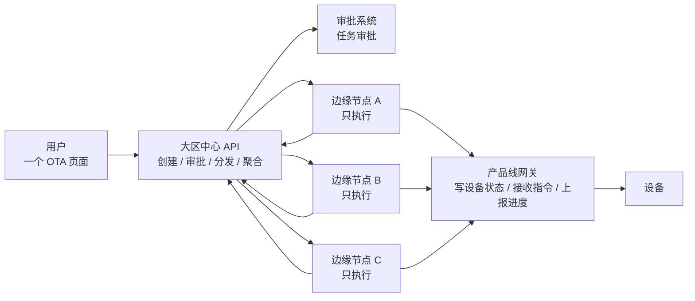

关键结论：

| 角色 | 核心职责 |
| --- | --- |
| 用户页面 | 创建、发布、中止任务；查看各区域概览和设备明细 |
| 大区中心 | 统一审批、统一分发、统一展示本大区聚合结果 |
| 边缘节点 | 接收中心任务包，只负责本节点执行 |
| 产品线网关 | 维护设备状态、接收 OTA 指令、上报上线和进度 |

中心不保存设备执行明细。设备成功、失败、进度原因都在边缘节点；页面需要明细时，由中心转发查询对应边缘节点。

## 2. 相比改造前的关键变化

这一节专门说明改造前后最容易理解错的地方，测试和产品评审时建议优先看这里。

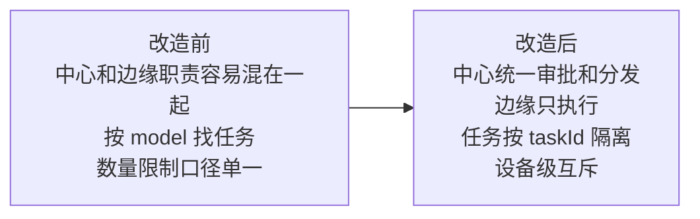

### 2.1 中心和边缘职责变化

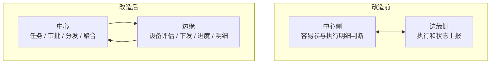

| 变化点 | 改造前容易出现的问题 | 改造后规则 |
| --- | --- | --- |
| 中心是否保存设备执行明细 | 中心和边缘明细口径容易混用 | 中心只保存目标清单和区域聚合，不保存执行明细 |
| 前端查设备明细 | 可能误以为中心直接查本地明细 | 前端只连中心，中心按选中区域转发到边缘查明细 |
| 边缘职责 | 可能承担审批或全局判断 | 边缘只执行中心下发的任务包 |
| 统计口径 | 容易按中心设备明细聚合 | 未完成任务实时查边缘，完成后看中心聚合快照 |

### 2.2 任务隔离从 model 升级为 taskId

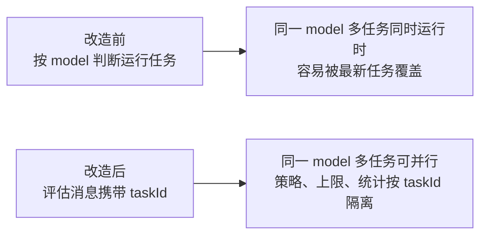

| 场景 | 改造后期望 |
| --- | --- |
| 同一个 model 同时有两个任务 | 两个任务不会互相覆盖，任务缓存和统计都按 taskId 隔离 |
| 文件/手动导入任务 | 每条目标设备评估都明确属于哪个 taskId |
| 指定版本号升级任务 | 启动扫描时也带 taskId 入队，不再只靠 model 反查任务 |
| 同一任务失败后的设备再次上线 | 已进入该 taskId 执行链路的设备不会重复下发 |

### 2.3 设备级仍然互斥

任务可以按 taskId 隔离，但设备本身仍然不能同时执行多个 OTA。

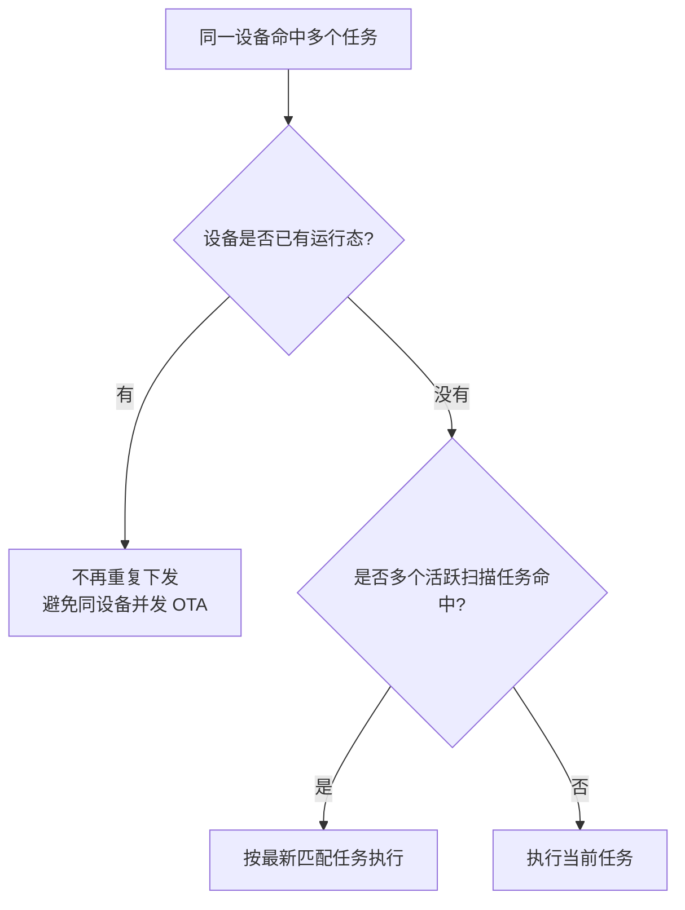

测试时要区分两个概念：

| 概念 | 说明 |
| --- | --- |
| 任务隔离 | 同 model 多任务可以同时存在，各自有 taskId 和统计 |
| 设备互斥 | 同一设备同一时间只允许进入一个 OTA 下发链路 |
| 活跃扫描最新任务 | 同一设备命中多个活跃扫描任务时，执行最新匹配的任务 |
| 固定设备任务 | 文件/手动导入因为本身有设备清单，所以按各自 taskId 评估 |

### 2.4 策略数量限制拆成两个口径

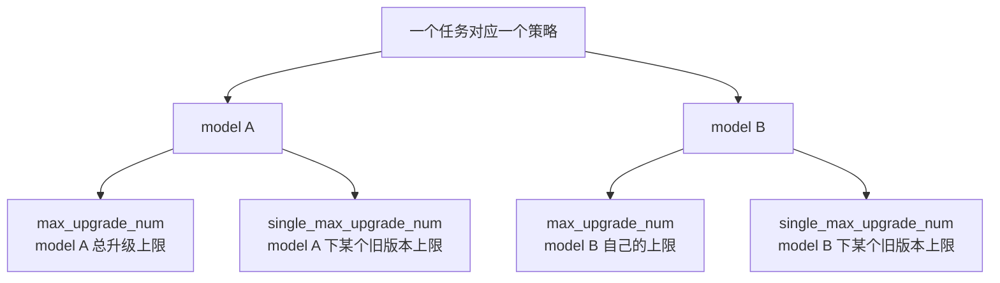

| 配置 | 改造后含义 | 不影响什么 |
| --- | --- | --- |
| `max_upgrade_num` | 当前 taskId + 当前 model 的最大升级数量 | 不影响同任务其他 model，也不影响其他 taskId |
| `single_max_upgrade_num` | 当前 taskId + 当前 model + 当前旧版本的最大升级数量 | 不影响同 model 的其他旧版本 |

举例：

| 策略配置 | 期望 |
| --- | --- |
| model A 的 `max_upgrade_num=100`，model B 的 `max_upgrade_num=20` | A 达到 100 后停止 A，B 仍可继续到 20 |
| model A 的 `single_max_upgrade_num=30` | A 的某个旧版本达到 30 后，该旧版本停止；A 的其他旧版本仍可继续 |
| 两个任务都升级 model A | 两个任务分别计算自己的上限，不互相占用 |

### 2.5 创建任务时的目标选择变化

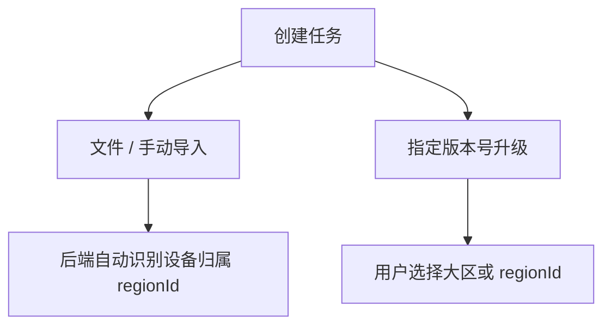

| 类型 | 改造前认知 | 改造后规则 |
| --- | --- | --- |
| 文件导入 | 可能需要用户选目标节点 | 用户不选，后端按设备归属自动分发 |
| 手动导入 | 可能需要用户选目标节点 | 用户不选，后端按设备归属自动分发，并且不走审批 |
| 指定版本号升级 | 需要明确范围 | 用户可选择单个 regionId、多个 regionId，或整个大区 |
| 查不到归属的固定设备 | 可能无法执行 | 当前大区所有节点先收到候选，设备上线后由实际节点认领 |

### 2.6 审批变化

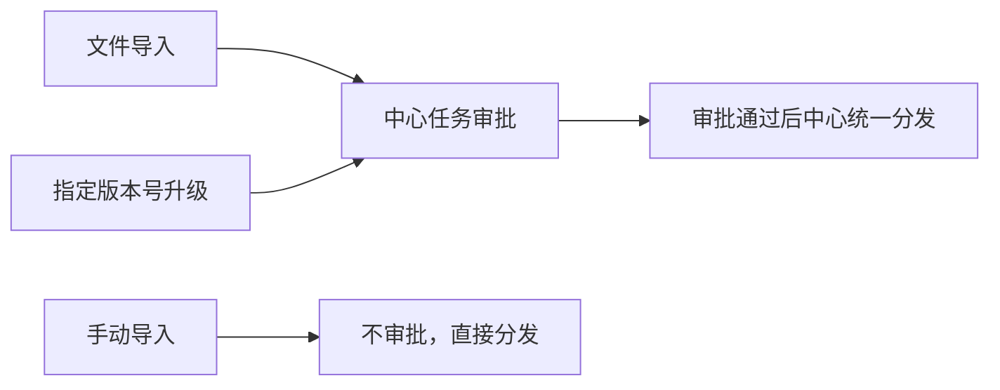

| 场景 | 改造后规则 |
| --- | --- |
| 文件导入 | 需要审批 |
| 指定版本号升级 | 需要审批 |
| 手动导入 | 不需要审批，发布即分发 |
| 审批结果 | 只回到中心，不需要各边缘节点各自审批 |
| 审批通过 | 中心统一分发给目标边缘，边缘只执行 |

## 3. 大区部署

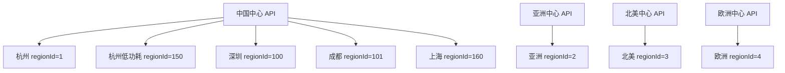

规则：

| 规则 | 说明 |
| --- | --- |
| 一个中心只管一个大区 | 中国中心只管中国区节点，亚洲中心只管亚洲节点 |
| 前端只连当前大区中心 | 用户在当前中心里只能看到当前大区可操作范围 |
| 中心调用边缘用配置地址 | 实际可以是边缘 API 地址，也可以是 SLB 地址 |
| 开发环境 | `regionId=5` 按中国大区模拟 |

## 4. 用户能创建哪几种任务

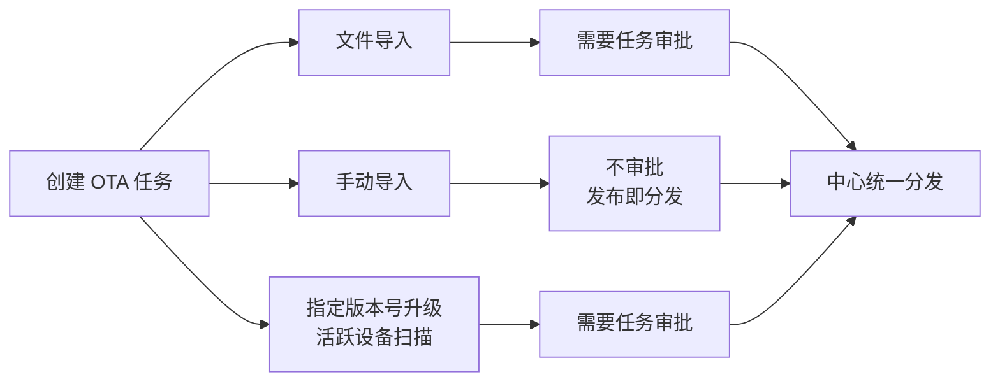

| 类型 | 用户是否选大区/节点 | 是否审批 | 目标设备怎么来 |
| --- | --- | --- | --- |
| 文件导入 | 不需要 | 需要 | 上传设备 ID 文件 |
| 手动导入 | 不需要 | 不需要 | 页面输入设备 ID |
| 指定版本号升级 | 需要 | 需要 | 用户选择一个或多个大区/节点，系统按机型和版本扫描在线设备 |

文件导入和手动导入的目标区域由后端自动识别。用户不需要也不应该手动选择集群。

## 5. 文件 / 手动导入怎么找节点

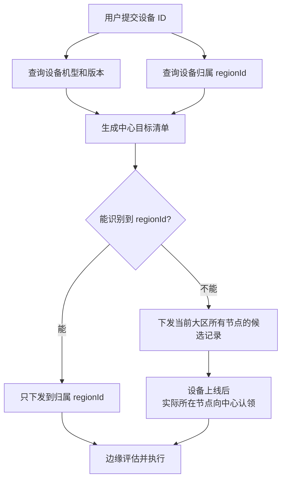

测试要点：

| 情况 | 期望结果 |
| --- | --- |
| 设备能识别到当前大区 regionId | 只在对应 regionId 看到目标和执行明细 |
| 设备归属是其他大区 | 当前大区任务不会下发该设备 |
| 设备查不到 regionId | 当前大区所有节点收到候选，设备真实上线后由所在节点认领执行 |
| 设备先在 A 节点上线，后重连到 B 节点 | 中心以更新的上线时间为准，归属切到 B，旧节点结果不再覆盖聚合 |
| 文件或手动任务没有任何可下发设备 | 发布失败，不进入审批或执行 |

## 6. 任务状态怎么流转

```mermaid
stateDiagram-v2
  [*] --> "待发布"
  "待发布" --> "审批中": 文件导入 / 指定版本号发布
  "待发布" --> "待执行": 手动导入发布
  "审批中" --> "待执行": 审批通过并分发
  "审批中" --> "审批拒绝": 审批拒绝
  "审批中" --> "已失效": 审批超时或任务过期
  "待执行" --> "执行中": 边缘开始执行
  "执行中" --> "全部成功": 所有目标成功
  "执行中" --> "失败/中止": 有失败或用户中止
  "待执行" --> "失败/中止": 分发失败或用户中止

```

页面展示建议：

| 状态 | 页面重点 |
| --- | --- |
| 待发布 | 可编辑、可发布、可删除 |
| 审批中 | 展示审批信息，不展示执行统计 |
| 待执行 / 执行中 | 展示目标区域概览，可进入区域设备明细 |
| 全部成功 | 展示最终成功数量和明细 |
| 失败/中止 | 展示失败数量、失败原因和各区域状态 |
| 审批拒绝 / 已失效 | 展示审批或失效结果，不展示执行进度 |

## 7. 边缘执行流程

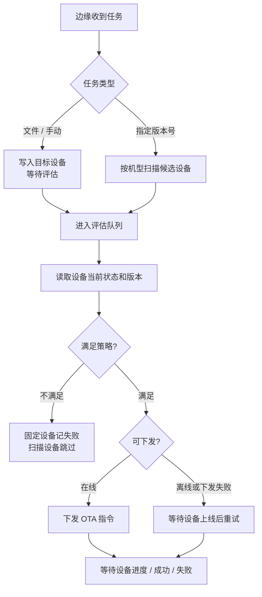

评估判断顺序可按下面理解：

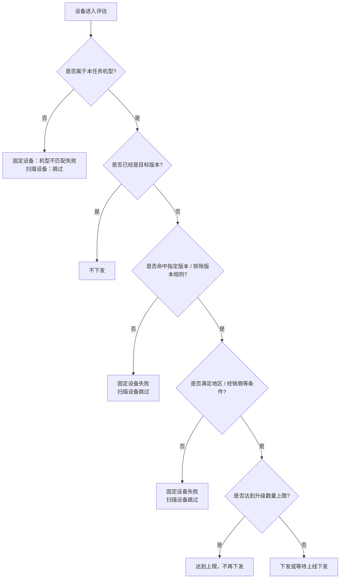

## 8. 版本和条件规则

### 版本规则

| 规则 | 说明 | 测试方向 |
| --- | --- | --- |
| 目标版本 | 设备当前版本等于目标版本，不下发 | 准备一台已是目标版本设备，应跳过 |
| 仅升级指定版本 | 只有列表里的旧版本能升级 | 列表内应下发，列表外应失败或跳过 |
| 排除版本 | 排除列表里的旧版本不能升级 | 排除内不下发，排除外按其他规则继续 |
| 机型匹配 | 设备版本前三段要匹配策略机型 | 手动输入非目标机型设备，应失败 |

文件导入和手动导入会优先使用创建任务时查询到的设备旧版本；没有旧版本时，才使用设备当前 Redis 状态里的版本。

### 条件规则

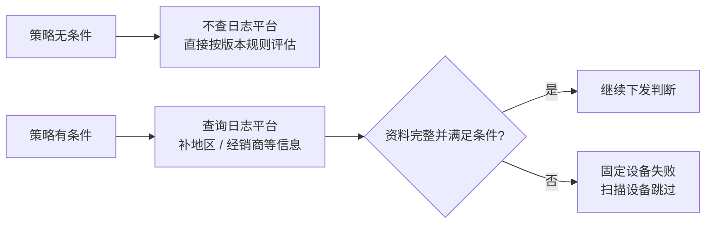

| 条件 | 测试方向 |
| --- | --- |
| 无条件策略 | 不依赖日志平台资料，版本满足即可进入下发判断 |
| 地区条件 | 准备满足地区、不满足地区、无地区资料三类设备 |
| 经销商条件 | 准备满足经销商、不满足经销商、无经销商资料三类设备 |
| 多条件组合 | 所有条件都满足才通过 |

## 9. 升级数量上限

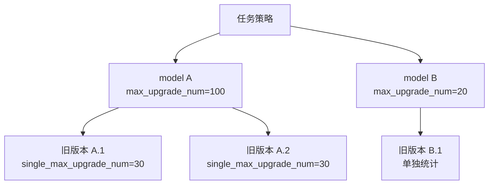

| 上限 | 生效范围 | 说明 |
| --- | --- | --- |
| 机型最大升级数 | 当前任务 + 当前 model | 一个 model 达到上限，不影响同任务其他 model |
| 单版本最大升级数 | 当前任务 + 当前 model + 当前旧版本 | 只限制对应旧版本 |
| 多任务同机型 | 按 taskId 隔离 | 同一 model 多个任务同时跑，不互相覆盖 |

测试方向：

| 场景 | 期望 |
| --- | --- |
| 同任务两个 model 上限不同 | model A 达到上限后，model B 仍可继续 |
| 同 model 多个旧版本 | 旧版本 A 达到单版本上限，不影响旧版本 B |
| 同 model 多任务同时运行 | 每个任务独立计数 |

## 10. 设备上线、重连和重试

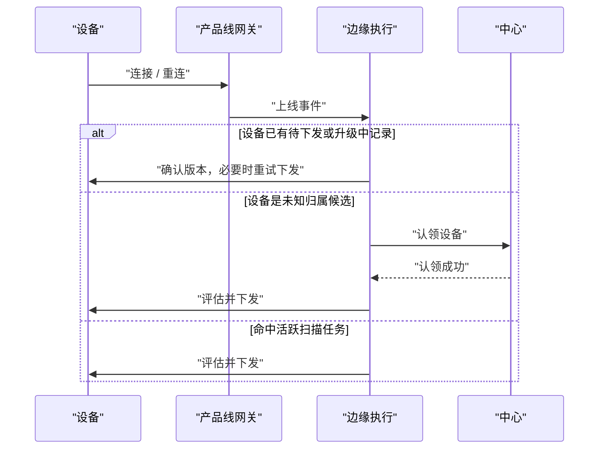

| 情况 | 期望 |
| --- | --- |
| 文件/手动导入设备当前离线 | 任务不会结束为成功；设备上线后应第一时间尝试下发 |
| 设备进入评估队列后离线 | 下发失败或等待上线，不应误算成功 |
| 设备升级中重连 | 先确认目标版本，已成功则更新成功，未成功则按规则重试 |
| 设备失败后再次上线 | 同一任务不会重复创建一轮新的升级 |
| 未知归属设备跨节点重连 | 中心按最新上线时间更新归属 |

## 11. 进度、成功和失败

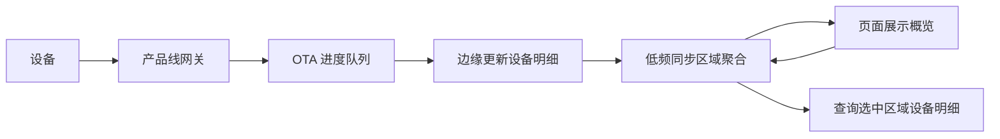

进度规则：

| 上报 | 系统处理 |
| --- | --- |
| 普通进度 | 更新边缘设备步骤 |
| 失败进度 | 更新失败状态和失败原因 |
| 成功上报 | 更新成功状态 |
| 任务结束 | 边缘同步本区域聚合统计到中心 |

中心不接收逐条设备进度，避免设备量大时中心压力过高。页面看设备明细时，会按用户选择的区域实时查询边缘。

## 12. 目标区域概览和设备明细

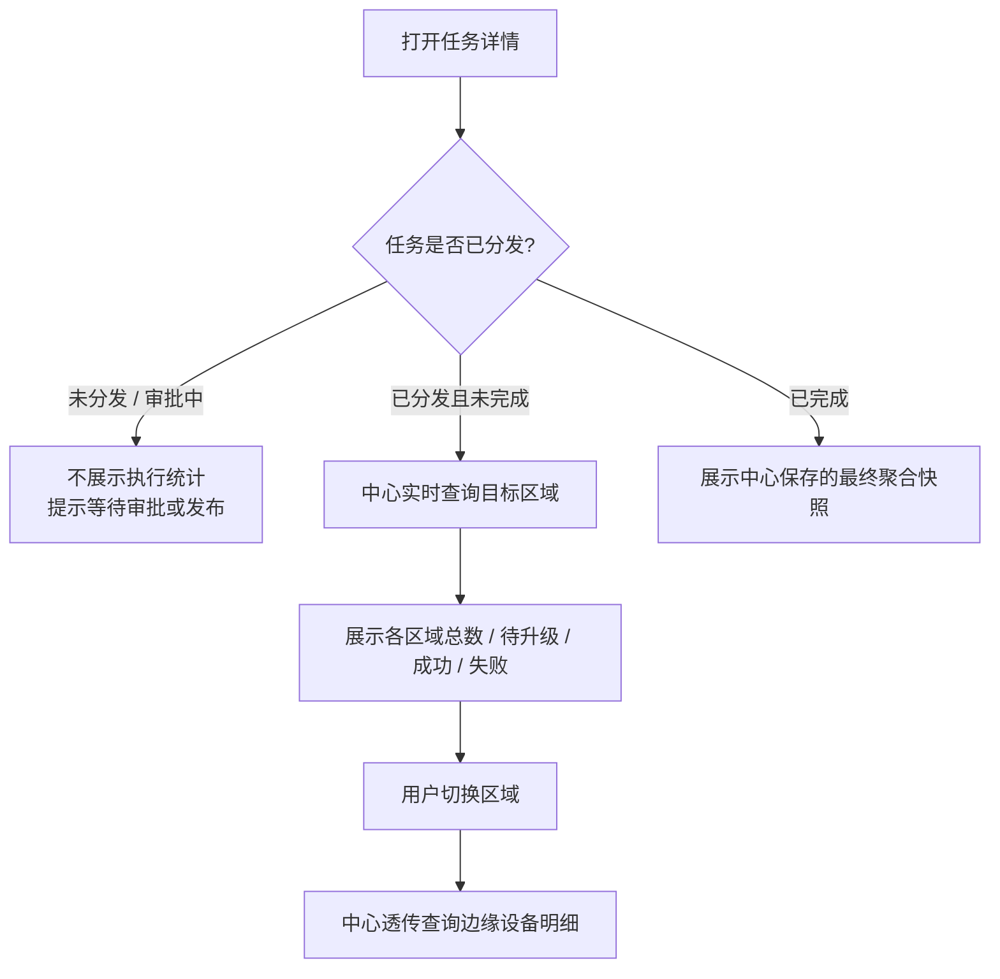

页面测试方向：

| 页面区域 | 测试点 |
| --- | --- |
| 任务列表 | 状态、总数、成功数、失败数是否随执行更新 |
| 任务详情顶部 | 审批中任务不应显示“执行中”的区域概览 |
| 目标区域概览 | 只展示任务真实目标区域 |
| 设备明细 | 切换不同 regionId 时，明细应来自对应边缘 |
| 中止按钮 | 只在待执行或执行中展示 |

## 13. 每日设备规模快照


说明：

| 项目 | 说明 |
| --- | --- |
| 用途 | 给用户预估各区域设备量、机型分布和产品线分布 |
| 频率 | 低频统计，不是实时在线统计 |
| 不统计什么 | 不展示在线、离线、休眠数量；不统计版本分布 |
| 索引口径 | Redis 设备索引包含 `model/type`，`status` 不建索引 |
| 展示口径 | 产品线显示名称，例如 `IPC MQTT`、`BK TCP`；不展示 `type=1` 这种内部编码 |
| 版本分布 | 版本只在 OTA 评估时实时读取，不进入每日规模快照 |

## 14. 提测场景清单

### 创建和审批

| 场景 | 期望 |
| --- | --- |
| 手动导入发布 | 不走审批，直接分发 |
| 文件导入发布 | 进入任务审批 |
| 指定版本号升级发布 | 进入任务审批 |
| 审批通过 | 中心分发到目标区域 |
| 审批拒绝 | 任务变为审批拒绝，不执行 |
| 审批回调重复到达 | 不重复分发 |
| 审批通过但边缘不可达 | 任务置失败或对应区域展示错误 |

### 目标设备和区域

| 场景 | 期望 |
| --- | --- |
| 手动导入当前大区设备 | 自动识别 regionId 并下发对应节点 |
| 手动导入其他大区设备 | 当前中心不下发该设备 |
| 文件导入未知归属设备 | 下发候选，等上线认领 |
| 未知归属设备上线 | 实际所在节点认领并执行 |
| 设备跨节点重连 | 中心按最新上线归属统计 |

### 策略判断

| 场景 | 期望 |
| --- | --- |
| 当前版本等于目标版本 | 不下发 |
| 指定版本命中 | 下发 |
| 指定版本未命中 | 固定设备失败，扫描设备跳过 |
| 排除版本命中 | 不下发 |
| 手动导入非目标机型 | 失败，原因是机型不匹配 |
| 无条件策略 | 不依赖日志平台条件资料 |
| 有地区或经销商条件 | 满足条件才下发 |

### 执行和统计

| 场景 | 期望 |
| --- | --- |
| 在线设备 | 评估通过后立即下发 |
| 离线固定设备 | 保持待升级，等上线重试 |
| 下发失败 | 不算成功，等待后续上线或重试 |
| 设备上报成功 | 边缘明细成功，中心聚合更新 |
| 设备上报失败 | 边缘明细失败，中心聚合更新 |
| 用户中止任务 | 中心立即终态，边缘待升级/升级中设备置失败 |
| 达到机型上限 | 当前 model 停止新增下发 |
| 达到单版本上限 | 当前旧版本停止新增下发 |

## 15. 和技术文档的关系

这份文档回答“流程是什么、页面怎么看、测试怎么测”。如果需要看接口、字段、缓存 key、队列名、索引创建、代码入口，请看 `OTA2.0技术方案.md`。