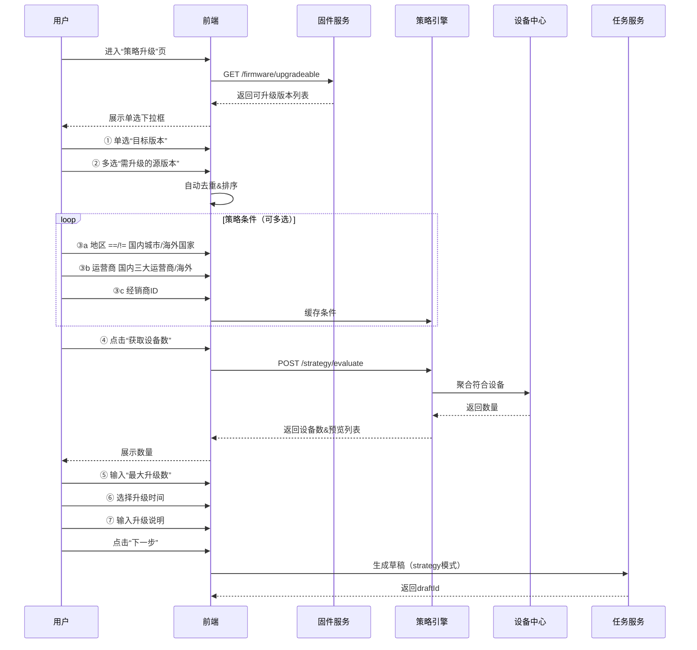
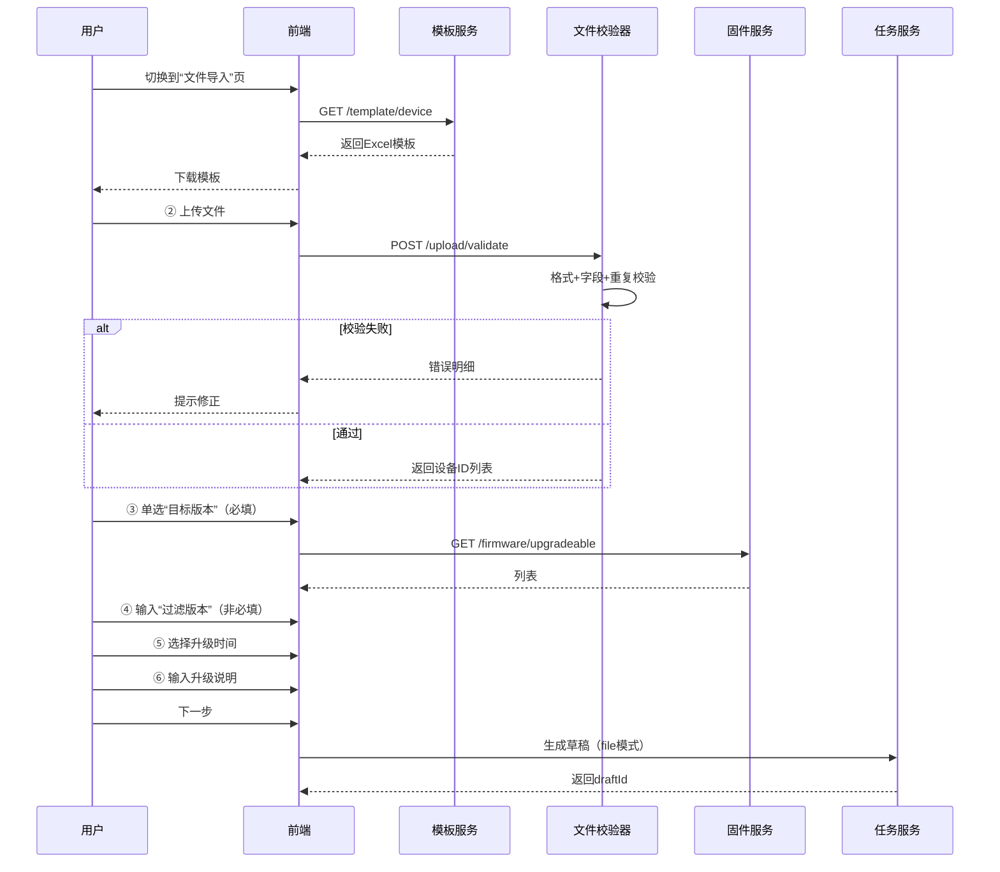
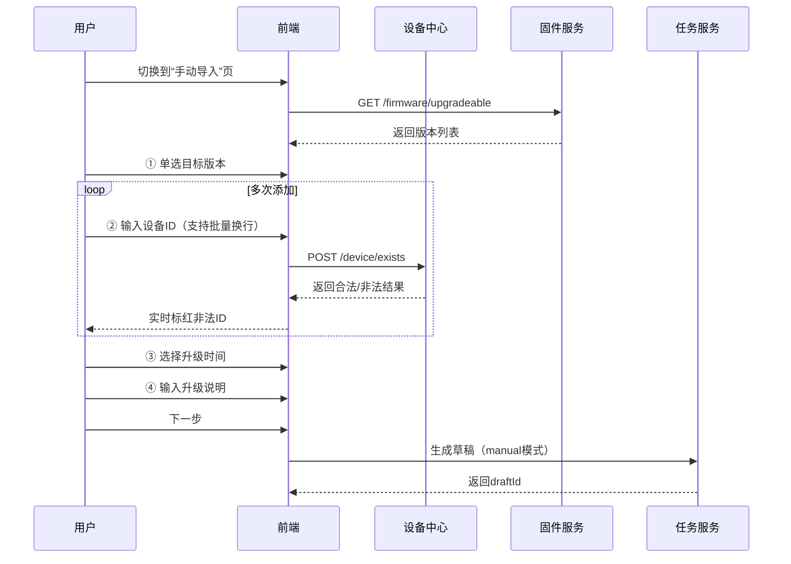
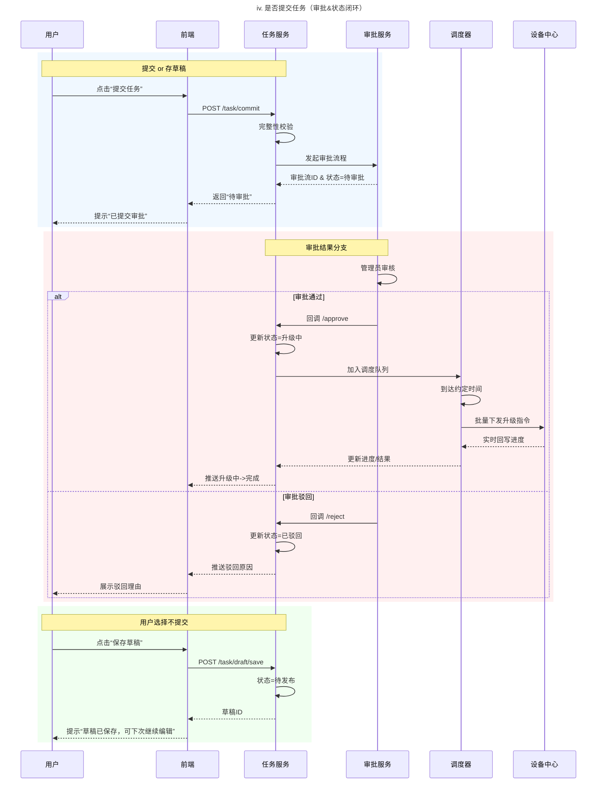

# OTA升级支持策略升级需求文档

# 需求迭代版本修订记录

| 修订日期 | 修订描述 | 原型/需求链接 | 版本 | 修订人 |
| --- | --- | --- | --- | --- |
| 2025-12-03 | 创建文档 | [https://modao.cc/proto/WAJBr15sdtfdtCUAUEQKG/sharing?view\_mode=read\_only&screen=rbpV47QLsqeF3o2gO](https://modao.cc/proto/WAJBr15sdtfdtCUAUEQKG/sharing?view_mode=read_only&screen=rbpV47QLsqeF3o2gO) | v1.0 | 汤彦珊 |
| 2025-12-08 | 修订发布任务流转状态说明 |  | v1.0 | 汤彦珊 |
|  |  |  |  |  |

# 概述

## 1.1 背景

随着公司物联网（IoT）设备规模的不断扩大，对设备固件的远程升级（Over-The-Air, OTA）成为保障设备功能迭代、修复安全漏洞和提升用户体验的关键环节。

## 1.2 目标

*   **提升运维效率**：实现固件批量升级，减少人工干预，支持百万级设备并发升级；
    

*   **精准升级控制**：支持按版本、地区、运营商等多维度策略进行精准升级；
    

*   **降低升级风险**：提供灰度升级、分批升级、升级监控等风险控制机制；
    

*   **可追溯性**：完整记录升级任务全生命周期，便于问题排查和审计；
    

*   **操作合规性**：所有正式升级任务必须经过指定负责人审批才能执行；
    

## 1.3 用户角色

*   测试人员：负责固件升级任务创建与发布，监控升级任务及异常设备；
    
*   产品线主管：负责审批升级任务合规性，降低升级风险；
    

# 需求清单

## 2.1 功能性需求

| **菜单** | **需求模块** | **需求功能描述** | **优先级** |
| --- | --- | --- | --- |
| OTA升级 | 升级任务管理 | 支持创建、编辑、发布升级任务 | P0 |
|  | 升级策略配置 | 支持指定版本号、文件导入、手动导入三种策略 |
|  | 策略条件定义 | 策略条件定义支持地区、运营商等多条件筛选 |
|  | 升级监控 | 实时监控升级进度、成功率、失败设备统计 |
|  | 升级任务记录 | 升级记录记录设备升级历史、任务执行日志 |
| 日志管理 | 审批日志 | 任务提交审批、审批状态流转 | P1 |
|  | 操作日志 | 任务发布，创建，编辑操作日志记录 | P1 |
| 用户角色 | 用户角色权限 | 用户角色权限控制、操作审计 | P2 |

## 2.2 非功能性需求

| **需求类型** | **需求描述** | **指标** |
| --- | --- | --- |
| 性能要求 | 支持百万设备并发升级 | 10000+ 设备 |
| 响应时间 | 页面加载时间 | < 2s |
| 数据一致性 | 升级状态实时同步 | 延迟<5s |
| 安全性 | 固件包完整性校验、传输加密 | MD5 |
| 兼容性 | 浏览器兼容 | Chrome/Firefox/IE/... |

# 核心业务流程

## 3.1 OTA升级任务创建流程


## 3.2 设备OTA升级执行流程

*   任务触发 → 设备筛选 → 推送升级指令 → 设备下载固件 → 校验固件包 → 执行升级 → 上报升级结果 → 更新设备升级状态 → 结束
    

## 3.3 升级策略类型

1.  **指定版本号升级**：根据设备当前版本号和目标版本号进行批量升级
    
2.  **文件导入设备号**：通过Excel文件批量导入设备ID进行升级
    
3.  **手动导入设备号**：手动输入设备ID进行小批量升级
    

# 产品模块详细需求说明

## 4.1 OTA升级任务

#### 4.1.1 功能描述

*   创建、管理和监控固件升级任务的全生命周期。
    


#### 4.1.2 功能清单

*   创建升级任务
    
*   任务列表查询（支持任务状态筛选排序）
    
*   任务详情查看
    
*   任务编辑（未发布状态）
    
*   任务发布
    

#### 4.1.3 任务状态流转

```plaintext
待发布 → 待审批 → 审批通过 → 待执行 → 升级中 → 已完成
         ↓                 ↓       ↓              
      审批驳回             已失效   已结束           
```

*   任务状态说明（12.8更新补充）
    
    | **状态名称** | **状态定义** | **触发条件** | **允许操作** | **备注** |
    | --- | --- | --- | --- | --- |
    | 待发布 | 任务已创建但未提交发布 | 创建任务，保存任务时 | 编辑、删除、发布 | \-- |
    | 待审批 | 任务已提交发布 | 点击提交“发布” | 详情 | 任务锁定，不可编辑 |
    | 已驳回 | 审批人拒绝了此任务执行 | 审批人操作“驳回” | 详情 | 驳回后不支持重新编辑，仅能查看详情 |
    | 待执行 | 审批人已通过了此任务，但未到设定的升级执行时间 | 审批人操作“同意”，审批通过 | 详情 | \-- |
    | 升级中 | 升级任务正在进行 | 到达执行时间 | 详情、结束 | 系统实时统计成功/失败数 |
    | 已结束 | 任务被人工暂停结束 | 操作“结束任务” | 详情 | 结束后，未开始升级的设备将不再收到升级指令进行升级 |
    | 已完成 | 所有目标设备均已返回升级结果或已到升级结束时间策略自动暂停结束 | 任务进度达100% | 详情 | 最终状态，不可变更 |
    | 已失效 | 任务起止时间已到期但任务还未执行或审批时长已过期 | \-- | 详情 | 最终状态，不可恢复 |
    

#### 4.2.4 创建OTA升级任务数据字段

| 字段名 | 字段类型 | 是否必填 | 说明 |
| --- | --- | --- | --- |
| 任务名称 | String | 是 |  |
| 目标固件版本 | String | 是 | 需要升级到的指定固件版本号 |
| 升级策略 | Enum | 是 | 指定版本/文件导入/手动导入 |
| 源版本号 | String | 是 | 需要升级的固件版本（可多选） |
| 升级数量限制 | Enum | 是 | 全量/批量 |
| 策略条件 | String | 否 |  |
| 执行时间 | DateTime | 是 | 精确到秒 |
| 任务说明 | String | 否 | 升级说明备注 |
| 创建时间 | DateTime | 自动生成 | 创建时间戳 |
| 任务状态 | Enum | 自动更新 | 任务当前状态 |

#### 4.2.5 创建OTA升级任务-策略条件

1.  **指定版本号升级**
    
    1.  数据验证规则：
        
        1.  源版本号和目标版本号不能相同
            
        2.  目标版本号必须存在对应的固件包
            
        3.  执行时间必须晚于当前时间
            


:::
**待讨论确认的点：**

升级只支持国内的设备吗？还是海外的设备也支持能筛选只升级某些区域的设备？

目前地区是根据ip进行解析的，会存在地区不精准的情况

是否能区分国内/海外，获取的设备还是需要根据4大区来获取？

~~指定运营商：海外运营商如何区分？都有哪些？~~

全量升级，设备数过多的情况下，超出最大限制剩余的那部分设备怎么处理？

能否根据策略条件后，在预览时，聚合符合策略查询可升级的设备数量？

表单文件上传，能否校验去重重复设备ID
:::


2.  **文件导入升级**
    

*   **文件校验规则：**
    
    *   文件大小限制：≤ 10MB
        
    *   设备数量限制：单次 ≤ 1000 条
        
    *   设备ID格式校验：字母数字组合
        
    *   设备ID去重处理
        
    *   设备ID有效性校验~~（是否存在于系统）~~
        

*   **错误处理：**
    
    *   文件格式错误：提示重新上传
        
    *   设备ID不存在：标记无效设备，允许继续
        
    *   设备ID重复：自动去重，提示重复数量
        
    *   设备离线：标记为待升级，设备上线后执行
        




1.  **手动导入升级**
    

*   **输入规则**：
    
    *   单次最多添加 100 个设备
        
    *   支持设备ID格式：字母数字组合
        
    *   自动去重
        
    *   实时校验设备是否存在
        




#### 4.2.6 创建OTA升级任务-提交任务



## 4.2 日志管理

> 记录用户的操作日志行为与审批日志信息

*   操作日志（记录并查询所有用户的操作日志（包括操作时间、操作人、操作模块、操作动作、事件描述））
    
    *   **记录范围 (操作模块)：**
        
        *   操作日志需要覆盖所有涉及修改或执行的模块，包括：
            
            *   **OTA任务列表**：创建、发布、编辑、删除。
                
    *   **筛选/搜索区域：**
        
        *   时间筛选：支持按时间段筛选日志。
            
        *   快速选择：支持今天、近7天、近30天等快捷选项。
            
        *   自定义时间：开始时间和结束时间选择器。
            
        *   操作按钮：查询和重置。
            


## 4.3 用户角色

1.  用户列表
    
    > 用于查询和展示系统内所有注册用户的基本信息及其角色归属
    
    :::
    **说明：**
    
    **搜索框**：支持输入“用户账号名称”进行模糊搜索。
    
    **按钮**：
    
    `查询`：点击触发列表刷新；
    
    `重置`：清空搜索框并重置列表为默认状态。
    
    **数据权限隔离**：系统在鉴权时，需根据“所属产线”字段过滤该用户能看到的升级任务数据（例如：IPC主管只能看到IPC产线的固件）
    :::
    
    
    
2.  角色权限列表
    

> 展示角色列表及该角色下绑定的账号数量

