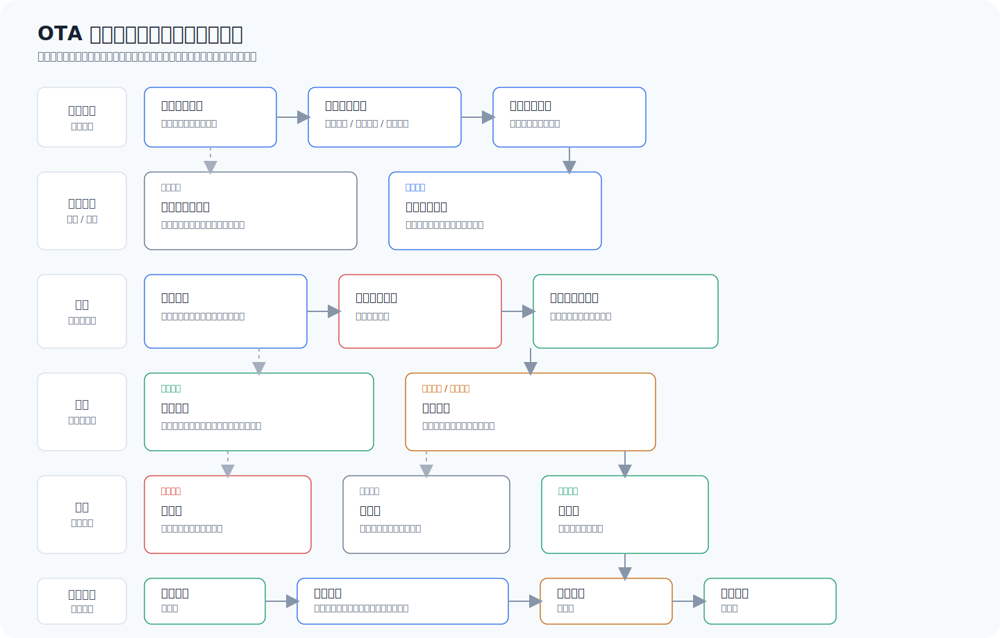
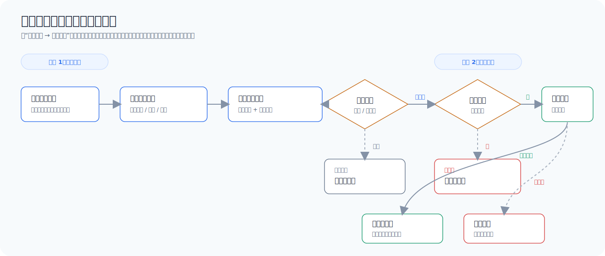
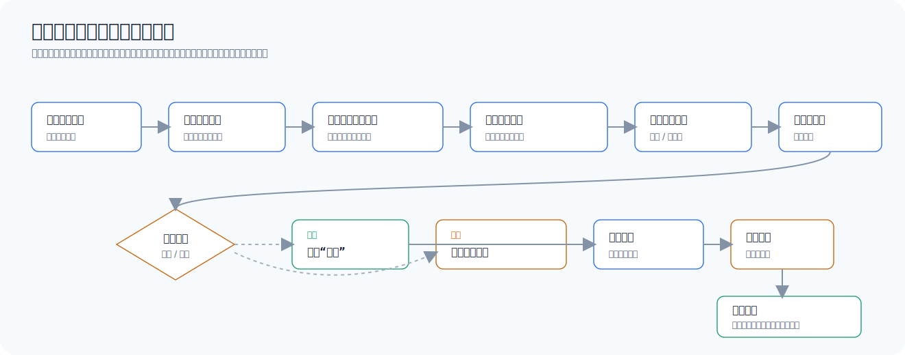
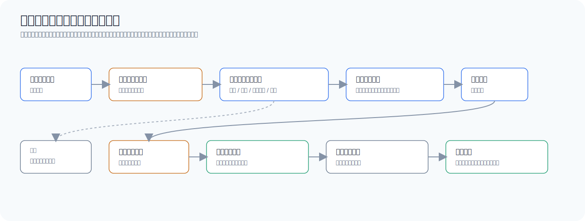
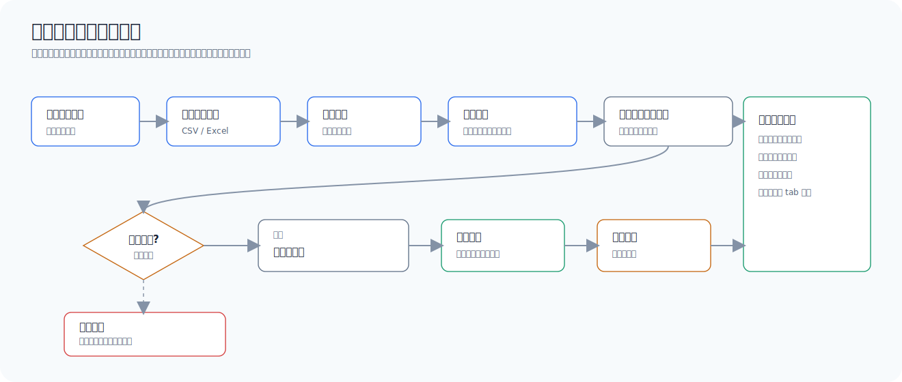
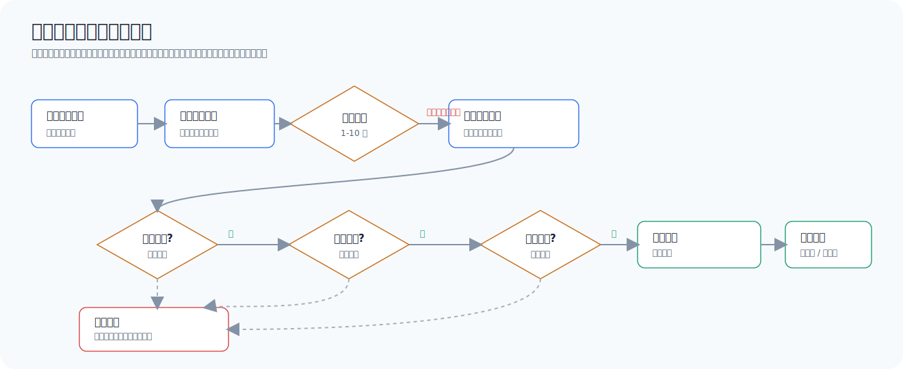
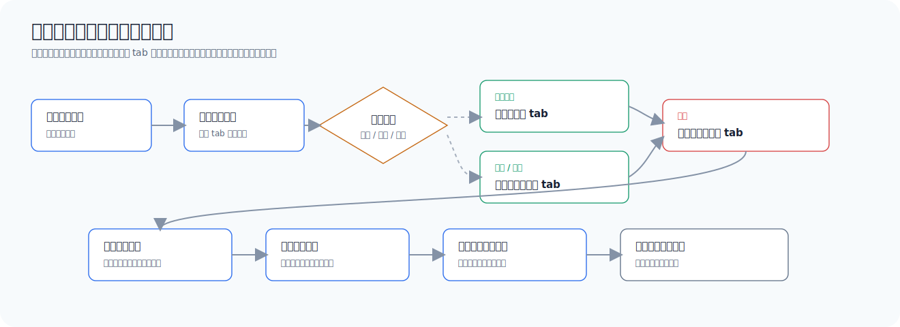

# OTA 升级任务管理优化 PRD

## 01. 本次需求范围

本次需求聚焦 OTA 升级任务从创建、发布、执行到详情复盘的完整链路。新版原型以“减少创建时的大区选择负担、保留详情复盘的大区信息”为核心原则。

| 范围 | 内容 |
| --- | --- |
| 新增任务 | 基本任务、策略配置、预览发布、保存草稿、提交审批或确认发布 |
| 升级方式 | 指定版本、文件导入、手动导入 |
| 大区规则 | 文件/手动按设备 ID 所属大区由后端自动分发；指定版本创建时选择指定分发范围 |
| 任务列表 | 状态展示、字段展示、筛选、列设置、分页、状态操作；移除全局区域上下文入口和列表区域列 |
| 任务详情 | 任务概览、策略信息、升级明细、设备所属大区、异常分类、流转明细 |

## 02. 方案结论

新增任务采用三步流程：

| 步骤 | 页面目标 | 关键展示 |
| --- | --- | --- |
| 基本任务 | 先录入任务公共信息 | 任务名称、目标固件版本、升级包、任务时间、升级说明 |
| 策略配置 | 再选择升级方式并配置策略 | 指定版本 / 文件导入 / 手动导入，以及各自策略字段 |
| 预览发布 | 最后确认预检和发布动作 | 任务摘要、可升级数、异常明细、提交审批或确认发布 |

关键结论：

- 去掉全局区域上下文入口，任务列表不按大区过滤。
- 任务列表不展示任务区域字段。
- 文件导入和手动导入创建时不选择大区；后端根据设备 ID 所属大区自动分发。
- 指定版本仍需在策略配置中选择指定分发范围，因为设备中心当前没有统一查询设备 ID 所属大区的接口。
- 指定版本分发范围支持多选父级大区，也支持展开中国并选择中国子节点。
- 所有策略的设备下发不做大区校验过滤；大区信息只用于任务详情、设备明细和复盘统计展示。

## 03. 创建任务设计

### 3.1 基本任务

| 字段 | 要求 |
| --- | --- |
| 任务名称 | 必填，1-64 个字符，不允许只输入空格 |
| 目标固件版本 | 必填，只能选择已上架或已生成升级包版本 |
| 升级包 | 必填，整包 / 差分包 |
| 任务时间 | 必填，开始时间不得早于当前时间，结束时间必须晚于开始时间 |
| 任务升级说明 | 必填，1-500 个有效字符，展示字数统计 |

基本任务步骤不展示任何大区选择。

### 3.2 策略配置

| 升级方式 | 创建时大区规则 | 策略字段 | 发布流转 |
| --- | --- | --- | --- |
| 指定版本 | 必须选择指定分发范围 | 指定分发范围、源版本、全量/批量、单批下发数量、任务最大下发数量 | 提交审批 |
| 文件导入 | 不选择大区 | 设备清单文件、导入总数、可升级数、异常数 | 提交审批 |
| 手动导入 | 不选择大区 | 设备 ID、源版本、所属大区、校验状态 | 直接发布 |

所有升级方式均支持配置可选策略条件项：

- 策略条件项默认关闭，非必填，不影响进入预览发布和提交发布。
- 开启后可新增一条或多条条件项，每条条件包含条件项、操作符和条件值，用于后端策略匹配或定制化下发控制。
- 条件项可覆盖设备标签、设备型号、渠道、客户、地区、设备分组等业务维度。
- 策略条件项不作为大区校验过滤；即使条件项选择地区，也仅作为业务条件记录和匹配，不拦截设备所属大区。
- 预览发布和详情需展示已配置的策略条件；未配置时展示“未配置”或不展示条件明细。

指定版本的分发范围选择规则：

- 指定版本可以选择多个分发范围。
- 可选父级大区为中国、香港、法兰福克、硅谷等。
- 中国支持展开选择杭州、杭州低功耗、深圳、成都、上海（宠物）等子节点。
- 选择“中国”父级表示覆盖全部中国子节点。
- 只选择部分中国子节点时，中国父级展示半选态。
- 香港、法兰福克、硅谷当前作为叶子节点处理。
- 分发范围用于后端匹配指定版本设备范围，并在详情页按范围拆分展示执行情况。
- 指定版本执行时不做额外设备级大区过滤校验。

指定版本批量数量规则：

| 字段 | 含义 | 默认 |
| --- | --- | --- |
| 单批下发数量 | 每轮最多下发多少台，用于控制灰度节奏 | 必填，大于 0 |
| 任务最大下发数量 | 本任务累计最多下发多少台，达到后停止继续匹配新设备 | 不限制 |

- 单批下发数量对整个任务生效，不按大区分别乘算。
- 任务最大下发数量对整个任务生效，不按大区分别乘算。
- 多个大区实际消耗数量由设备满足条件和系统匹配顺序决定。
- 若达到任务最大下发数量，系统停止匹配新设备；已下发设备全部有最终结果后，任务可提前完成。
- 若未设置任务最大下发数量，任务持续动态匹配，直到任务结束时间、无可匹配设备或用户手动结束。

文件导入和手动导入的大区规则：

- 创建时不展示大区选择控件。
- 上传或录入设备 ID 后，可展示设备所属大区作为校验辅助信息。
- 发布后由后端按设备 ID 所属大区分发到对应大区。
- 设备区域归属不再作为创建拦截原因，不提示用户切换区域后再创建。

### 3.3 预览发布

| 内容 | 展示要求 |
| --- | --- |
| 基本信息摘要 | 任务名称、目标版本、升级包、任务时间、升级说明 |
| 策略摘要 | 升级方式、指定版本分发范围或自动按设备大区分发说明 |
| 设备规模 | 指定版本展示全量、批量单批数量、任务最大下发数量；文件/手动展示清单总数、可升级数、异常数 |
| 异常明细 | 展示已是目标版本、差分包不可用、版本不匹配、设备不存在等原因 |
| 发布动作 | 指定版本/文件导入为提交审批；手动导入为确认发布 |

异常原因中不再包含区域不匹配类拦截。

### 3.4 草稿规则

- 基本任务或策略配置过程中均可保存草稿。
- 草稿进入列表状态为“待发布”。
- 待发布任务支持编辑和删除。
- 草稿再次编辑时回到保存时的步骤。
- 切换升级方式时，仅保留基本任务信息，策略私有配置按新方式重新配置。

### 3.5 创建任务校验

| 校验对象 | 校验时机 | 校验规则 |
| --- | --- | --- |
| 基本任务 | 进入策略配置、提交发布 | 任务名称、目标版本、升级包、任务时间、升级说明必填 |
| 指定版本策略 | 进入预览发布、提交发布 | 必须选择指定分发范围，至少选择一个源版本；批量模式下单批下发数量必须大于 0，任务最大下发数量默认可不填；若填写任务最大下发数量，必须大于等于单批下发数量 |
| 文件导入策略 | 进入预览发布、提交发布 | 必须上传设备清单，且存在可升级设备 |
| 手动导入策略 | 进入预览发布、提交发布 | 至少 1 台可升级设备，最多 10 台，设备 ID 不允许重复 |

## 04. 任务状态定义

| 状态 | 业务含义 | 进入条件 | 可操作项 | 退出条件 |
| --- | --- | --- | --- | --- |
| 待发布 | 草稿态，任务未正式提交 | 保存草稿；编辑草稿后再次保存 | 编辑、删除、提交发布 | 指定版本/文件导入提交后进入待审批；手动导入确认发布后进入待执行或升级中 |
| 待审批 | 已提交审批，尚未允许执行 | 指定版本或文件导入提交发布且预检通过 | 详情 | 审批通过进入待执行或升级中；审批驳回进入已驳回；审批超时或执行窗口失效进入已失效 |
| 待执行 | 已发布，等待计划开始时间 | 审批通过但未到开始时间；手动导入发布成功但未到开始时间 | 详情 | 到达开始时间进入升级中；开始前任务窗口失效进入已失效 |
| 升级中 | 任务正在匹配、下发或等待设备回执 | 到达开始时间且任务窗口有效 | 详情、结束任务 | 全部纳入执行的设备产生最终结果或达到提前完成条件进入已完成；用户结束进入已结束；任务窗口结束后停止继续匹配并进入已完成 |
| 已完成 | 系统正常结束，任务不可再执行 | 执行窗口结束；固定清单全部处理完成；指定版本达到任务最大下发数量且已下发设备全部有最终结果；无新的可匹配设备且执行链路已收敛 | 详情、复制重建 | 终态 |
| 已结束 | 用户提前终止，系统不再继续匹配或下发 | 升级中状态下用户确认结束任务 | 详情、复制重建 | 终态 |
| 已驳回 | 审批未通过，任务不执行 | 审批人驳回发布申请 | 详情、复制重建 | 终态 |
| 已失效 | 任务未进入可执行链路且窗口已不可用 | 审批超时；审批通过时任务结束时间已过；待执行阶段到达结束时间仍未启动 | 详情、复制重建 | 终态 |

状态流转规则：

- 待发布是唯一可编辑原任务配置的状态；进入待审批、待执行或升级中后不允许修改原任务配置。
- 删除仅允许待发布草稿，不作为任务终态进入详情。
- 指定版本和文件导入必须先进入待审批；手动导入无需审批，发布后按任务时间直接进入待执行或升级中。
- 审批通过时若当前时间早于开始时间，进入待执行；若当前时间处于开始和结束时间之间，直接进入升级中；若结束时间已过，进入已失效。
- 待执行阶段不提供结束任务操作，因为尚未形成执行链路和设备下发记录。
- 升级中执行结束后进入已完成；用户主动结束进入已结束，后端需停止后续匹配和新增下发，但已下发设备的最终回执仍可在详情中更新。
- 已完成、已结束、已驳回、已失效均为终态，只允许查看详情和复制重建。

## 05. 三种升级方式流程

新增任务统一采用三步创建流程：

### 5.1 指定版本

指定版本适用于根据分发范围、源版本和策略条件动态圈选设备的任务。由于设备中心当前没有统一查询设备 ID 所属大区的接口，创建时必须选择指定分发范围。

| 阶段 | 处理规则 | 产出 |
| --- | --- | --- |
| 策略配置 | 选择一个或多个分发范围；支持中国父级、中国子节点，以及香港、法兰福克、硅谷等父级或叶子大区 | dispatchRegions |
| 版本配置 | 选择一个或多个源版本；目标版本来自基本任务 | sourceVersions、targetVersion |
| 数量配置 | 选择全量或批量；批量必填单批下发数量；任务最大下发数量默认不限制 | quantityMode、batchLimit、maxDispatchTotal |
| 策略条件 | 可选配置设备标签、型号、渠道、客户、地区、设备分组等条件项 | strategyCondition |
| 预览发布 | 校验分发范围、源版本、时间窗口和批量数量；展示策略摘要 | previewSnapshot |
| 审批 | 提交审批，审批通过后按任务时间进入待执行或升级中 | approvalRecord |
| 执行 | 后端按分发范围、源版本、策略条件动态匹配设备；批量任务按全局单批数量和全局最大下发数量控制节奏 | regionExecution、deviceExecution |
| 详情复盘 | 升级明细按分发范围 tab 查看，不提供全部聚合 tab | regionStats、deviceList |

指定版本分发拆分规则：

- 选择“中国”父级时，任务配置记录父级选择，执行和详情按中国子节点拆分展示。
- 选择部分中国子节点时，只对已选子节点建立分区执行记录。
- 香港、法兰福克、硅谷作为独立分发范围展示。
- 多个分发范围共用同一个任务最大下发数量；达到最大下发数量后停止匹配新设备。
- 全量模式不展示未知总量和未处理数；批量模式展示单批下发数量、任务最大下发数量和已下发进度。
- 所有策略条件只参与业务匹配，不作为大区校验过滤。

### 5.2 文件导入

文件导入适用于运营人员上传固定设备清单的任务。创建时不选择大区，后端按设备 ID 所属大区自动拆分执行。

| 阶段 | 处理规则 | 产出 |
| --- | --- | --- |
| 文件上传 | 上传设备 ID 清单，系统解析、去重并校验格式 | uploadRecord、rawDeviceList |
| 设备校验 | 校验设备是否存在、当前版本、是否已是目标版本、差分包是否可用 | precheckResult、exceptionList |
| 大区识别 | 根据设备 ID 查询设备所属大区，仅作为拆分执行和详情展示字段 | deviceRegion |
| 策略条件 | 可选配置策略条件项；条件项不拦截设备所属大区 | strategyCondition |
| 预览发布 | 展示导入总数、去重后总数、可升级数、异常数和异常原因 | previewSnapshot |
| 审批 | 提交审批，审批通过后进入待执行或升级中 | approvalRecord |
| 执行 | 后端按设备所属大区拆分子执行单，下发到对应大区 | regionExecution、deviceExecution |
| 详情复盘 | 升级明细按设备所属大区 tab 查看概览、异常和设备列表，不提供跨大区聚合明细 | regionStats、deviceList |

文件导入异常原因中不得包含区域不匹配、非当前大区、请切换大区等旧口径。

### 5.3 手动导入

手动导入适用于小规模、临时性的固定设备升级任务。创建时不选择大区，最多录入 10 台设备，发布后直接进入执行链路。

| 阶段 | 处理规则 | 产出 |
| --- | --- | --- |
| 手动录入 | 输入设备 ID，支持逐条校验，最多 10 台，不允许重复 | manualDevices |
| 设备校验 | 实时查询源版本、设备所属大区、是否可升级和异常原因 | validationStatus、exceptionList |
| 策略条件 | 可选配置策略条件项；未配置不影响发布 | strategyCondition |
| 预览发布 | 展示设备清单、可升级数、异常数和设备所属大区 | previewSnapshot |
| 直接发布 | 无需审批；确认发布后按任务时间进入待执行或升级中 | publishRecord |
| 执行 | 后端按设备所属大区拆分执行并下发 | regionExecution、deviceExecution |
| 详情复盘 | 升级明细按设备所属大区 tab 查看概览、异常和设备列表，不提供跨大区聚合明细 | regionStats、deviceList |

## 06. 字段与记录要求

### 6.1 任务主记录字段

| 字段 | 中文名 | 适用范围 | 要求 |
| --- | --- | --- | --- |
| taskId | 任务 ID | 全部 | 系统生成，列表、详情、流转记录统一使用 |
| taskName | 任务名称 | 全部 | 必填，1-64 个有效字符 |
| upgradeMethod | 升级方式 | 全部 | specified_version / file_import / manual_import |
| packageType | 升级包类型 | 全部 | full / diff |
| packageId | 升级包 ID | 全部 | 关联升级包记录，用于下发 |
| targetVersion | 目标固件版本 | 全部 | 必填，只能选择已上架或已生成升级包版本 |
| taskStartAt | 任务开始时间 | 全部 | 必填，不得早于当前时间 |
| taskEndAt | 任务结束时间 | 全部 | 必填，必须晚于开始时间 |
| description | 任务升级说明 | 全部 | 必填，1-500 个有效字符 |
| status | 任务状态 | 全部 | 待发布、待审批、待执行、升级中、已完成、已结束、已驳回、已失效 |
| draftStep | 草稿所在步骤 | 待发布 | 保存草稿时记录，编辑草稿时回到对应步骤 |
| approvalRequired | 是否需要审批 | 全部 | 指定版本、文件导入为是；手动导入为否 |
| dispatchMode | 分发模式 | 全部 | 指定版本为 selected_region；文件/手动为 device_owner_region_auto |
| dispatchRegions | 指定分发范围 | 指定版本 | 记录父级大区和中国子节点；文件/手动为空 |
| quantityMode | 数量模式 | 指定版本 | full / batch |
| batchLimit | 单批下发数量 | 指定版本批量 | 必填，大于 0 |
| maxDispatchTotal | 任务最大下发数量 | 指定版本批量 | 可为空；为空表示不限制 |
| deviceTotalDisplay | 升级规模展示值 | 全部 | 指定版本全量展示“全量”；其他展示 N 台 |
| creator / createdAt / updatedAt | 创建信息 | 全部 | 记录创建人、创建时间、更新时间 |
| submittedAt | 提交发布时间 | 待审批及之后 | 指定版本、文件导入提交审批时记录；手动导入发布时记录 |
| approvedAt / approver | 审批通过信息 | 审批通过任务 | 记录审批人和审批通过时间 |
| rejectedAt / rejectReason | 驳回信息 | 已驳回 | 记录驳回时间和原因 |
| expiredAt / expireReason | 失效信息 | 已失效 | 记录失效时间和原因 |
| startedAt | 实际开始时间 | 升级中及之后 | 任务进入升级中时记录 |
| completedAt / completeReason | 完成信息 | 已完成 | 记录完成时间和完成原因 |
| endedAt / endReason | 结束信息 | 已结束 | 记录用户结束时间和结束原因 |

### 6.2 策略配置字段

| 策略 | 字段 | 说明 |
| --- | --- | --- |
| 指定版本 | dispatchRegions[] | 指定分发范围，支持父级大区和中国子节点 |
| 指定版本 | sourceVersions[] | 源版本，可多选 |
| 指定版本 | quantityMode | full 表示全量；batch 表示批量 |
| 指定版本 | batchLimit | 单批下发数量，仅批量必填 |
| 指定版本 | maxDispatchTotal | 任务最大下发数量，空值表示不限制 |
| 文件导入 | fileId / fileName | 上传文件标识和文件名 |
| 文件导入 | uploadTotal | 文件原始行数 |
| 文件导入 | dedupedTotal | 去重后设备数 |
| 文件导入 | upgradeableTotal | 可升级设备数 |
| 文件导入 | exceptionTotal | 预检异常设备数 |
| 文件导入 | importBatchId | 文件解析批次，用于追溯解析结果 |
| 手动导入 | manualDevices[] | 手动录入设备列表 |
| 手动导入 | manualTotal | 录入设备数，最大 10 |
| 手动导入 | upgradeableTotal | 可升级设备数 |
| 手动导入 | exceptionTotal | 校验异常设备数 |
| 通用策略条件 | strategyCondition.enabled | 是否启用自定义策略条件，默认 false |
| 通用策略条件 | strategyCondition.items[] | 条件项列表，非必填 |
| 通用策略条件 | items[].field | 条件字段，如设备标签、设备型号、渠道、客户、地区、设备分组 |
| 通用策略条件 | items[].operator | 操作符，如等于、不等于、包含、不包含、在范围内 |
| 通用策略条件 | items[].values | 条件值，支持单值或多值 |
| 通用策略条件 | items[].relation | 条件间关系，本期默认为 AND |

### 6.3 策略条件字段

| 字段 | 说明 | 展示要求 |
| --- | --- | --- |
| conditionId | 条件唯一标识 | 后端生成或前端临时生成后提交 |
| fieldCode / fieldName | 条件字段编码和名称 | 页面展示名称，接口传编码 |
| operator | 操作符 | 与字段类型匹配 |
| valueCodes / valueLabels | 条件值编码和展示名 | 多选时按数组存储 |
| valueType | 值类型 | string / number / enum / region / tag |
| enabled | 是否启用 | 关闭后不参与匹配 |
| validationStatus | 条件校验状态 | 非必填项；失败时提示但不默认拦截其他策略 |
| createdAt / updatedAt | 条件更新时间 | 用于详情复盘 |

策略条件展示规则：

- 创建页仅提供配置控件，不展示规则性说明文案。
- 预览发布展示已配置条件摘要；未配置时展示“未配置”。
- 详情页展示任务真实配置的策略条件，并支持通过评审口径快速切换查看不同策略条件下的页面状态。
- 条件字段即使选择地区，也不等同于任务大区校验，不产生区域不匹配异常。

### 6.4 预检与异常字段

| 字段 | 说明 | 适用范围 |
| --- | --- | --- |
| precheckId | 预检批次 ID | 全部 |
| precheckTotal | 参与预检设备数 | 文件导入、手动导入；指定版本可展示预估或不展示未知总数 |
| upgradeableCount | 可升级设备数 | 全部 |
| blockedCount | 异常设备数 | 全部 |
| exceptionType | 异常类型 | 已是目标版本、差分包不可用、版本不匹配、设备不存在、设备离线、设备状态不允许升级等 |
| exceptionLevel | 异常级别 | blocking / warning |
| deviceId | 设备标识 | 文件导入、手动导入、执行明细 |
| currentVersion | 当前固件版本 | 文件导入、手动导入、执行明细 |
| sourceVersionMatched | 是否命中源版本 | 全部 |
| deviceRegionCode / deviceRegionName | 设备所属大区 | 文件导入、手动导入、执行明细 |
| canPublish | 是否允许发布 | 全部 |
| checkedAt | 预检时间 | 全部 |

### 6.5 分区执行字段

| 字段 | 说明 | 展示要求 |
| --- | --- | --- |
| regionExecutionId | 分区执行 ID | 每个分发范围或设备所属大区生成一条 |
| taskId | 任务 ID | 关联主任务 |
| regionCode / regionName | 执行大区 | 指定版本为分发范围拆分结果；文件/手动为设备所属大区 |
| parentRegionCode / parentRegionName | 父级大区 | 中国子节点需记录父级中国 |
| selectedScopeLabel | 创建时选择范围 | 用于说明是父级覆盖还是子节点直选 |
| executionStatus | 分区执行状态 | 待执行、升级中、已完成、已结束、已失效 |
| matchedCount | 已匹配设备数 | 指定版本动态匹配统计 |
| dispatchedCount | 已下发设备数 | 已实际下发到设备的数量 |
| successCount | 升级成功数 | 当前分区统计 |
| failedCount | 升级失败数 | 当前分区统计 |
| upgradingCount | 升级中数 | 当前分区统计 |
| pendingCount | 未处理数 | 固定清单任务展示；指定版本全量可不展示 |
| successRate | 成功率 | successCount / 已处理数 |
| lastSyncedAt | 最近更新时间 | 当前分区数据更新时间 |
| finishReason | 分区完成原因 | 正常完成、用户结束、达到最大下发数量、执行窗口结束等 |

### 6.6 设备明细字段

| 字段 | 说明 | 展示要求 |
| --- | --- | --- |
| deviceId | 设备 ID | 必展示 |
| taskId / regionExecutionId | 任务和分区执行关联 | 用于按大区 tab 查询 |
| sourceVersion | 源版本 | 指定版本为命中源版本；文件/手动为校验时当前版本 |
| targetVersion | 目标版本 | 必展示 |
| packageType | 升级包类型 | 整包 / 差分包 |
| deviceRegionName | 设备所属大区 | 必展示 |
| dispatchRegionName | 实际下发大区 | 文件/手动应与设备所属大区一致；指定版本为当前分区 |
| batchNo | 下发批次 | 批量任务展示 |
| precheckStatus | 预检状态 | 可升级 / 异常 |
| deliveryStatus | 下发状态 | 未下发、下发中、下发成功、下发失败 |
| upgradeStatus | 升级状态 | 未开始、升级中、成功、失败 |
| failureCategory | 失败分类 | 包下载失败、设备离线、版本不匹配、安装失败、超时等 |
| failureReason | 失败原因 | 失败时展示 |
| dispatchedAt / reportedAt / finishedAt | 时间信息 | 最近上报时间必展示 |

### 6.7 流转记录字段

| 字段 | 说明 |
| --- | --- |
| flowId | 流转记录 ID |
| taskId | 任务 ID |
| fromStatus / toStatus | 流转前后状态 |
| action | 保存草稿、提交审批、审批通过、审批驳回、开始执行、结束任务、系统完成、系统失效 |
| operatorType | user / system / approval |
| operatorName | 操作人或系统名称 |
| operatedAt | 操作时间 |
| reason | 驳回、结束、失效、完成等原因 |
| snapshot | 本次流转时的关键字段快照 |

## 07. 列表页承接规则

任务列表展示全部任务，不提供全局区域上下文入口，不按大区过滤，不展示任务区域列。

| 字段 | 展示规则 |
| --- | --- |
| 名称 | 展示任务名称、任务 ID、必要状态标签 |
| 升级方式 | 指定版本 / 文件导入 / 手动导入 |
| 升级包 | 整包 / 差分包 |
| 目标版本 | 展示目标固件版本号 |
| 升级规模 | 指定版本全量展示“全量”；批量、文件导入、手动导入展示 N 台 |
| 任务时间 | 展示开始和结束时间 |
| 执行结果 | 非执行态展示 `-`；执行态按各策略统计口径展示 |
| 状态 | 展示待发布、待审批、待执行、升级中、已完成等 |
| 创建人 | 展示任务创建人 |
| 创建时间 | 展示任务创建时间 |
| 操作 | 按状态展示编辑、删除、详情、结束任务、复制重建 |

## 08. 详情页承接规则

详情页展示任务本身的完整配置和执行结果。大区信息只在详情页中作为复盘信息出现。

| 策略 | 详情大区展示 |
| --- | --- |
| 指定版本 | 展示指定分发范围，并按大区/子节点拆分执行情况 |
| 文件导入 | 展示“按设备所属大区自动分发”，并展示设备所属大区分布 |
| 手动导入 | 展示“按设备所属大区自动分发”，并展示设备所属大区分布 |

指定版本详情的分区升级明细放在“升级明细”页签最上方展示，不在任务概览页签重复展示：

- 按创建时选择的父级大区或中国子节点拆分。
- 若选择“中国”父级，详情按中国子节点展开展示。
- 每个分发范围需展示执行状态、已匹配、已下发、成功、失败、升级中、成功率和最近更新时间。
- 批量任务需展示单批下发数量和任务最大下发数量；任务最大下发数量为不限制时，展示“不限制”。
- 当前后端无法跨大区汇集设备明细和执行结果，因此升级明细不提供“全部”聚合 tab，也不展示跨分发范围的统一概览。
- 升级明细默认进入第一个分发范围；页面最上方提供各分发范围 tab，切换 tab 后同步切换当前分区概览、当前分区升级概览、当前分区异常明细和当前分区设备列表。
- 指定版本升级明细中的统计卡片、异常分类、设备搜索和导出均基于当前选中的分发范围，不支持在页面上切换到全部范围。
- 指定版本已结束时，当前分区设备列表仅展示已匹配或已下发到该分区链路的设备；未继续匹配的新设备不进入设备明细表。
- 文件导入和手动导入的设备所属大区分布放在“升级明细”页签内展示，不在任务概览中重复展示执行统计。
- 从真实任务进入详情后，评审视图默认带入任务自身策略口径，但需保留文件导入、手动导入、指定版本全量、指定版本批量的快速切换能力，用于查阅各策略条件下的状态页面；切换评审口径不修改真实任务配置。

详情页状态与操作规则：

| 状态 | 任务概览 | 升级明细 | 详情页操作 |
| --- | --- | --- | --- |
| 待审批 | 展示任务配置、提交审批记录和等待审批节点 | 展示待审批空态，不展示升级概览、异常分类和设备列表 | 无 |
| 已驳回 | 展示驳回原因、审批流转和任务配置 | 展示已驳回空态，不展示升级概览、异常分类和设备列表 | 复制重建 |
| 已失效 | 展示失效原因、审批流转和任务配置 | 展示已失效空态，不展示升级概览、异常分类和设备列表 | 复制重建 |
| 待执行 | 展示计划开始时间和等待执行节点 | 展示待执行空态，不展示升级概览、异常分类和设备列表 | 无 |
| 升级中 | 展示执行中状态和流转记录 | 展示升级概览、异常分类和设备列表；指定版本按当前分发范围展示 | 结束任务 |
| 已完成 | 展示完成时间和最终流转记录 | 展示最终升级概览、异常分类和设备列表；指定版本按当前分发范围展示 | 复制重建 |
| 已结束 | 展示结束时间、结束原因和最终流转记录 | 固定清单展示结束前已处理设备和未继续下发设备；指定版本仅展示已进入当前分区链路的设备 | 复制重建 |

统计口径要求：

- 已匹配数 / 已处理数 = 升级成功数 + 升级失败数 + 升级中数。
- 未处理数 = 固定清单总数 - 已处理数；指定版本全量不展示未知总数和未处理数。
- 固定清单任务的进度条需区分成功、失败、升级中和未处理。
- 异常分类仅在执行态且存在失败设备时展示。

设备明细表必须包含设备 ID、源版本、目标版本、所属大区、下发状态、升级状态、失败原因、最近上报时间。

## 09. 验收标准

### 9.1 新增任务

| 验收点 | 标准 |
| --- | --- |
| 步骤流程 | 新增任务按基本任务、策略配置、预览发布三步完成 |
| 基本任务 | 不出现大区选择 |
| 指定版本 | 必须选择至少一个指定分发范围，支持父级大区和中国子节点 |
| 指定版本批量 | 支持配置单批下发数量；支持配置任务最大下发数量，默认不限制；达到最大下发数量后停止继续匹配新设备 |
| 策略条件项 | 三种升级方式均可配置多条策略条件项；默认非必填；未配置时不影响发布 |
| 文件导入 | 不选择大区，上传后提示按设备所属大区自动分发 |
| 手动导入 | 不选择大区，录入后展示设备所属大区 |
| 预览发布 | 不出现区域范围拦截类旧口径 |

### 9.2 列表页

| 验收点 | 标准 |
| --- | --- |
| 全局区域上下文 | 不展示区域切换入口 |
| 列表字段 | 不展示任务区域字段 |
| 列表筛选 | 不按大区过滤 |
| 状态统计 | 统计全部任务，不按大区聚合 |

### 9.3 详情页

| 验收点 | 标准 |
| --- | --- |
| 指定版本 | 在升级明细最上方展示指定分发范围 tab 和分区升级明细，不提供全部范围 tab |
| 指定版本批量 | 在升级明细中展示单批下发数量、任务最大下发数量，以及按分发范围 tab 拆分的升级结果 |
| 状态操作 | 待执行详情页不展示结束任务；升级中展示结束任务；已完成、已结束、已驳回、已失效展示复制重建 |
| 非执行态空态 | 待审批、已驳回、已失效、待执行不展示升级概览、异常分类和设备列表 |
| 策略条件项 | 展示任务创建时配置的策略条件项；未配置时不作为异常或拦截原因 |
| 文件/手动 | 展示自动按设备所属大区分发 |
| 设备列表 | 指定版本按当前分发范围展示设备列表，文件/手动展示设备所属大区 |
| 异常分类 | 不包含区域不匹配类异常 |

## 10. 原型自测清单

| 自测类型 | 检查内容 |
| --- | --- |
| 代码可用性 | `app.js` 无语法错误，页面入口可加载 |
| 文案一致性 | 页面不再出现已废弃的区域上下文、区域范围拦截等旧口径 |
| 交互覆盖 | 新增任务、保存草稿、发布弹窗、列表筛选、详情切换、导出、结束任务均可用 |
| 状态覆盖 | 待发布、待审批、待执行、升级中、已完成、已结束、已驳回、已失效均可展示 |
| 策略覆盖 | 指定版本、文件导入、手动导入均可切换查看 |
| 响应式覆盖 | 大屏、中屏、小屏下表单、列表、详情无明显溢出 |
