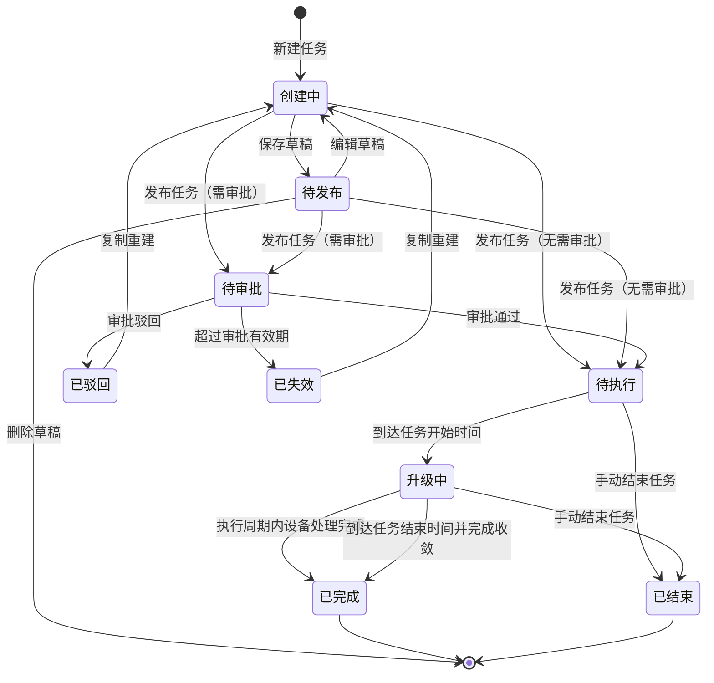

# OTA 升级任务管理优化产品需求文档

## 1. 摘要

### 问题背景

当前 OTA 升级任务创建、任务列表和任务详情中，存在流程步骤割裂、状态操作不统一、设备统计口径混用、详情页信息分散的问题。尤其在“指定版本升级”场景下，设备总数在执行过程中动态匹配，创建任务时无法准确得到最终设备规模，若按固定设备总数展示进度，会误导用户判断任务规模、成功率和失败率。

### 解决方案

围绕“新增任务、任务列表、任务详情、升级明细”进行信息架构和交互优化：新增任务压缩为三步流程，发布结果通过弹窗反馈；任务列表统一字段、筛选、列设置和状态操作；任务详情以“任务概览 / 升级明细”组织信息；升级统计明确区分“指定版本动态匹配”和“文件/手动导入固定清单”两类口径；异常分类采用 ECharts 基础环形图和分类列表联动展示。

### 成功标准

- 新增任务流程按三步完成，最后发布结果不再作为独立步骤跳转。
- 每一步必填项校验完整，未填写时阻止进入下一步并展示字段级提示。
- 指定版本全量场景不展示未知总数百分比，只展示已匹配数、成功数、失败数及基于已匹配数的占比。
- 文件/手动导入场景展示明确设备总数、已处理、成功、失败、未处理。
- 任务列表字段、状态、操作、分页、列设置符合统一规则。
- 详情页信息不重复：任务配置在“任务概览”，执行结果、异常分类、设备列表在“升级明细”。
- 异常分类按 6 个一级分类展示，环形图与右侧列表支持鼠标移入联动。

### 本次需求范围

本次需求范围聚焦 OTA 升级任务管理链路的前端交互、信息架构、展示口径和原型验证，不覆盖真实后端执行能力建设。

范围内：

- **新增任务**：覆盖基础信息、配置升级策略、预览发布三步流程，以及保存草稿、提交审批、发布反馈、必填校验、时间选择、指定版本表格勾选、文件导入、手动导入等交互。
- **任务列表**：覆盖查询筛选、状态统计卡片、列表字段、列设置、分页、创建时间倒序、状态展示、执行结果展示和不同状态下的操作按钮。
- **任务详情**：覆盖顶部任务概览卡、任务进度、流转明细、任务概览页签、升级明细页签，以及不同任务状态下的字段展示规则。
- **升级统计口径**：覆盖文件导入、手动导入、指定版本全量、指定版本批量四类口径，明确固定设备总数和动态匹配设备数的展示差异。
- **异常分类**：覆盖 6 个一级异常分类、ECharts 基础环形图、分类列表联动、异常明细下载入口和最小可行版本展示方案。
- **原型验证**：覆盖任务状态模拟、统计口径模拟、预览发布三种场景模拟，用于产品、研发、测试共同核对逻辑闭环。

范围外：

- 不包含真实 OTA 任务下发、设备动态匹配、设备升级执行和结果回传能力。
- 不包含真实审批流、真实文件解析、真实设备校验和真实异常明细生成。
- 不包含跨大区聚合查询、复杂报表、异常趋势分析、异常原因多级钻取和权限体系重构。

## 2. 用户体验与功能

### 用户角色

- **运营/实施用户**：创建 OTA 升级任务，跟踪任务状态和升级结果。
- **产线负责人**：审批任务，关注升级范围、目标版本、策略条件和风险。
- **产品负责人**：确认创建、审批、执行、结束、复制重建等流程是否闭环。
- **研发人员**：按清晰口径实现状态、统计字段、异常分类和权限操作。
- **测试人员**：验证不同状态、升级方式、统计口径下的页面展示是否正确。

### 用户故事

- 作为运营用户，我希望按步骤创建 OTA 升级任务，以避免遗漏必填配置。
- 作为产线负责人，我希望清晰查看任务配置和策略条件，以便安全审批任务。
- 作为普通用户，我希望任务流转进度和设备升级结果分开展示，以避免混淆流程状态和执行结果。
- 作为研发人员，我希望统计口径规则明确，以便一致实现动态匹配和固定清单场景。
- 作为测试人员，我希望原型提供状态和统计口径模拟控件，以便高效验证不同展示场景。

### 验收标准

- 新增任务流程为：`基础信息 > 配置升级策略 > 预览发布`。
- 发布成功、提交审批成功、保存草稿成功均通过弹窗或消息反馈，不新增“完成”步骤。
- 保存草稿后默认返回任务列表，草稿状态为“待发布”，支持二次进入编辑。
- 指定版本升级不再提供“全部版本升级 / 仅指定版本升级 / 排除指定版本不升级”切换，统一使用源版本表格勾选。
- 配置升级数量为“全量”时，表格“升级设备数”展示 `全量`；为“批量”时，仅支持统一输入数量，不支持单个源版本分别输入。
- 任务列表支持筛选、分页、列设置、刷新，默认按创建时间倒序。
- 详情页主页签为：`任务概览 / 升级明细`。
- 任务概览只展示任务配置、策略条件和任务流转，不展示设备执行结果。
- 升级明细展示升级概览、异常分类、设备列表和导出操作。
- 非执行态任务进入“升级明细”时展示空状态，不展示设备表格。
- 原型阶段提供状态模拟和统计口径模拟按钮，方便验证展示逻辑；生产环境不展示模拟按钮。

### 非目标

- 不实现真实后端设备检索、动态匹配和下发逻辑。
- 不实现真实审批流接口。
- 不实现真实文件解析和设备校验。
- 不支持跨多个大区查询，仍通过顶部大区切换查看不同大区任务。
- 不新增人工智能能力。
- 最小可行版本不做异常原因多级钻取、趋势分析或复杂报表。

## 3. 人工智能能力要求

不适用。本需求不涉及人工智能模型、人工智能工具调用、生成式输出或人工智能评估策略。

## 4. 技术规格

### 架构概览

当前原型以静态网页技术实现，核心模块包括：

- 新增任务向导
- 任务列表与分页
- 任务列表列设置
- 任务详情
- 状态模拟
- 统计口径模拟
- 任务进度与流转明细
- 升级概览、异常分类与设备列表

前端状态建议维护：

| 状态字段 | 说明 |
| --- | --- |
| `createStep` | 当前新增任务步骤，取值 1-3 |
| `quantityMode` | 全量 / 批量 |
| `selectedVersions` | 指定版本升级中勾选的源版本 |
| `selectedRegions` | 任务执行大区或策略地区 |
| `previewScenario` | 原型预览发布模拟场景 |
| `taskFilters` | 任务列表查询条件 |
| `taskPage` | 任务列表当前分页 |
| `visibleTaskColumns` | 任务列表列设置 |
| `detailStatus` | 当前详情模拟状态 |
| `detailMetricMode` | 文件导入 / 手动导入 / 指定版本全量 / 指定版本批量 |
| `detailTab` | 任务概览 / 升级明细 |
| `flowTab` | 任务进度 / 流转明细 |

### 接口集成点

后端接口建议包含：

- 创建任务接口
- 保存草稿接口
- 提交审批接口
- 查询任务列表接口
- 查询任务详情接口
- 查询升级明细接口
- 查询设备列表接口
- 查询流转明细接口
- 下载异常明细接口
- 导出设备列表接口
- 结束任务接口
- 复制重建接口

建议数据字段：

| 字段 | 说明 |
| --- | --- |
| `taskId` | 任务标识 |
| `taskName` | 任务名称 |
| `targetVersion` | 目标版本 |
| `upgradeMethod` | 指定版本 / 文件导入 / 手动导入 |
| `packageType` | 整包 / 差分包 |
| `region` | 任务所属大区 |
| `quantityMode` | 全量 / 批量 |
| `plannedSuccessCount` | 批量场景计划成功下发数量 |
| `matchedCount` | 指定版本场景已匹配数 |
| `totalDeviceCount` | 文件/手动导入场景设备总数 |
| `processedCount` | 已处理设备数 |
| `upgradeSuccessCount` | 升级成功数 |
| `upgradeFailedCount` | 升级失败数 |
| `pendingCount` | 未处理或待匹配数量 |
| `sourceVersions` | 指定版本升级的源版本列表 |
| `sourceScope` | 文件/手动导入的设备来源 |
| `strategyConditions` | 策略条件，如指定地区 |
| `taskStatus` | 任务状态 |
| `createdBy` | 创建人 |
| `createdAt` | 创建时间 |
| `updatedAt` | 更新时间，详情页可展示 |
| `submittedAt` | 提交审批时间 |
| `approvedAt` | 审批通过时间 |
| `rejectedAt` | 审批驳回时间 |
| `startAt` | 任务开始时间 |
| `endAt` | 任务结束时间 |

### 安全与隐私

- 设备标识、区域信息、固件版本号属于业务敏感数据，需按权限展示。
- 文件导入/手动导入设备清单需校验权限后展示和导出。
- 审批、结束任务、删除草稿、复制重建等操作需后端权限校验。
- 操作审计记录需由后端保留；详情页不单独展示“操作记录”，只展示任务流转明细。

## 5. 功能需求

### 5.1 新增任务流程

新增任务流程固定为三步：

```text
基础信息 → 配置升级策略 → 预览发布
```

发布结果不作为第 4 步展示：

- 保存草稿：提示保存成功，返回任务列表，状态为“待发布”。
- 发布需审批：提示提交审批成功，进入“待审批”状态。
- 发布无需审批：提示发布成功，按任务起止时间进入“待执行”或后续执行状态。

发布结果弹窗规则：

- 弹窗需展示结果标题、结果说明、任务摘要和后续流程说明，避免用户提交后不知道下一步去向。
- 发布需审批时，需说明任务已进入“待审批”，审批通过前不会进入执行队列，也不会下发 OTA；审批通过后按任务时间进入待执行或升级中；审批驳回或超时失效时任务不会下发。
- 发布无需审批时，需说明任务已发布，未到开始时间为“待执行”，到达开始时间后进入“升级中”，升级结果可在任务详情的升级明细中查看。
- 弹窗底部提供“返回任务列表”和“查看任务详情”两个明确出口。
- 点击关闭按钮或遮罩关闭时，默认返回任务列表，保证创建流程闭环。

基础信息必填字段：

- 任务名称
- 任务执行大区
- 目标固件版本号
- 任务起止时间
- 任务升级说明

基础信息字段规则：

| 字段 | 是否必填 | 格式要求 | 异常提示 | 交互要求 |
| --- | --- | --- | --- | --- |
| 任务名称 | 必填 | 1-64 个字符；不允许只输入空格；建议包含升级对象、地区或升级目的，便于列表识别 | 未填写时提示：`请输入任务名称`；超过 64 个字符时禁止继续输入或提示：`任务名称最多 64 个字符` | 输入框右侧展示字数计数；用户输入后清除字段错误；保存草稿和进入下一步时均需校验 |
| 任务执行大区 | 必填 | 至少选择 1 个任务执行大区；支持选择大区及其子集群；可多选 | 未选择时提示：`请选择任务执行大区` | 采用下拉级联多选；输入框内以标签展示已选项；支持删除单个标签、全选、清空；选项过多时输入框高度自适应 |
| 目标固件版本号 | 必填 | 只能从已上架或已生成升级包的目标版本中选择；不支持手动输入不存在的版本 | 未选择时提示：`请选择目标固件版本`；版本不可用时提示：`当前版本暂不可用于创建升级任务` | 使用下拉选择；切换升级包类型时，目标版本展示对应可用状态；已是目标版本的设备不进入升级范围 |
| 任务起止时间 | 必填 | 开始时间不得早于当前时间；默认开始时间为当前时间后 5 分钟；结束时间必须晚于开始时间 | 未选择时提示：`请选择任务起止时间`；选择过去时间时提示：`开始时间不可早于当前时间`；结束时间早于开始时间时提示：`结束时间必须晚于开始时间` | 使用日期时间范围选择器；过去日期不可选；支持快捷按钮：未来 7 天、未来 30 天、未来 90 天；点击快捷按钮后自动设置开始与结束时间 |
| 任务升级说明 | 必填 | 1-500 个有效字符；需说明升级目标、影响范围、灰度或回滚关注点；不允许只输入空格 | 未填写时提示：`请输入任务升级说明`；超过 500 个字符时禁止继续输入或提示：`任务升级说明最多 500 个字符` | 使用多行文本框；支持换行；右下角展示字数统计；用户输入后清除字段错误；保存草稿和进入下一步时均需校验 |

时间选择规则：

- 过去日期不可选。
- 默认开始时间为当前时间后 5 分钟。
- 快捷时间按钮为：`未来 7 天`、`未来 30 天`、`未来 90 天`。
- 点击快捷时间后，默认配置为“当前时间后 5 分钟”至对应未来周期结束。

校验规则：

- 每一步点击下一步或发布前，都必须校验当前步骤必填项。
- 未填写字段需展示字段级错误提示，并阻止进入下一步。
- 上传文件、手动导入设备、源版本勾选等策略配置也需在进入预览发布前校验。

### 5.2 配置升级策略

升级包类型：

- 整包
- 差分包

升级方式：

- 指定版本升级
- 文件导入升级
- 手动导入升级

所有支持多选的输入框，交互应采用类似企业后台组件库的下拉多选样式：

- 输入框内展示已选标签。
- 下拉面板支持勾选。
- 支持清空或删除单个标签。
- 控件高度需自适应，不得出现内容溢出。

### 5.3 指定版本升级

交互要求：

- 使用源版本表格勾选作为统一入口。
- 不再拆分“全部版本升级 / 仅指定版本升级 / 排除指定版本不升级”。
- 表格支持全选、单选、取消勾选。
- 表格字段为：`源版本号`、`升级设备数`。

配置升级数量：

- 全量：右侧说明文案为 `按表格勾选范围下发全部可升级版本`；表格“升级设备数”展示 `全量`。
- 批量：右侧说明文案为 `所有勾选源版本统一按该数量下发`；用户只输入统一数量。

统计口径：

- 全量场景最终设备数不可预估，执行过程中逐步匹配。
- 批量场景有计划成功下发数量，但下发失败不占用匹配名额，系统需持续补充匹配符合条件设备。

### 5.4 文件导入升级

功能要求：

- 支持表格文件。
- 提供下载模板按钮。
- 上传前不展示设备清单预检结果，不默认展示已上传状态。
- 用户点击上传后，需体现未上传、上传中、上传完成的状态变化。
- 上传完成后展示文件名、识别设备数量、上传完成状态，支持重新上传。
- 不向用户展示研发校验规则。
- 上传区与结果区布局需清晰，不得将上传、说明、表格压缩到同一狭窄区域。

### 5.5 手动导入升级

功能要求：

- 最多 10 台。
- 支持逐行录入或批量粘贴设备标识。
- 录入后展示设备列表。
- 列表字段包括：设备标识、源固件版本号、所属大区、校验状态、异常说明、操作。
- 支持删除单台设备。
- 校验状态由系统根据设备标识检索后展示。

### 5.6 预览发布

预览发布需支持三种结果场景：

| 场景 | 展示与操作 |
| --- | --- |
| 存在部分可升级 | 提示“检测到部分设备不符合发布条件”，展示基本信息、升级策略、任务预览、异常分类明细，支持下载异常文件明细，可继续发布或提交审批 |
| 不存在可升级 | 提示“无法发布 OTA 升级任务”，不支持发布 |
| 全部可升级 | 提示“预检通过”，支持正常发布；指定版本和文件导入方式需走审批流程 |

原型阶段需提供三个模拟按钮，便于切换查看上述场景。

## 6. 任务列表需求

### 6.1 查询区

查询条件顺序：

1. 任务名称
2. 任务状态
3. 升级方式
4. 升级包
5. 创建人
6. 创建时间

字段规则：

| 条件 | 默认值 | 交互方式 | 查询规则 |
| --- | --- | --- | --- |
| 任务名称 | 空 | 输入框 | 支持任务名称模糊搜索 |
| 任务状态 | 全部 | 下拉单选 | 支持全部、待发布、待审批、待执行、升级中、已完成、已结束、已驳回、已失效 |
| 升级方式 | 全部 | 下拉单选 | 支持全部、指定版本、文件导入、手动导入 |
| 升级包 | 全部 | 下拉单选 | 支持全部、整包、差分包 |
| 创建人 | 空 | 输入 + 下拉选择 | 支持模糊搜索创建人并选择 |
| 创建时间 | 空 | 日期选择器 | 选择某日创建的任务，不使用时间区间 |

交互要求：

- 查询条件变更后，列表需真实过滤并重置到第一页。
- 创建人输入时展示匹配候选项，点击候选项后填入输入框并触发筛选。
- 不支持跨多个大区查询，任务数据随顶部大区切换。

### 6.2 状态统计卡片

查询区上方展示基础状态统计卡片：

- 当前任务大区
- 全部任务
- 待发布
- 待审批
- 待执行
- 升级中
- 已完成
- 已结束
- 已驳回
- 已失效

统计卡片只表达当前顶部大区下的任务状态数量，不包含跨大区汇总。

### 6.3 列表字段与布局

任务列表字段：

- 名称
- 升级方式
- 升级包
- 目标版本
- 升级设备数
- 任务时间
- 执行结果
- 任务所属大区
- 状态
- 创建人
- 创建时间
- 操作

排序规则：

- 默认按创建时间倒序。
- 列表不展示更新时间。

字段展示规则：

- “升级设备数”统一展示为 `N 台` 或 `全量`，保持一致性。
- 指定版本全量展示 `全量`。
- 指定版本批量展示设置的计划数量。
- 文件导入/手动导入展示固定设备数量。
- 执行结果需一眼看出成功与失败数量及占比，不按动态文案展示。
- 非执行态任务执行结果展示 `-`。

列设置：

- 支持用户勾选展示字段。
- 勾选后即时预览列表列变化。
- 支持列设置刷新。
- 操作列固定在右侧。
- 文案过长时通过横向滚动查看，不设置桌面端精简模式。

分页：

- 分页器需可交互。
- 支持页码切换。
- 支持每页条数切换。
- 查询条件变化后重置到第一页。

### 6.4 状态操作

任务状态定义：

| 状态 | 说明 |
| --- | --- |
| 待发布 | 用户创建任务但未提交发布，保存草稿状态 |
| 待审批 | 任务已提交发布但尚未审批通过 |
| 待执行 | 审批通过且未到任务下发执行时间 |
| 升级中 | 任务审批通过并到达任务下发时间周期，开始执行 OTA 升级 |
| 已完成 | 任务周期内所有符合下发的设备均完成升级任务，包含升级失败设备 |
| 已结束 | 任务执行中被用户提前手动结束 |
| 已驳回 | 审批被驳回 |
| 已失效 | 审批未及时处理，超过审批有效时间 |

状态操作规则：

| 状态 | 操作 |
| --- | --- |
| 待发布 | 编辑、删除 |
| 待审批 | 详情 |
| 待执行 | 详情 |
| 升级中 | 详情、结束任务 |
| 已完成 | 详情 |
| 已结束 | 详情 |
| 已驳回 | 详情、复制重建 |
| 已失效 | 详情、复制重建 |

## 7. 任务详情需求

### 7.1 页面结构

详情页主页签：

```text
任务概览 / 升级明细
```

任务概览：

- 顶部任务概览卡
- 策略条件
- 任务进度
- 流转明细

升级明细：

- 升级概览
- 异常分类
- 设备列表

顶部操作按钮规则：

- 只放真实任务操作，如结束任务、复制重建。
- 不在顶部卡片额外放“查看升级明细”按钮，避免与页签导航重复。

### 7.2 顶部任务概览卡

顶部任务概览卡关注升级任务本身，不展示任务流程进度仪表盘，也不展示重复执行概览。

展示规则：

- 任务状态标签放在任务名称旁边。
- 元信息行展示：任务标识、创建人、更新时间。
- 任务说明放在元信息行下方。
- 匹配规则字段与新增任务中的“策略条件”保持一致，不额外加背景框。

核心字段：

- 任务名称
- 当前状态
- 任务标识
- 创建人
- 更新时间
- 任务说明
- 目标版本
- 任务时间
- 任务大区
- 升级设备数
- 升级方式
- 升级包
- 下发方式
- 审批流程
- 指定地区
- 指定源版本或设备来源

### 7.3 任务进度与流转明细

任务进度只表达流程阶段，不展示设备执行百分比、执行结果占比或升级仪表盘。

局部页签：

- 任务进度
- 流转明细

阶段包括：

- 创建任务
- 提交审批
- 审批结果
- 等待执行
- OTA 下发
- 任务结束

图标语义：

| 阶段 | 图标语义 |
| --- | --- |
| 创建任务 | 文档 |
| 提交审批 | 用户 |
| 审批结果 | 盾牌 |
| 等待执行 | 时钟 |
| OTA 下发 | 刷新 |
| 任务结束 | 完成 |

状态文案规则：

- 待审批：停留在审批结果节点，提示审批处理中，任务尚未进入执行队列。
- 已驳回：停留在审批结果节点，展示驳回原因，后续执行节点置灰。
- 已失效：停留在审批结果节点，展示失效原因，后续执行节点置灰。
- 待执行：停留在等待执行节点，提示等待到达计划开始时间。
- 升级中：停留在 OTA 下发节点，提示执行结果持续回传中。
- 已完成：所有流程节点完成。
- 已结束：展示中性终止态，说明任务提前结束和结束原因。

流转明细：

- 以时间线展示创建、提交审批/发布、审批结果、开始下发、执行中、完成或结束。
- 待执行不得记录为“已开始下发”。
- 已驳回、已失效不展示 OTA 下发和任务完成记录。
- 不再单独展示“操作记录”模块。

### 7.4 升级概览

升级概览只在“升级明细”页签中展示。

非执行态：

- 待发布、待审批、待执行、已驳回、已失效不展示升级概览数据卡，展示空状态或提示任务尚未进入执行阶段。

执行态：

- 升级中
- 已完成
- 已结束

文件/手动导入：

- 升级设备总数
- 已处理
- 升级成功
- 升级失败
- 未处理
- 支持展示成功、失败、未处理的分段进度条。

指定版本全量：

- 已匹配数
- 升级成功
- 升级失败
- 成功占比：以已匹配数为分母
- 失败占比：以已匹配数为分母
- 不展示最终总数，不展示未知总数百分比。

指定版本批量：

- 计划成功下发数量
- 已匹配数
- 升级成功
- 升级失败
- 待匹配名额
- 成功/失败占比以已匹配数为分母。

### 7.5 异常分类

展示条件：

- 仅执行态且存在升级失败设备时展示。
- 失败设备数为 0 时不展示异常分类模块。

最小可行版本分类口径采用一级分类：

- 设备升级过程失败
- 升级前不满足条件
- 升级数量限制
- 任务和链路异常
- 移动端主动升级相关
- 设备上报失败信息

图表要求：

- 使用 ECharts 基础环形图，不使用南丁格尔玫瑰图。
- 不使用圆角环形图强化效果。
- 中心展示异常总数；鼠标移入图表扇区时展示当前分类名称、数量、占比。
- 右侧展示分类列表，包含分类名称、数量、占比和横向占比条。
- 鼠标移入右侧分类列表时，同步高亮环形图扇区并展示提示浮层。
- 鼠标移入图表扇区时，同步高亮右侧分类项。
- 支持下载异常明细。

### 7.6 设备列表

设备列表位于“升级明细”页签。

展示规则：

- 待发布、待审批、已驳回、已失效、待执行：展示空状态，不展示设备表格。
- 升级中、已完成、已结束：展示设备列表。
- 指定版本全量：只展示已动态匹配并进入下发链路的设备。
- 指定版本批量：展示已匹配、已下发、升级结果和剩余名额相关状态。
- 文件/手动导入：展示固定设备清单。

列表上方工具栏：

- 左侧为设备标识搜索。
- 右侧为“导出设备列表”按钮。
- 搜索与导出需保持同一行水平展示，空间不足时自然换行。
- 去掉下方提示说明。

表格字段：

- 设备标识
- 源版本
- 目标版本
- 所属大区
- 下发状态
- 升级状态
- 完成时间
- 失败原因
- 最近上报时间

## 8. 统计口径规则

统计口径模拟按钮：

```text
文件导入 / 手动导入 / 指定版本全量 / 指定版本批量
```

### 文件导入

- 设备总数已知。
- 分母为设备清单总数。
- 展示固定设备总数、已处理、升级成功、升级失败、未处理。

### 手动导入

- 设备总数已知。
- 分母为手动录入设备总数。
- 展示固定设备总数、已处理、升级成功、升级失败、未处理。

### 指定版本全量

- 设备执行中动态匹配。
- 不展示最终总数百分比。
- 展示已匹配数。
- 可展示已匹配设备中的成功/失败数量和占比。

示例：

```text
已匹配数：358 台
升级成功：346 台，占已匹配 96.6%
升级失败：12 台，占已匹配 3.4%
```

### 指定版本批量

- 有计划成功下发数量。
- 展示已匹配数 / 计划成功下发数量。
- 展示待匹配名额。
- 下发失败不占用匹配名额，系统持续匹配符合条件设备。

示例：

```text
计划成功下发数量：5,000 台
已匹配数：358 / 计划 5,000 台
升级成功：346 台，占已匹配 96.6%
升级失败：12 台，占已匹配 3.4%
```

## 9. 任务状态流转

### UML 状态流转图



说明：

- `创建中` 为页面编辑态，不作为任务列表状态展示。
- `待发布` 对应保存草稿后的列表状态。
- 指定版本全量场景在 `升级中` 阶段持续动态匹配设备，最终设备数以执行结束后的已匹配数为准。
- 文件/手动导入场景设备清单固定，进入执行阶段后按固定设备总数统计。
- `已完成` 包含升级成功和升级失败设备，表示任务执行闭环完成，不代表所有设备均升级成功。
- `已结束` 表示用户提前手动结束任务，不等同于审批驳回或任务失效。

### 草稿路径

```text
新建任务 → 保存草稿 → 待发布 → 编辑 → 发布
```

### 审批路径

```text
发布任务 → 待审批 → 审批通过 → 待执行 → 升级中 → 已完成
```

### 驳回路径

```text
发布任务 → 待审批 → 审批驳回 → 已驳回 → 复制重建
```

### 失效路径

```text
发布任务 → 待审批 → 超过审批有效期 → 已失效 → 复制重建
```

### 手动结束路径

```text
待执行 / 升级中 → 结束任务 → 已结束
```

## 10. 风险与路线图

### 最小可行版本

- 完成新增任务三步流程。
- 完成保存草稿、发布、提交审批的结果反馈。
- 完成任务列表字段、筛选、分页、列设置和状态操作。
- 完成任务详情“任务概览 / 升级明细”。
- 完成升级概览、异常分类环形图、设备列表导出入口。
- 完成状态模拟和统计口径模拟。

### 1.1 版本

- 接入真实任务列表和任务详情接口。
- 接入审批流状态。
- 接入升级明细、设备列表与流转明细接口。
- 接入异常明细和设备列表导出。

### 2.0 版本

- 支持真实动态匹配统计。
- 支持异常原因二级钻取和失败明细分析。
- 支持按角色控制详情字段和操作权限。
- 支持任务复盘、趋势分析和报表能力。

### 技术风险

- 指定版本动态匹配最终设备数不可预估，前后端必须避免展示固定总数。
- 下发失败和升级失败必须严格区分，否则批量名额统计会错误。
- 状态流转与审批流若不同步，列表和详情状态可能不一致。
- 文件/手动导入设备清单涉及敏感设备标识，导出权限需严格控制。
- ECharts 若采用内容分发网络加载，离线环境无法渲染图表；生产环境建议使用本地依赖或构建产物。

## 11. 测试与验收

核心验收用例：

- 创建任务每一步必填校验生效。
- 保存草稿后返回任务列表，状态为待发布，并支持编辑。
- 发布成功不进入第 4 步，结果通过弹窗或消息反馈。
- 指定版本全量下，详情页不展示未知总数百分比。
- 指定版本全量升级中，升级概览显示“已匹配数 N 台”。
- 指定版本全量完成后，展示“升级成功 N 台，失败 N 台”。
- 指定版本批量下，展示计划成功下发数量、已匹配数、待匹配名额。
- 文件/手动导入下，展示明确设备总数和成功/失败/未处理结果。
- 任务列表分页可切换页码和每页条数。
- 任务列表不同状态下操作按钮符合规则。
- 详情页主页签为任务概览和升级明细。
- 顶部任务概览卡不展示重复执行概览。
- 升级明细中展示升级概览、异常分类、设备列表。
- 异常分类使用 ECharts 基础环形图，并支持图表与分类列表鼠标悬停联动。
- 设备列表导出按钮与搜索框位于同一工具栏。
- 主详情页不展示操作记录，保留流转明细。

## 12. 待确认问题

- 后端是否能明确区分下发失败、升级失败、未处理三个字段。
- 指定版本批量中的计划成功下发数量是否以“成功匹配”还是“成功下发”作为最终占用名额。
- 指定版本全量完成后的最终已匹配数是否可作为历史实际设备数固化。
- 文件导入和手动导入是否统一使用同一设备统计字段。
- 审批超时失效规则由审批系统还是 OTA 系统计算。
