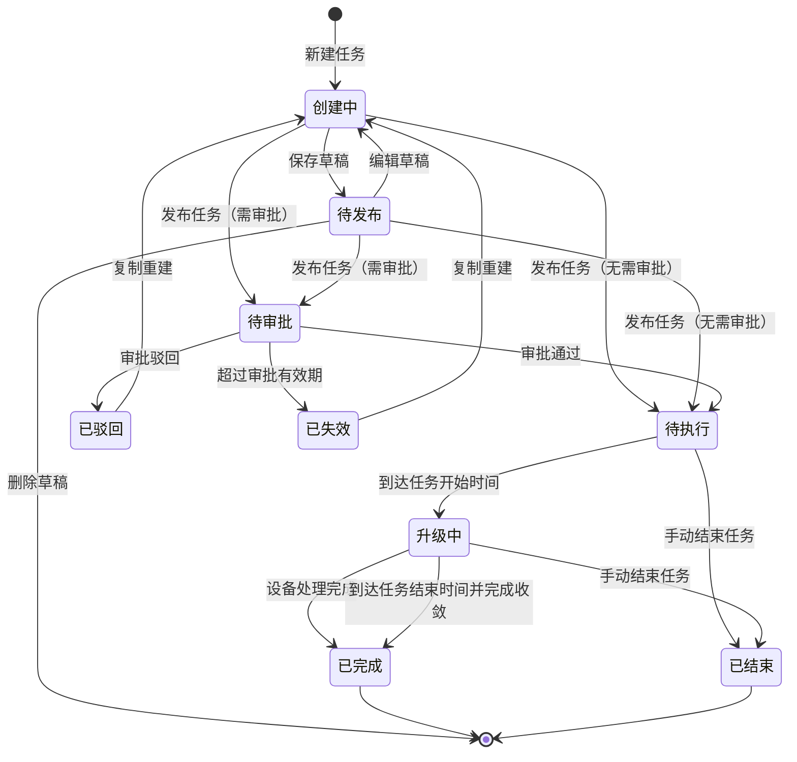

# OTA 升级任务管理优化 PRD 宣讲版

## 1. 项目背景

当前 OTA 升级任务管理链路已经具备基础创建、列表查看和详情查看能力，但在实际使用中存在三个核心问题：

- **创建流程不够顺**：新增任务步骤较多，发布结果和审批结果的反馈不够闭环，用户提交后不清楚下一步去哪里看。
- **状态和操作不够统一**：任务列表中不同状态下的展示字段、操作按钮和执行结果口径不一致，容易让用户误判任务当前阶段。
- **统计口径容易误导**：指定版本升级场景下，设备是在执行过程中动态匹配的，创建任务时无法提前得到真实设备总数。如果强行展示固定总数或固定百分比，会误导用户判断任务规模和升级进展。

本次优化目标不是重做后端执行链路，而是先把前端产品交互、状态流转、统计展示和需求说明统一起来，让产品、研发、测试能基于同一套口径推进。

## 2. 本次目标

本次需求聚焦 OTA 升级任务从创建到查看结果的完整前端闭环：

- 让用户按清晰步骤完成任务创建，减少遗漏配置。
- 让任务列表能快速看清任务状态、升级方式、目标版本、设备规模和执行结果。
- 让任务详情按“任务本身”和“升级结果”分层展示，避免信息重复。
- 明确动态匹配和固定设备清单两类统计口径，避免展示不真实的设备总数。
- 在原型中提供必要的模拟状态，方便研发和测试快速验证不同业务场景。

## 3. 需求范围

### 范围内

- 新增任务三步流程：基础信息、配置升级策略、预览发布。
- 保存草稿、提交审批、发布成功后的弹窗反馈和跳转闭环。
- 指定版本、文件导入、手动导入三种升级方式的交互优化。
- 任务列表字段、筛选、分页、列设置和不同状态下的操作按钮。
- 任务详情的任务概览、任务进度、流转明细、升级明细、异常分类和设备列表。
- 指定版本动态匹配、文件/手动导入固定清单两类统计口径。
- PRD 内容在原型中内置展示，便于研发查看需求说明。

### 范围外

- 不实现真实 OTA 下发、设备动态匹配、设备升级执行和结果回传。
- 不实现真实审批流接口。
- 不实现真实文件解析和真实设备校验。
- 不做跨大区聚合查询。
- 不做复杂报表、趋势分析和异常原因多级钻取。

## 4. 核心方案概览

本次优化围绕四个页面能力展开：

| 模块 | 优化方向 | 核心价值 |
| --- | --- | --- |
| 新增任务 | 三步创建，发布结果弹窗反馈 | 降低创建成本，保证流程闭环 |
| 任务列表 | 统一字段、状态、操作和分页 | 让用户快速定位任务和当前状态 |
| 任务详情 | 拆分任务概览和升级明细 | 让配置、流程、结果各自清晰 |
| 升级统计 | 区分动态匹配和固定清单 | 避免错误展示设备总数和百分比 |

## 5. 新增任务流程

新增任务固定为三步：

```text
基础信息 → 配置升级策略 → 预览发布
```

不再保留独立的“完成”步骤。发布后的结果通过弹窗反馈。

### 第一步：基础信息

用户需要配置：

- 任务名称
- 任务执行大区
- 目标固件版本
- 任务起止时间
- 任务升级说明

关键交互规则：

- 每个必填项未填写时，需要展示字段级错误提示。
- 任务起止时间默认从当前时间后 5 分钟开始。
- 时间快捷按钮为：未来 7 天、未来 30 天、未来 90 天。
- 任务升级说明至少 1 个有效字符，最多 500 字符，并展示字数统计。

### 第二步：配置升级策略

用户需要选择：

- 升级包类型：整包 / 差分包
- 升级方式：指定版本 / 文件导入 / 手动导入

指定版本升级不再拆分“全部版本升级、仅指定版本升级、排除指定版本不升级”。统一使用源版本表格勾选：

- 表格支持全选和单选。
- 配置升级数量为“全量”时，表格设备数展示“全量”。
- 配置升级数量为“批量”时，只允许统一输入数量，不支持对单个源版本分别输入数量。

文件导入升级：

- 用户上传设备清单。
- 上传前不默认展示预检结果。
- 上传后展示文件名、识别设备数量和上传完成状态。
- 支持重新上传。

手动导入升级：

- 最多支持 10 台设备。
- 支持逐行录入或批量粘贴。
- 录入后展示设备 ID、源版本、所属大区、校验状态、异常说明和操作。

### 第三步：预览发布

预览发布需要覆盖三种模拟场景：

| 场景 | 页面反馈 | 是否允许发布 |
| --- | --- | --- |
| 全部可升级 | 提示预检通过 | 允许发布 |
| 部分可升级 | 提示部分设备不符合发布条件，支持下载异常明细 | 允许继续发布可升级范围 |
| 不存在可升级 | 提示无法发布 OTA 升级任务 | 不允许发布 |

## 6. 发布结果弹窗闭环

发布结果不进入第 4 步，而是通过弹窗反馈。

### 保存草稿

- 提示保存成功。
- 返回任务列表。
- 任务状态为“待发布”。
- 支持再次进入编辑。

### 提交审批

- 弹窗提示任务已提交审批。
- 当前状态进入“待审批”。
- 明确说明审批通过前不会进入执行队列，也不会下发 OTA。
- 审批通过后按任务时间进入待执行或升级中。
- 审批驳回或超时失效时任务不会下发。

### 无需审批发布

- 弹窗提示任务发布成功。
- 未到开始时间时进入“待执行”。
- 到达开始时间后进入“升级中”。
- 升级结果在任务详情的升级明细中查看。

弹窗底部提供两个出口：

- 返回任务列表
- 查看任务详情

点击关闭按钮或遮罩关闭时，默认返回任务列表，保证流程闭环。

## 7. 任务列表设计

任务列表要帮助用户快速判断“这个任务是什么、现在处于什么状态、结果如何、还能做什么”。

### 查询条件

建议保留：

- 任务名称
- 任务状态
- 升级方式
- 升级包
- 创建人
- 创建时间

任务所属大区仍通过顶部大区切换，不支持跨多个大区聚合查询。

### 列表字段

建议展示：

- 名称
- 升级方式
- 升级包
- 目标版本
- 升级设备数
- 任务时间
- 执行结果
- 任务所属大区
- 状态
- 创建人
- 创建时间
- 操作

列表默认按创建时间倒序。

### 列设置

- 支持用户勾选要展示的字段。
- 勾选后即时预览。
- 操作列固定在右侧。
- 字段较多时允许横向滚动。

### 状态与操作

| 状态 | 状态含义 | 操作 |
| --- | --- | --- |
| 待发布 | 保存草稿，尚未发布 | 编辑、删除 |
| 待审批 | 已提交审批，尚未通过 | 详情 |
| 待执行 | 已通过审批或已发布，未到开始时间 | 详情 |
| 升级中 | 已到任务时间，正在执行 OTA | 详情、结束任务 |
| 已完成 | 任务周期内设备处理完成，包含失败设备 | 详情 |
| 已结束 | 用户提前手动结束任务 | 详情 |
| 已驳回 | 审批被驳回 | 详情、复制重建 |
| 已失效 | 审批超时未处理 | 详情、复制重建 |

## 8. 任务详情设计

详情页主结构调整为：

```text
任务概览 / 升级明细
```

### 任务概览

任务概览关注“任务本身”，不展示设备执行结果。

建议展示：

- 任务名称和状态标签
- 任务 ID、创建人、更新时间
- 任务说明
- 目标版本
- 任务时间
- 任务大区
- 升级方式
- 升级包
- 升级设备数
- 策略条件
- 任务进度
- 流转明细

任务进度只表达流程阶段，不表达设备升级百分比。

### 升级明细

升级明细关注“设备升级结果”。

建议展示：

- 升级概览
- 异常分类
- 设备列表
- 导出设备列表

非执行态任务进入升级明细时展示空状态，不展示设备表格。

## 9. 升级统计口径

这是本次需求最关键的口径统一点。

### 文件导入 / 手动导入

这两类任务有明确设备清单，因此设备总数是已知的。

展示口径：

- 升级设备总数
- 已处理
- 升级成功
- 升级失败
- 未处理

可以用分段进度条展示成功、失败、未处理占比。

### 指定版本全量

指定版本全量是动态匹配场景，创建任务时无法知道最终设备总数。

展示口径：

- 已匹配数
- 升级成功
- 升级失败
- 成功占比以已匹配数为分母
- 失败占比以已匹配数为分母

不展示最终总数，不展示未知总数百分比。

### 指定版本批量

指定版本批量有计划成功下发数量，但下发失败不能占用名额，系统需要持续匹配符合条件设备。

展示口径：

- 计划成功下发数量
- 已匹配数
- 升级成功
- 升级失败
- 待匹配名额

成功和失败占比仍以已匹配数为分母。

## 10. 异常分类

MVP 阶段不做复杂钻取，只做一级分类展示。

异常分类包括：

- 设备升级过程失败
- 升级前不满足条件
- 升级数量限制
- 任务和链路异常
- 移动端主动升级相关
- 设备上报失败信息

展示方式：

- 使用 ECharts 基础环形图。
- 中心展示异常总数。
- 鼠标移入图表扇区时展示分类、数量和占比。
- 右侧列表展示分类名称、数量、占比和占比条。
- 图表和右侧列表支持鼠标悬停联动。
- 支持下载异常明细。

## 11. 任务状态流转



说明：

- “创建中”是页面编辑态，不作为任务列表状态展示。
- “已完成”表示任务执行闭环完成，不代表所有设备都升级成功。
- “已结束”表示用户提前手动结束任务，不等同于审批驳回或任务失效。

## 12. 研发与测试关注点

研发重点关注：

- 状态流转和操作按钮是否与表格规则一致。
- 指定版本动态匹配不要返回或展示虚假的最终设备总数。
- 下发失败、升级失败、未处理需要区分清楚。
- 文件/手动导入场景需要按固定设备总数统计。
- 设备列表导出、异常明细下载需要做权限控制。

测试重点关注：

- 每一步必填校验是否生效。
- 保存草稿是否回到任务列表，且状态为待发布。
- 发布结果弹窗是否说明清楚后续流程。
- 不同任务状态下列表操作是否正确。
- 详情页任务概览和升级明细是否存在重复信息。
- 指定版本全量是否不展示未知总数百分比。
- 文件/手动导入是否展示固定设备总数。
- 异常分类图表和列表悬停联动是否正常。

## 13. 验收标准

- 新增任务按三步完成，不再出现独立完成步骤。
- 每一步必填项未填写时阻止进入下一步，并展示字段级提示。
- 保存草稿后返回任务列表，状态为待发布，支持二次编辑。
- 提交审批和发布成功后通过弹窗反馈，并提供返回列表和查看详情入口。
- 任务列表字段、筛选、分页、列设置可正常使用。
- 不同任务状态下操作按钮符合状态规则。
- 详情页主入口为任务概览和升级明细。
- 任务概览只展示任务配置和流转，不展示设备执行结果。
- 升级明细展示升级概览、异常分类、设备列表和导出入口。
- 指定版本全量不展示未知总数百分比。
- 文件/手动导入展示明确设备总数。
- 异常分类使用基础环形图，并支持悬停联动。

## 14. MVP 交付边界

MVP 只需要完成可验证的前端原型和明确需求口径：

- 完成新增任务三步流程。
- 完成任务列表筛选、分页、列设置和状态操作。
- 完成任务详情任务概览和升级明细。
- 完成动态匹配与固定清单两类统计口径展示。
- 完成异常分类基础环形图展示。
- 完成 PRD 在原型中的内置查看。

后续版本再接入真实接口、真实审批流、真实设备结果和异常明细数据。
