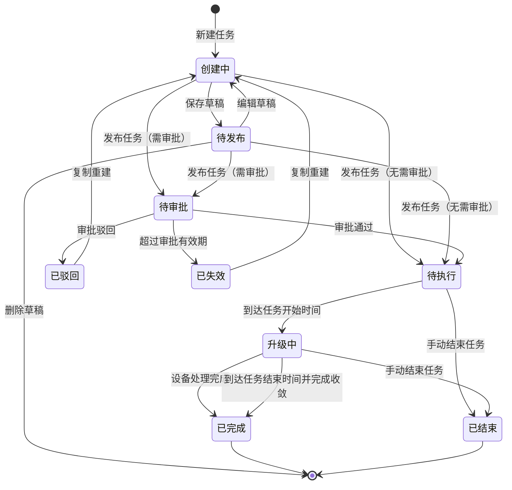

# OTA 升级任务管理优化方案宣讲稿

## 01. 封面

**主题：OTA 升级任务管理优化方案**

**聚焦范围：**

- 新增任务流程
- 任务列表管理
- 任务详情查看
- 升级统计口径
- 异常分类展示
- 需求说明内置

**宣讲目标：**

让产品、研发、测试对本次 OTA 升级任务管理优化的目标、范围、交互闭环和统计口径形成统一理解。

## 02. 为什么要做

> 核心问题：当前页面能完成基础操作，但用户很难快速判断任务当前处于什么阶段、下一步应该做什么、升级结果应该怎么看。

| 问题 | 当前表现 | 影响 |
| --- | --- | --- |
| 创建流程不够闭环 | 任务提交后反馈不明确，用户不知道去列表还是详情继续查看 | 创建完成后的去向不清晰 |
| 状态与操作不统一 | 不同状态下字段、按钮、执行结果展示口径不一致 | 用户容易误判任务当前阶段 |
| 统计口径容易误导 | 指定版本升级无法提前知道真实设备总数 | 如果展示固定总数或百分比，会造成错误理解 |
| 详情信息较分散 | 任务配置、流程、执行结果混在一起 | 用户不知道应该优先看哪里 |

**本次优化不是重做后端能力，而是先把前端交互、状态流转和统计展示口径统一起来。**

## 03. 本次优化目标

> 核心目标：让 OTA 任务从创建、审批、执行到结果查看形成清晰闭环。

- **创建任务更顺**：三步完成配置，每一步都有必填校验。
- **发布反馈更明确**：保存草稿、提交审批、发布成功都通过弹窗说明后续流程。
- **列表判断更快**：用户一眼看清任务名称、状态、目标版本、设备规模和执行结果。
- **详情分层更清楚**：任务概览看配置和流程，升级明细看执行结果。
- **统计口径更准确**：区分动态匹配和固定设备清单，避免展示虚假总数。
- **原型验证更方便**：保留状态模拟和统计口径模拟，便于研发、测试核对场景。

## 04. 本次需求范围

> 本次重点是 OTA 升级任务管理链路的前端交互、信息架构和展示口径优化。

| 模块 | 本次覆盖内容 |
| --- | --- |
| 新增任务 | 基础信息、配置升级策略、预览发布三步流程 |
| 发布反馈 | 保存草稿、提交审批、发布成功后的弹窗闭环 |
| 升级方式 | 指定版本、文件导入、手动导入三种方式 |
| 任务列表 | 查询、状态、字段、分页、列设置、操作按钮 |
| 任务详情 | 任务概览、任务进度、流转明细、升级明细 |
| 升级统计 | 动态匹配和固定清单两类统计口径 |
| 异常分类 | 一级异常分类、环形图、分类列表、异常明细下载 |
| 需求说明 | PRD 内容内置到原型，方便研发直接查看 |

## 05. 整体方案总览

> 方案主线：创建更清晰，列表更可读，详情更聚焦，统计更准确。

| 页面能力 | 优化前痛点 | 优化后方案 |
| --- | --- | --- |
| 新增任务 | 步骤割裂，提交后去向不清晰 | 三步创建，结果弹窗闭环 |
| 任务列表 | 字段和操作口径不统一 | 统一字段、状态、操作和分页 |
| 任务详情 | 配置、流程、结果混杂 | 拆分任务概览和升级明细 |
| 升级统计 | 动态设备数被当成固定总数展示 | 区分动态匹配和固定清单 |
| 异常分类 | 文本信息不够直观 | 用环形图和列表联动呈现 |

## 06. 新增任务流程

> 创建任务固定为三步，不再保留独立“完成”步骤。

```text
基础信息 → 配置升级策略 → 预览发布
```

### 第一步：基础信息

用户必须填写：

- 任务名称
- 任务执行大区
- 目标固件版本
- 任务起止时间
- 任务升级说明

关键规则：

- 每个必填项未填写时展示字段级错误。
- 任务起止时间默认从当前时间后 5 分钟开始。
- 快捷周期为未来 7 天、未来 30 天、未来 90 天。
- 任务升级说明至少 1 个有效字符，最多 500 字符，并展示字数统计。

### 第二步：配置升级策略

用户需要选择：

- 升级包类型：整包 / 差分包
- 升级方式：指定版本 / 文件导入 / 手动导入

指定版本升级统一使用源版本表格勾选，不再拆分“全部版本升级、仅指定版本升级、排除指定版本不升级”。

### 第三步：预览发布

预览发布用于让用户发布前确认任务是否可下发：

| 预检场景 | 页面反馈 | 发布动作 |
| --- | --- | --- |
| 全部可升级 | 提示预检通过 | 支持发布 |
| 部分可升级 | 提示部分设备不符合条件，支持下载异常明细 | 支持继续发布可升级范围 |
| 不存在可升级 | 提示无法发布 OTA 升级任务 | 不允许发布 |

## 07. 升级方式交互

> 三种升级方式各自服务不同业务场景，需要保持入口清晰、反馈明确。

| 升级方式 | 适用场景 | 核心交互 |
| --- | --- | --- |
| 指定版本 | 正式发版、安全补丁、灰度覆盖某些源版本 | 通过源版本表格勾选范围 |
| 文件导入 | 批量定向升级指定设备 | 上传设备清单，上传后展示文件状态和识别数量 |
| 手动导入 | 小批量灰度或单台处理 | 最多 10 台，支持逐行录入或批量粘贴 |

指定版本升级数量规则：

- 选择“全量”：表格设备数展示“全量”。
- 选择“批量”：只允许统一输入数量，不支持每个源版本单独输入。

文件导入升级规则：

- 上传前不默认展示预检结果。
- 上传后展示文件名、识别设备数量和上传完成状态。
- 支持重新上传。

手动导入升级规则：

- 最多 10 台设备。
- 展示设备 ID、源版本、所属大区、校验状态、异常说明和操作。

## 08. 发布结果闭环

> 用户完成发布动作后，必须清楚知道当前状态和下一步去向。

| 操作结果 | 进入状态 | 弹窗需要说明 |
| --- | --- | --- |
| 保存草稿 | 待发布 | 草稿已保存，可回到列表再次编辑 |
| 提交审批 | 待审批 | 审批通过前不会进入执行队列，也不会下发 OTA |
| 无需审批发布 | 待执行 / 升级中 | 未到开始时间为待执行，到达时间后进入升级中 |

弹窗底部提供两个明确出口：

- 返回任务列表
- 查看任务详情

关闭按钮或点击遮罩时，默认返回任务列表，避免用户停留在已完成提交的创建页。

## 09. 任务列表优化

> 任务列表要回答五个问题：任务是什么、当前什么状态、升级多少设备、结果如何、还能做什么。

### 查询条件

建议保留：

- 任务名称
- 任务状态
- 升级方式
- 升级包
- 创建人
- 创建时间

任务所属大区仍通过顶部大区切换查看。

### 列表字段

建议展示：

- 名称
- 升级方式
- 升级包
- 目标版本
- 升级设备数
- 任务时间
- 执行结果
- 任务所属大区
- 状态
- 创建人
- 创建时间
- 操作

列表默认按创建时间倒序。

### 列设置

- 支持勾选展示字段。
- 勾选后即时预览。
- 操作列固定在右侧。
- 字段较多时允许横向滚动。

## 10. 任务状态与操作

> 每个状态都必须有明确含义和明确操作。

| 状态 | 状态含义 | 操作 |
| --- | --- | --- |
| 待发布 | 保存草稿，尚未发布 | 编辑、删除 |
| 待审批 | 已提交审批，尚未通过 | 详情 |
| 待执行 | 已通过审批或已发布，未到开始时间 | 详情 |
| 升级中 | 已到任务时间，正在执行 OTA | 详情、结束任务 |
| 已完成 | 任务周期内设备处理完成，包含失败设备 | 详情 |
| 已结束 | 用户提前手动结束任务 | 详情 |
| 已驳回 | 审批被驳回 | 详情、复制重建 |
| 已失效 | 审批超时未处理 | 详情、复制重建 |

关键说明：

- “已完成”不代表所有设备都升级成功，只代表任务执行闭环完成。
- “已结束”表示用户主动提前结束，不等同于审批驳回或任务失效。

## 11. 任务详情优化

> 详情页要分清楚“任务本身”和“升级结果”。

详情页主结构：

```text
任务概览 / 升级明细
```

### 任务概览

任务概览关注任务配置和流程，不展示设备执行结果。

建议展示：

- 任务名称和状态标签
- 任务 ID、创建人、更新时间
- 任务说明
- 目标版本
- 任务时间
- 任务大区
- 升级方式
- 升级包
- 升级设备数
- 策略条件
- 任务进度
- 流转明细

### 升级明细

升级明细关注设备升级结果。

建议展示：

- 升级概览
- 异常分类
- 设备列表
- 导出设备列表

非执行态任务进入升级明细时展示空状态，不展示设备表格。

## 12. 升级统计口径

> 这是本次需求的关键点：不能把动态匹配设备数当成固定设备总数。

| 场景 | 设备总数是否已知 | 展示口径 |
| --- | --- | --- |
| 文件导入 | 已知 | 设备总数、已处理、成功、失败、未处理 |
| 手动导入 | 已知 | 设备总数、已处理、成功、失败、未处理 |
| 指定版本全量 | 未知，执行中动态匹配 | 已匹配数、成功数、失败数 |
| 指定版本批量 | 有计划数量，但设备仍动态匹配 | 计划数量、已匹配数、成功数、失败数、待匹配名额 |

指定版本全量：

- 不展示最终设备总数。
- 不展示未知总数百分比。
- 成功占比和失败占比以已匹配数为分母。

指定版本批量：

- 下发失败不占用匹配名额。
- 系统需要继续匹配符合条件设备。
- 成功和失败占比仍以已匹配数为分母。

## 13. 异常分类展示

> MVP 阶段只做一级异常分类，先保证用户能看懂失败主要集中在哪里。

一级分类：

- 设备升级过程失败
- 升级前不满足条件
- 升级数量限制
- 任务和链路异常
- 移动端主动升级相关
- 设备上报失败信息

展示方式：

- 使用 ECharts 基础环形图。
- 中心展示异常总数。
- 鼠标移入图表扇区时展示分类、数量和占比。
- 右侧列表展示分类名称、数量、占比和占比条。
- 图表和右侧列表支持悬停联动。
- 支持下载异常明细。

## 14. 任务状态流转

> 状态流转要保证从创建、审批、执行到结束都有闭环。



说明：

- “创建中”是页面编辑态，不作为任务列表状态展示。
- “待发布”对应保存草稿后的列表状态。
- “已完成”包含升级成功和升级失败设备。
- “已结束”表示用户提前手动结束任务。

## 15. 研发关注点

> 研发实现时重点保证状态、字段和统计口径一致。

- 状态流转和操作按钮必须与状态规则一致。
- 指定版本动态匹配不要返回或展示虚假的最终设备总数。
- 下发失败、升级失败、未处理需要区分清楚。
- 文件导入和手动导入按固定设备清单统计。
- 设备列表导出和异常明细下载需要做权限控制。
- 原型中的状态模拟和统计口径模拟仅用于验证，生产环境不展示。

## 16. 测试关注点

> 测试重点验证流程闭环、状态展示和统计口径。

- 每一步必填校验是否生效。
- 保存草稿是否回到任务列表，且状态为待发布。
- 发布结果弹窗是否说明清楚后续流程。
- 不同任务状态下列表操作是否正确。
- 详情页任务概览和升级明细是否存在重复信息。
- 指定版本全量是否不展示未知总数百分比。
- 文件导入和手动导入是否展示固定设备总数。
- 异常分类图表和列表悬停联动是否正常。

## 17. 验收标准

> 验收时只看关键闭环和关键口径，不纠结非核心展示细节。

- 新增任务按三步完成，不再出现独立完成步骤。
- 每一步必填项未填写时阻止进入下一步，并展示字段级提示。
- 保存草稿后返回任务列表，状态为待发布，支持二次编辑。
- 提交审批和发布成功后通过弹窗反馈，并提供返回列表和查看详情入口。
- 任务列表字段、筛选、分页、列设置可正常使用。
- 不同任务状态下操作按钮符合状态规则。
- 详情页主入口为任务概览和升级明细。
- 任务概览只展示任务配置和流转，不展示设备执行结果。
- 升级明细展示升级概览、异常分类、设备列表和导出入口。
- 指定版本全量不展示未知总数百分比。
- 文件导入和手动导入展示明确设备总数。
- 异常分类使用基础环形图，并支持悬停联动。

## 18. MVP 交付边界

> MVP 先完成可验证的前端原型和明确需求口径。

| 阶段 | 交付重点 |
| --- | --- |
| MVP | 新增任务、任务列表、任务详情、统计口径、异常分类、PRD 内置说明 |
| 后续版本 | 接入真实接口、真实审批流、真实设备结果和异常明细数据 |

MVP 验证通过后，再进入真实接口联调和后端能力建设。
