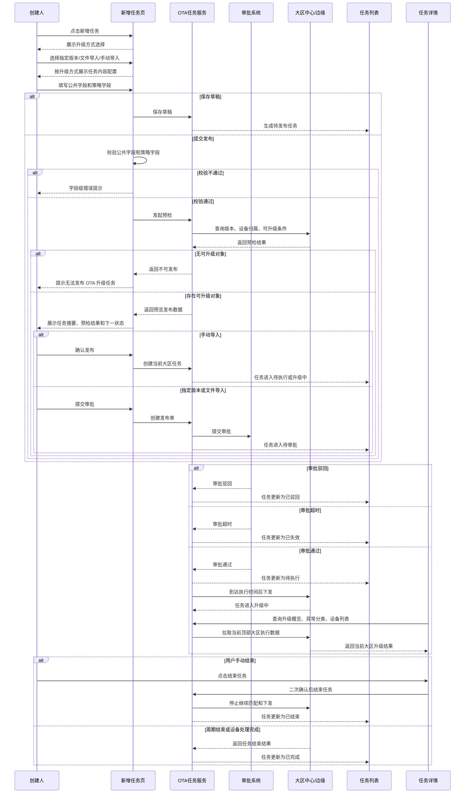

# OTA 升级任务管理优化 PRD

## 01. 本次需求范围

本次需求聚焦 OTA 升级任务从创建到执行复盘的完整业务链路闭环。

| 范围 | 内容 |
| --- | --- |
| 新增任务 | 选择升级方式、配置任务内容、预览发布、保存草稿、提交发布 |
| 升级方式 | 指定版本、文件导入、手动导入 |
| 跨大区能力 | 当前版本仅指定版本支持跨大区同步下发 |
| 任务列表 | 状态展示、字段展示、筛选、列设置、分页、状态操作 |
| 任务详情 | 任务概览、升级明细、异常分类、设备列表、流转明细 |
| 中国区详情 | 展示中国大区下子节点升级统计 |

## 02. 方案结论

新增任务采用“策略前置”的三步向导：

```text
选择升级方式 -> 配置任务内容 -> 预览发布
```

原因是升级方式会决定后续字段、跨大区能力、审批流转、设备数口径和详情展示方式。

| 能力 | 当前版本方案 | 设计原因 |
| --- | --- | --- |
| 指定版本 | 支持当前大区，也支持跨大区同步 | 适合正式发版、安全补丁、多大区同策略发布 |
| 文件导入 | 仅支持当前顶部大区 | 文件清单跨大区拆分和多中心校验复杂，MVP 不做 |
| 手动导入 | 仅支持当前顶部大区，最多 10 台 | 适合灰度测试和单台处理，跨大区收益低 |
| 审批 | 指定版本、文件导入需审批；手动导入无需审批 | 在效率和风险控制之间保持 MVP 边界 |
| 跨大区详情 | 不做多大区汇总详情 | 当前架构按顶部大区查询，不支持跨中心统一汇总 |
| 中国区详情 | 展示中国子节点统计 | 中国大区包含多个子节点，需要更细颗粒度定位问题 |

关键业务前提：

- 各大区升级包保持一致，不存在跨大区升级包不可用的常规场景。
- 跨大区同步正常情况下会成功生成各大区本地任务。
- 系统异常仅作为后台日志和兜底提示，不在 MVP 原型中展开复杂重试流程。

## 03. 创建任务设计

### 3.1 三步向导

| 步骤 | 页面目标 | 关键展示 |
| --- | --- | --- |
| 选择升级方式 | 先确定策略分支 | 指定版本 / 文件导入 / 手动导入卡片，展示跨大区、审批、设备数口径 |
| 配置任务内容 | 按策略动态展示字段 | 基础信息中的任务下发范围 + 当前策略配置项 |
| 预览发布 | 确认预检与流转 | 任务摘要、预检结果、异常处理、审批规则、下一状态 |

### 3.2 公共字段

| 字段 | 要求 |
| --- | --- |
| 任务名称 | 必填，1-64 个字符，不允许只输入空格 |
| 任务下发范围 | 必选；指定版本可选择当前大区任务或跨大区同步任务；文件导入和手动导入只读展示当前顶部大区 |
| 目标固件版本 | 必选，只能选择已上架或已生成升级包版本 |
| 升级包 | 整包 / 差分包 |
| 任务时间 | 必填，开始时间不得早于当前时间，默认当前时间后 5 分钟 |
| 任务升级说明 | 必填，1-500 个有效字符，展示字数统计 |

### 3.3 大区选择口径

| 概念 | 用途 | 规则 |
| --- | --- | --- |
| 顶部大区 | 系统查询上下文 | 任务列表和任务详情只展示当前顶部大区结果 |
| 任务范围 | 指定版本的下发类型 | 在基础信息中选择当前大区任务或跨大区同步任务；文件导入和手动导入固定为当前大区任务 |
| 当前大区执行范围 | 当前大区任务的实际覆盖范围 | 只能在当前顶部大区内选择；中国区可选择全部中国或杭州、杭州低功耗、深圳、成都、上海（宠物）等子节点 |
| 同步目标大区 | 指定版本跨大区同步的目标范围 | 只选择父级大区：中国 / 香港 / 法兰福克 / 硅谷；选择“中国”代表覆盖全部中国子节点 |
| 策略条件地区 | 对当前大区执行范围的进一步过滤 | 只能从当前大区执行范围内选择，不能扩大到执行范围之外；当前大区执行范围为“中国全部”时，可继续选择中国子节点作为过滤条件 |

关键规则：

- 顶部大区决定列表、详情和当前大区任务的查询上下文。
- 任务下发范围放在基础信息中统一决策，升级配置不再二次选择当前大区或跨大区。
- 指定版本选择当前大区任务时，继续选择当前大区执行范围；不能选择其他顶部大区的数据范围。
- 指定版本选择跨大区同步任务时，选择同步目标父级大区，并在页面、预览、列表和详情展示“跨大区同步”标签。
- 文件导入和手动导入仅支持当前顶部大区，任务下发范围展示为只读当前顶部大区。
- 跨大区同步创建时不选择中国子节点；中国子节点只用于中国当前大区任务范围和详情复盘。
- 当前大区执行范围选择父级“全部”时，策略条件地区可在该父级大区下继续收窄；若当前大区执行范围已选择具体子节点，策略条件地区只能从这些子节点内选择。

### 3.4 草稿规则

- 选择升级方式后允许保存草稿。
- 草稿进入列表状态为“待发布”。
- 待发布任务支持编辑和删除。
- 草稿再次编辑时回到对应升级方式的配置链路。
- 切换升级方式时，仅保留公共任务信息，策略私有配置按新方式重新配置。

## 04. 任务状态定义

| 状态 | 触发条件 | 用户关注点 | 操作 |
| --- | --- | --- | --- |
| 待发布 | 保存草稿，未提交发布 | 配置是否完整，是否继续编辑 | 编辑、删除 |
| 待审批 | 指定版本或文件导入提交发布后 | 审批是否通过 | 详情 |
| 待执行 | 审批通过或手动导入发布成功，未到开始时间 | 执行窗口、目标版本、下发范围 | 详情 |
| 升级中 | 到达执行时间，任务开始匹配并下发 | 已匹配、成功、失败、异常占比 | 详情、结束任务 |
| 已完成 | 执行周期结束，或纳入范围设备均已处理 | 最终成功数、失败数、异常原因 | 详情、复制重建 |
| 已结束 | 用户提前结束任务 | 结束前已处理结果、结束人、结束时间 | 详情、复制重建 |
| 已驳回 | 审批被驳回 | 驳回原因、审批人 | 详情、复制重建 |
| 已失效 | 审批超时或任务过了可执行窗口 | 失效原因、失效时间 | 详情、复制重建 |

## 05. 完整生命周期 UML 时序图



## 06. 指定版本流程

### 6.1 当前大区

```text
选择指定版本
 -> 配置公共字段
 -> 选择当前大区任务
 -> 选择当前大区执行范围
 -> 选择目标版本和升级包
 -> 勾选源版本表格
 -> 配置全量或批量
 -> 预览发布
 -> 提交审批
 -> 审批通过后按时间窗口执行
 -> 详情展示已匹配、成功、失败和异常分类
```

关键规则：

- 创建阶段不展示真实设备总数。
- 全量展示“全量”。
- 批量展示统一配置的 `N 台`。
- 执行中展示已匹配数，成功和失败占比按已匹配设备计算。

### 6.2 跨大区同步

```text
选择指定版本
 -> 在基础信息中选择跨大区同步任务
 -> 勾选同步目标父级大区：中国 / 香港 / 法兰福克 / 硅谷
 -> 配置统一任务信息、目标版本、升级包、源版本范围和数量规则
 -> 统一预览
 -> 提交统一审批
 -> 审批通过后生成各大区本地任务
 -> 用户切换顶部大区查看对应大区任务
```

关键规则：

- 当前版本仅指定版本支持跨大区同步。
- 跨大区同步是指定版本的任务下发范围选项，和当前大区任务在基础信息中二选一。
- 跨大区只选择父级大区，不选择中国子节点。
- 跨大区同步任务需展示“跨大区同步”标签；列表展示同步批次标识，详情展示同步批次 ID、同步目标大区和当前本地任务大区。
- 升级包各大区一致，不做大区升级包差异展示。
- 跨大区批量数量按“每个目标大区各自执行该数量”理解，不做跨大区总量汇总。
- 任务列表和详情仍按顶部大区查看，不做跨大区统一汇总。
- 中国区详情展示杭州、杭州低功耗、深圳、成都、上海（宠物）节点统计。

## 07. 文件导入流程

```text
选择文件导入
 -> 配置公共字段
 -> 上传设备清单
 -> 系统清洗、去重、校验设备
 -> 非当前大区设备进入异常
 -> 版本前三位不一致进入异常
 -> 已是目标版本进入异常
 -> 存在可升级设备时允许预览发布
 -> 提交审批
 -> 审批通过后在当前大区执行
```

关键规则：

- 文件导入当前不支持跨大区同步。
- 非当前大区设备进入异常明细，不拆分到其他大区。
- 文件导入有明确设备清单，因此升级概览展示设备总数、成功数、失败数和未完成数。
- 支持下载异常明细和导出设备列表。

## 08. 手动导入流程

```text
选择手动导入
 -> 配置公共字段
 -> 输入设备 ID，最多 10 台
 -> 系统查询设备归属和源版本
 -> 非当前大区设备进入异常
 -> 版本不匹配或已是目标版本进入异常
 -> 存在可升级设备时允许发布
 -> 发布后进入待执行或升级中
```

关键规则：

- 手动导入当前不支持跨大区同步。
- 最多 10 台，适合灰度测试或单台处理。
- 手动导入无需审批。
- 非当前大区设备提示切换到设备所属大区创建。

## 09. 中国区详情颗粒度流程

```text
切换顶部大区为中国
 -> 进入任务详情
 -> 查看中国整体升级概览
 -> 查看中国子节点统计
 -> 选择杭州 / 杭州低功耗 / 深圳 / 成都 / 上海（宠物）
 -> 按子节点查看升级概览、异常分类和设备列表
```

关键规则：

- 跨大区创建时选择“中国”即覆盖全部中国子节点。
- 当前版本不支持在跨大区任务中细选中国子节点。
- 子节点用于详情查看和问题定位，不作为跨大区创建范围。

## 10. 列表页承接规则

任务列表只展示当前顶部大区下的任务。来自跨大区同步的任务，在对应大区列表中展示为本地任务，并带同步批次标识。

| 字段 | 展示规则 |
| --- | --- |
| 名称 | 展示任务名称 |
| 任务大区 | 展示当前任务所属大区 |
| 升级方式 | 指定版本 / 文件导入 / 手动导入 |
| 升级包 | 整包 / 差分包 |
| 目标版本 | 展示目标固件版本号 |
| 升级设备总数 | 指定版本全量展示“全量”；批量、文件导入、手动导入展示 `N 台` |
| 执行结果 | 展示成功数、失败数和占比 |
| 任务状态 | 展示状态标签 |
| 创建人 | 单独一列展示 |
| 创建时间 | 按最新创建时间倒序排序 |
| 操作 | 按状态展示可用操作 |

## 11. 详情页承接规则

详情页按“当前顶部大区”展示数据，不展示跨大区统一汇总。

| 模块 | 展示内容 |
| --- | --- |
| 顶部任务概览 | 任务名称、状态、任务 ID、创建人、创建时间、目标版本、升级方式、升级包、任务说明 |
| 当前链路节点 | 当前状态、下一步、流转规则 |
| 升级明细 | 升级概览、异常分类图表、设备列表、导出设备列表 |
| 流转明细 | 创建、提交、审批、执行、结束/完成时间线 |

不同策略数据口径：

| 策略 | 详情口径 |
| --- | --- |
| 指定版本全量 | 展示已匹配、成功、失败，不展示未知总数百分比 |
| 指定版本批量 | 展示计划数量、已匹配、成功、失败、剩余匹配名额 |
| 文件导入 | 展示设备总数、成功、失败、未完成 |
| 手动导入 | 展示设备总数、成功、失败、未完成 |

## 12. 异常与边界场景

| 场景 | 处理规则 |
| --- | --- |
| 未选择升级方式保存草稿 | 不允许保存，提示先选择升级方式 |
| 保存草稿但必填项未完整 | 允许保存为待发布，提交发布时必须校验完整 |
| 切换升级方式 | 保留公共任务信息，策略私有配置重新配置 |
| 提交发布必填项缺失 | 停留当前步骤，展示字段级错误提示 |
| 过去时间 | 不可选择，默认选中当前时间后 5 分钟 |
| 任务下发范围 | 指定版本可在基础信息中选择当前大区任务或跨大区同步任务；文件/手动导入只读当前顶部大区 |
| 当前大区任务选择执行范围 | 只能选择当前顶部大区及子节点，不允许选择其他父级大区 |
| 跨大区同步选择目标大区 | 只展示父级大区，不展示中国子节点，并展示“跨大区同步”标签 |
| 策略条件地区 | 只能在当前大区执行范围内进一步收窄，不能扩大执行范围；执行范围为父级全部时可选择其子节点 |
| 指定版本全量 | 创建阶段不查询真实设备总数，执行中逐步展示已匹配数 |
| 指定版本批量 | 只支持统一数量；跨大区时每个目标大区各自按该数量执行 |
| 文件中存在非当前大区设备 | 进入异常明细，不拆分到其他大区 |
| 手动导入非当前大区设备 | 进入异常，并提示切换设备所属大区创建 |
| 跨大区系统异常 | 作为系统异常兜底提示和日志记录，不作为产品主流程 |
| 中国区查看详情 | 展示中国整体和子节点统计 |

## 13. 用户故事

### US-01 创建任务草稿

- **作为** OTA 任务创建人
- **我希望** 先选择升级方式并保存草稿
- **以便** 后续从任务列表继续编辑对应策略任务。

验收标准：

- **Given** 用户进入新增任务页
- **When** 用户选择升级方式并点击保存草稿
- **Then** 系统生成待发布任务并返回任务列表
- **And** 待发布任务支持编辑和删除

### US-02 指定版本跨大区同步

- **作为** OTA 任务创建人
- **我希望** 对多个父级大区使用同一版本策略发起同步任务
- **以便** 减少重复创建并保证配置一致。

验收标准：

- **Given** 用户选择指定版本
- **When** 用户选择跨大区同步并勾选目标大区
- **Then** 系统提交统一审批
- **And** 审批通过后分别生成各大区本地任务
- **And** 列表和详情仅展示当前顶部大区结果

### US-03 文件导入发布

- **作为** OTA 任务创建人
- **我希望** 上传设备清单进行定向升级
- **以便** 对明确设备集合下发升级任务。

验收标准：

- **Given** 用户选择文件导入
- **When** 用户上传设备清单
- **Then** 系统展示导入总数、可升级数和异常数
- **And** 非当前大区设备进入异常明细
- **And** 存在可升级设备时允许提交审批

### US-04 手动导入发布

- **作为** OTA 任务创建人
- **我希望** 手动输入少量设备 ID 并实时校验
- **以便** 快速完成灰度测试或单台处理。

验收标准：

- **Given** 用户选择手动导入
- **When** 用户输入设备 ID
- **Then** 系统展示设备 ID、源版本、所属大区、校验状态和异常说明
- **And** 设备数量最多 10 台
- **And** 存在可升级设备时允许发布且无需审批

### US-05 任务详情复盘

- **作为** OTA 任务使用者、产品或研发
- **我希望** 在详情页集中查看状态、流转、升级结果和异常分类
- **以便** 判断升级效果并定位异常原因。

验收标准：

- **Given** 用户从列表进入任务详情
- **When** 用户查看任务概览、升级明细和流转明细
- **Then** 页面按当前顶部大区展示任务数据
- **And** 跨大区同步任务展示同步批次提示和中国区子节点统计

## 14. 测试验收标准

### 14.1 新增任务验收

| 验收点 | 标准 |
| --- | --- |
| 步骤流程 | 新增任务按选择升级方式、配置任务内容、预览发布三步完成 |
| 策略前置 | 第一步展示三种升级方式及跨大区、审批、设备数口径差异 |
| 任务下发范围 | 基础信息中统一展示范围决策；指定版本可选当前大区任务或跨大区同步任务，文件/手动导入只读当前顶部大区 |
| 大区口径 | 当前大区任务选择当前顶部大区内执行范围；跨大区同步只选择父级目标大区；文件/手动导入执行范围只读当前顶部大区 |
| 策略条件地区 | 只能基于当前大区执行范围收窄；选择父级全部时可继续选择其子节点，选择具体子节点时不得超出已选子节点 |
| 必填校验 | 提交发布时校验任务名称、任务下发范围、目标版本、任务时间、任务说明、升级包和策略字段 |
| 草稿 | 选择升级方式后允许保存草稿，状态为待发布 |
| 发布结果 | 提交发布后通过弹窗说明当前状态和后续流程 |

### 14.2 策略配置验收

| 升级方式 | 验收点 | 标准 |
| --- | --- | --- |
| 指定版本 | 跨大区 | 仅指定版本支持跨大区同步 |
| 指定版本 | 源版本选择 | 使用表格勾选源版本 |
| 指定版本 | 全量 | 展示“全量” |
| 指定版本 | 批量 | 仅支持统一输入数量 |
| 文件导入 | 上传后 | 展示文件名、上传完成状态、导入总数、可升级数、异常数 |
| 文件导入 | 异常 | 非当前大区设备进入异常明细 |
| 手动导入 | 数量 | 最多 10 台 |
| 手动导入 | 审批 | 无需审批，发布后进入待执行或升级中 |

### 14.3 详情页验收

| 验收点 | 标准 |
| --- | --- |
| 当前链路节点 | 展示当前状态、下一步和流转规则 |
| 顶部任务概览 | 展示任务名称、状态、任务 ID、创建人、时间、目标版本、方式、升级包、说明 |
| 升级明细 | 展示升级概览、异常分类图表、设备列表 |
| 跨大区提示 | 提示当前仅展示顶部大区结果 |
| 中国区详情 | 展示中国整体和子节点统计 |

## 15. 原型自测清单

| 自测类型 | 检查内容 |
| --- | --- |
| 代码可用性 | `app.js` 无语法错误，页面入口可加载 |
| 文案覆盖 | 原型包含关键状态、升级方式、字段名称和异常提示 |
| 交互覆盖 | 新增任务、保存草稿、发布弹窗、列表筛选、详情切换、导出、结束任务均有交互 |
| 状态覆盖 | 待发布、待审批、待执行、升级中、已完成、已结束、已驳回、已失效均可展示 |
| 策略覆盖 | 指定版本、文件导入、手动导入均可切换查看 |
| 跨大区覆盖 | 指定版本可体现跨大区同步；文件/手动不支持跨大区 |
| 响应式覆盖 | 大屏、中屏、小屏下表单、列表、详情无明显溢出 |
