# OTA 升级任务管理优化 — 上线操作指南

## 文档修订记录

| **修订时间** | **修订描述** | **修订人** | **文档版本** |
| --- | --- | --- | --- |
| 2026-06-30 | 优化长流程图展示格式，将创建、策略、导入和明细流程改为横向分段样式 | 产品团队 | v1.4 |
| 2026-06-30 | 检查并优化操作路径、状态流转和高风险口径，补充重点关注提示框 | 产品团队 | v1.3 |
| 2026-06-30 | 优化新旧版本迭代对比设计图，补充短期迭代功能、旧版问题和解决效果说明 | 产品团队 | v1.2 |
| 2026-06-30 | 补充上线审查缺口、高风险口径、核心页面截图，并将流程图统一调整为 Mermaid 图源码口径 | 产品团队 | v1.1 |
| 2026-06-29 | 新建本期上线操作指南，覆盖 OTA 升级任务创建、分发、列表、详情和结束任务相关变化 | 产品团队 | v1.0 |

---

## 1 背景信息

本期 OTA 升级任务管理优化主要面向多大区升级场景，目标是减少重复创建任务的操作成本，统一不同升级方式的分发规则，并让运维和测试人员可以在详情页按分区复盘执行结果。

本期优化不改变 OTA 升级的基础目标：用户仍然需要选择固件版本、升级包、任务时间和升级方式，并在发布前确认升级范围和风险。变化集中在以下方面：

* **创建链路调整**：新增任务统一按“基本任务、策略配置、预览发布”三步完成。
* **分发规则调整**：文件导入和手动导入由系统按设备所属大区自动分发；指定版本仍由用户选择指定分发范围。
* **列表口径调整**：任务列表展示全部任务，不再依赖全局区域入口。
* **详情复盘调整**：升级明细按指定分发范围或设备所属大区查看，不提供跨分区的统一设备明细入口。
* **结束任务调整**：升级中任务结束后先进入“中止中”，等待已下发设备回执或超时收敛后进入“已结束”。

---

## 2 本期变化概览

| **变化项** | **本期上线后的操作口径** | **对运维/测试的影响** |
| --- | --- | --- |
| 新增任务流程 | 按基本任务、策略配置、预览发布三步完成 | 创建路径更清晰，草稿可回到保存步骤继续编辑 |
| 文件导入升级 | 创建时不选择大区，上传设备清单后由系统识别设备所属大区 | 只需关注设备清单、可升级数和异常原因 |
| 手动导入升级 | 创建时不选择大区，最多录入 10 台设备，发布后自动按设备所属大区执行 | 适合小范围验证和临时定向升级 |
| 指定版本升级 | 创建时必须选择指定分发范围，可多选父级大区或中国子节点 | 适合按版本和范围动态圈选设备 |
| 任务列表 | 展示全部任务，列表不展示区域列 | 通过任务名称、升级方式、状态等字段定位任务 |
| 升级明细 | 指定版本按分发范围查看；文件/手动按设备所属大区查看 | 当前分区的概览、异常、设备列表和导出保持一致 |
| 结束任务 | 仅升级中任务可结束，结束后进入中止中 | 需等待已下发设备产生最终结果或超时收敛 |

**注意**：本期上线后，设备所属大区主要用于系统自动分发和详情复盘，不再作为文件导入、手动导入创建时的人工选择项。

### 2.1 上线前必须确认的高风险口径

以下内容是本次上线操作指南的硬口径，培训、验收、测试用例和页面文案不得混用旧规则。

| **风险点** | **本指南采用的上线口径** | **容易出错的写法** |
| --- | --- | --- |
| 结束任务 / 中止中 | 仅 **升级中** 任务可结束；确认后进入 **中止中**，系统停止新增匹配和新增下发，已下发设备继续回传最终结果，收敛后进入 **已结束**。 | 写成“待执行可结束”；或同时写“已下发设备继续完成”和“待升级/升级中设备直接置失败”两套互斥规则。 |
| 差分升级 | 差分升级仅在设备所属产线支持、目标版本和基线版本已生成可用差分包、设备当前版本严格匹配差分基线时可用；不确定时优先改用整包。 | 只写“选择差分包即可升级”，忽略产线、基线版本和差分包状态。 |
| 文件/手动导入大区 | 创建时不选择大区；系统按设备 ID 识别设备所属大区并自动分发。设备所属大区只用于自动分发和详情复盘展示。 | 继续要求用户选择任务所属大区，或提示“设备不属于当前大区，请切换大区创建”。 |
| 指定版本分发范围 | 指定版本是动态匹配任务，必须选择指定分发范围；单批下发数量和任务最大下发数量对整个任务生效，不按分发范围分别乘算。 | 把每个大区都按单批数量单独计算，导致实际下发量被放大。 |
| 策略条件 | 策略条件是可选业务匹配条件，不作为大区校验过滤；即使条件项选择地区，也不等同于任务大区拦截。 | 把“地区条件”写成“设备所属大区必须匹配”的发布拦截。 |
| 升级明细与导出 | 明细按当前分区 tab 展示和导出；指定版本按分发范围，文件/手动按设备所属大区，不提供跨分区统一设备明细入口。 | 提供“全部大区设备明细”或把当前 tab 导出误写成全量导出。 |
| 明细查询异常 | 边缘明细查询异常不等于设备升级失败；页面应提示查询异常，并保留已获取统计或引导稍后刷新。 | 把接口查询失败计入升级失败设备数。 |

### 2.2 核心页面截图清单

流程图统一使用 Mermaid 图源码描述，页面截图用于帮助运维、测试和审批人员识别真实页面控件。截图文件统一存放在 `docs/assets/screenshots/`，每张截图均需能看到对应页面的关键字段、按钮、状态和风险提示。

| **截图编号** | **截图** | **落图章节** | **必须露出的页面核心内容** |
| --- | --- | --- | --- |
| S01 | 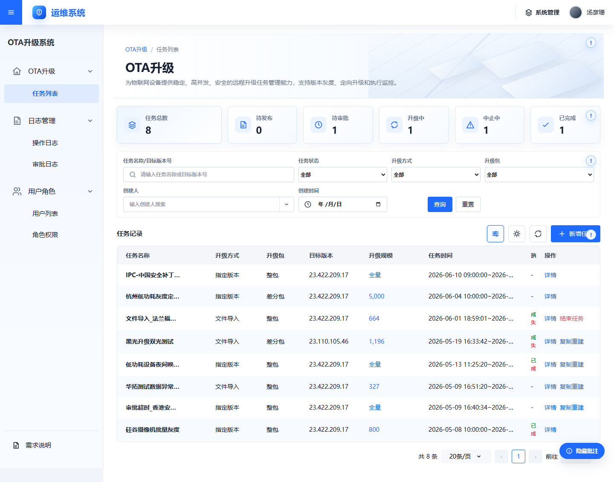 | 5 查看升级任务列表 | 左侧 **OTA 升级 > 任务列表** 入口、筛选区、任务表格、状态标签、操作列；列表不得出现“任务所属大区”列。 |
| S02 | 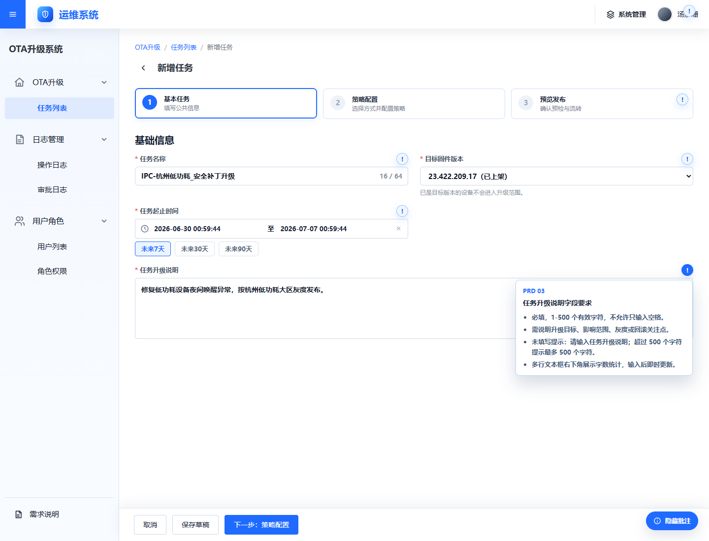 | 6.2 第一步：基本任务 | 三步条中的 **基本任务**、任务名称、目标固件版本、升级包、任务时间、任务升级说明、保存草稿和下一步按钮；页面不得出现大区选择控件。 |
| S03 | 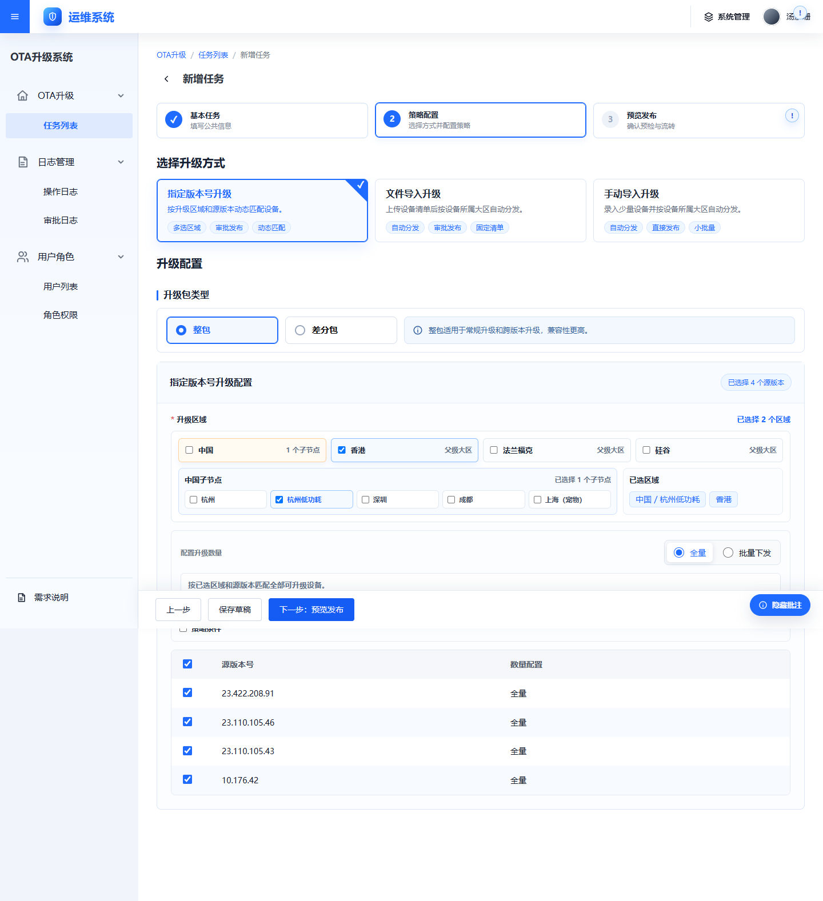 | 7.1 指定版本升级 | **指定版本** 方式、指定分发范围、中国父级/子节点、多选范围、源版本、全量/批量、单批下发数量、任务最大下发数量、策略条件入口。 |
| S04 | 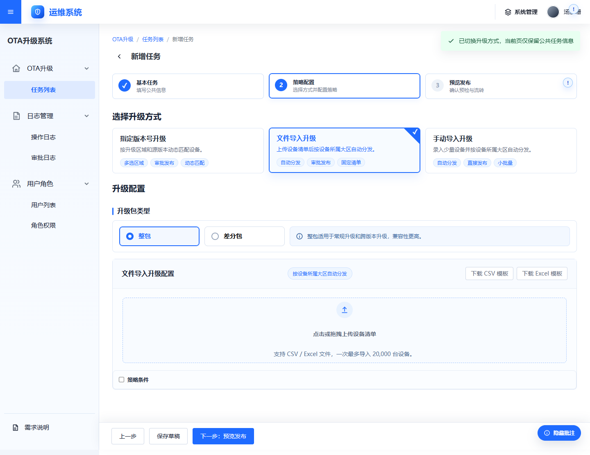 | 7.2 文件导入升级 | **文件导入** 方式、上传区域、模板/格式提示、导入总数、去重后数量、可升级数、异常数、设备所属大区展示或自动分发提示。 |
| S05 | 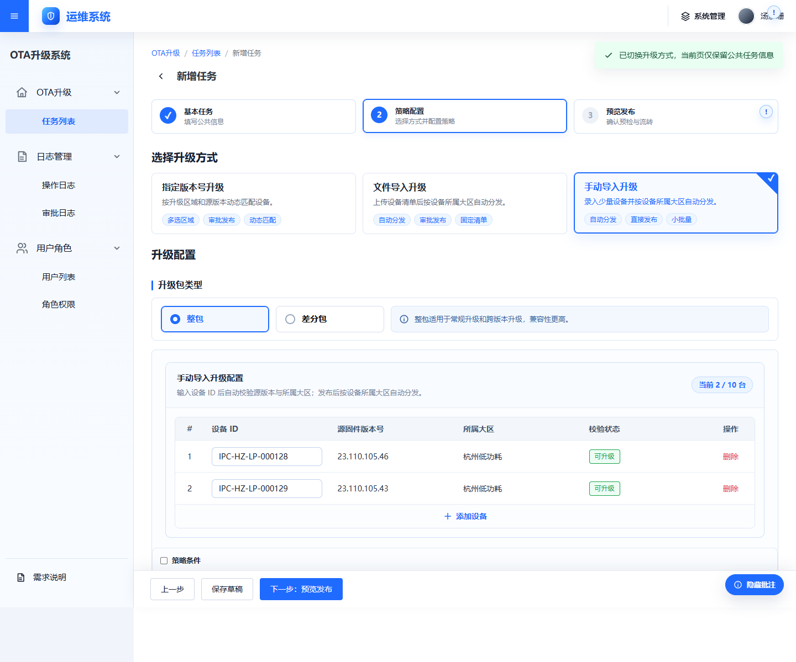 | 7.3 手动导入升级 | **手动导入** 方式、设备 ID 输入区、最多 10 台提示、校验按钮、源版本、设备所属大区、校验状态、异常原因。 |
| S06 | 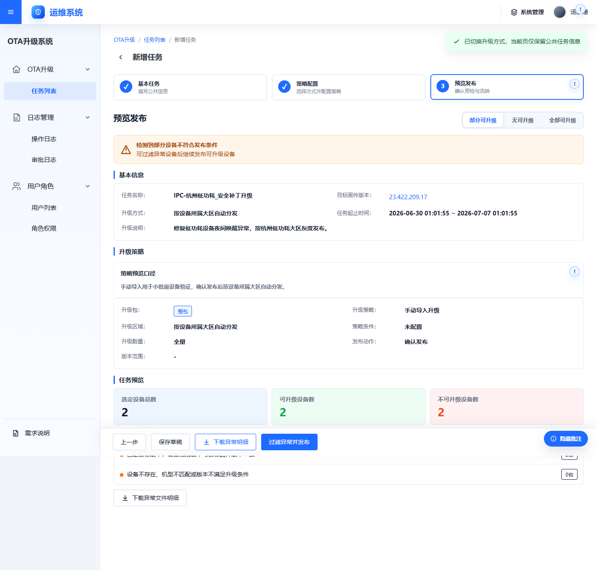 | 8 任务配置预览与发布 | 基本信息摘要、策略信息、设备规模、异常明细、策略条件、提交审批或确认发布按钮。 |
| S07 | 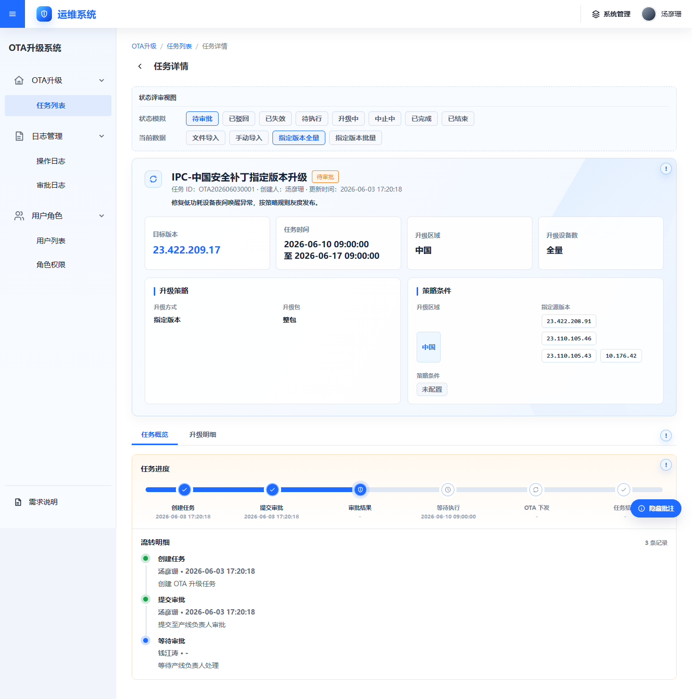 | 9 查看任务详情与升级明细 | 任务详情页头部、状态标签、任务概览、策略信息、审批/执行流转记录、结束任务或复制重建按钮展示规则。 |
| S08 | 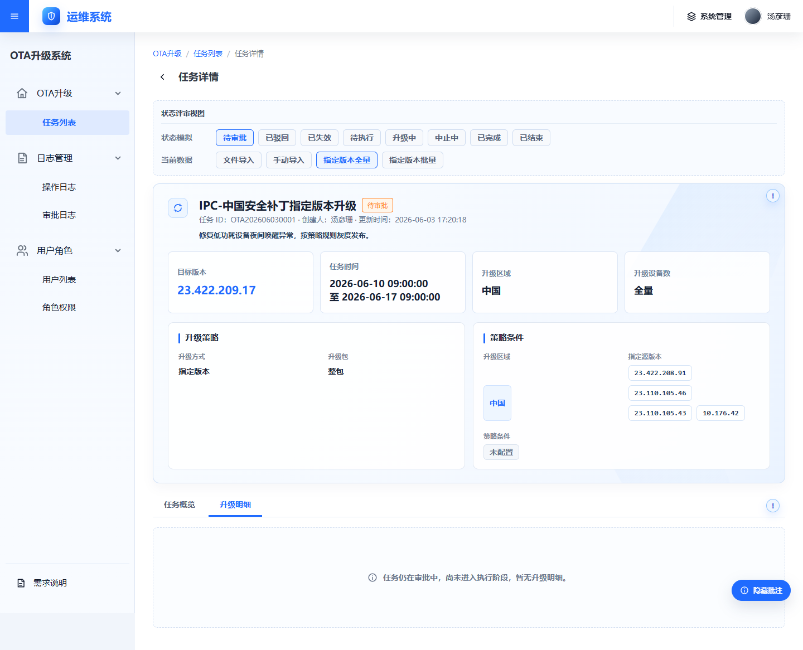 | 9 查看任务详情与升级明细 | **升级明细** 页签、分区 tab、当前分区概览、异常分类、设备列表、导出按钮；需体现“当前分区”口径。 |
| S09 | 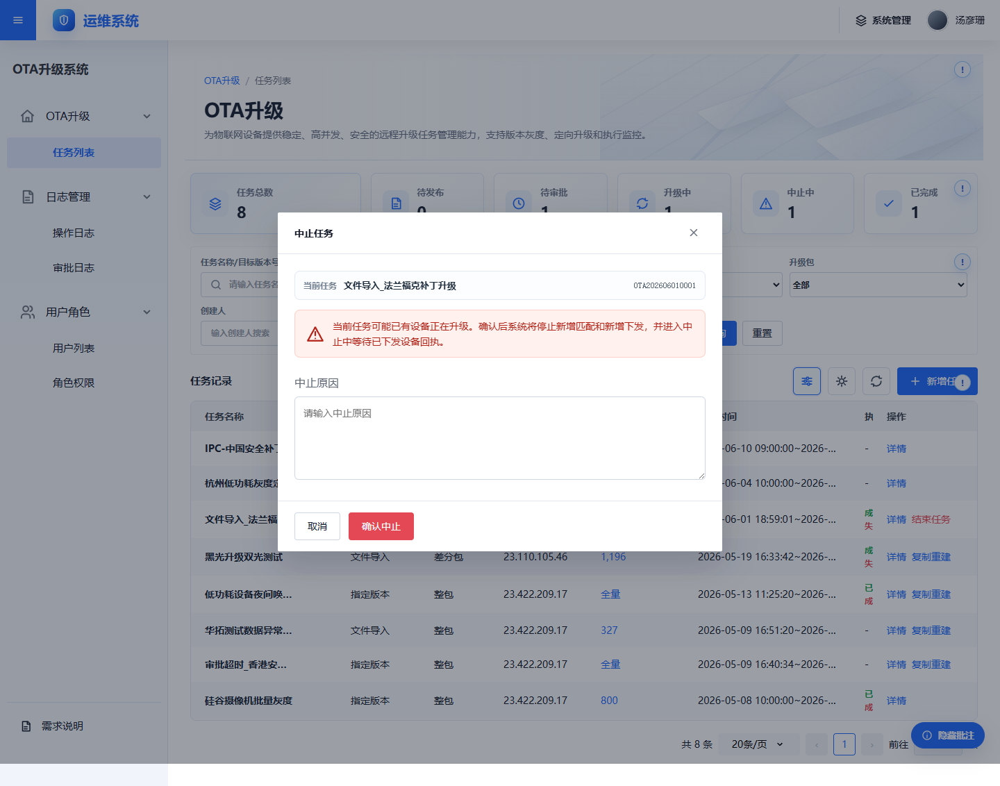 | 10 结束升级任务与中止中状态 | 结束任务确认弹窗、不可恢复提示、停止新增匹配/新增下发说明、确认和取消按钮。 |
| S10 | 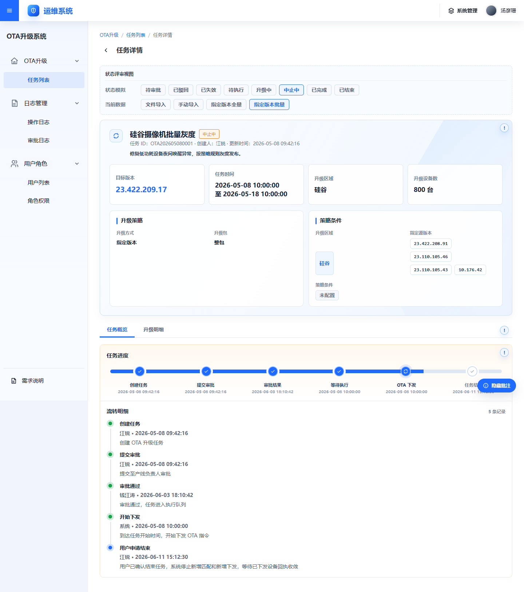 | 10 结束升级任务与中止中状态 | **中止中** 状态、结束任务按钮不再展示、等待设备回执或超时收敛提示、仍可查看升级明细。 |

### 2.3 新旧版本迭代对比图

本期迭代重点不是改变 OTA 升级目标，而是解决多大区场景下任务创建、分发、复盘和结束状态口径不一致的问题。下图按“旧版表现 > 暴露问题 > 本期短期迭代功能 > 解决效果”展示整体变化。

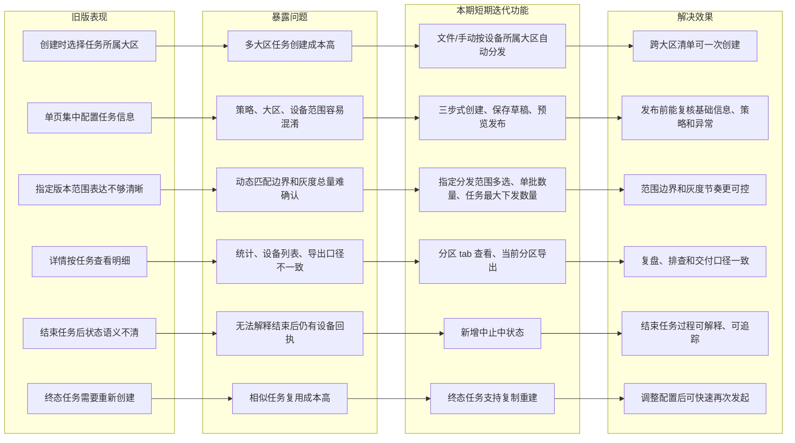

**看图结论**：

* 旧版的关键动作是“先选任务所属大区，再配置任务”；新版的关键动作是“先配置任务，再由升级方式决定分发口径”。
* 指定版本仍需要人工选择指定分发范围，因为它是动态匹配任务；文件导入和手动导入不再人工选择大区，由系统按设备所属大区自动分发。
* 本期短期迭代补齐了三步式创建、草稿、预览发布、审批流转、分区明细、当前分区导出、中止中和复制重建等上线闭环能力。

### 2.4 旧版问题与本期短期迭代功能

| **场景** | **旧版问题** | **本期短期迭代功能** | **解决效果** |
| --- | --- | --- | --- |
| 创建体验 | 创建页信息集中，基础信息、升级方式、大区和设备范围容易混在一起。 | 新增 **基本任务 > 策略配置 > 预览发布** 三步式创建，并支持保存草稿。 | 创建路径更清楚，未完成任务可回到保存步骤继续编辑，减少漏填和误选。 |
| 多大区分发 | 文件导入和手动导入也要人工考虑大区，跨大区设备清单容易被拆成多次任务。 | 文件导入和手动导入创建时不选择大区，系统按设备 ID 识别设备所属大区并自动拆分执行。 | 跨大区设备清单可一次导入，用户只需关注设备清单、可升级数和异常原因。 |
| 指定版本范围 | 指定版本属于动态匹配任务，旧版范围边界容易和任务所属大区混淆。 | 指定版本必须选择指定分发范围，支持父级大区、中国子节点和多选范围。 | 动态匹配设备前先明确执行范围，审批和测试能看清本次覆盖边界。 |
| 灰度数量控制 | 批量下发节奏和任务总量容易按大区重复理解，存在实际下发量被放大的风险。 | 批量模式区分 **单批下发数量** 和 **任务最大下发数量**，且两个数量均对整个任务生效。 | 灰度节奏和总量上限更可控，避免按分发范围分别乘算。 |
| 发布前确认 | 任务提交前对影响范围、异常设备、策略条件和发布动作的确认不够集中。 | 预览发布统一展示基本信息、策略信息、设备规模、异常明细和提交审批/确认发布按钮。 | 发布前能一次复核关键风险，减少审批后才发现范围或异常不一致。 |
| 审批流转 | 审批节点和审批结果在操作说明中不够明确，测试和运维不容易判断任务下一步状态。 | 指定版本、文件导入提交审批；手动导入确认发布；详情页展示审批/执行流转记录。 | 发布动作与状态流转一致，审批过程可追踪。 |
| 详情复盘 | 详情页容易跨分区混看，统计、异常分类、设备列表和导出口径不一致。 | 升级明细按分区 tab 查看；指定版本按分发范围，文件/手动按设备所属大区。 | 当前分区的概览、异常、设备列表和导出保持同一口径，便于排查和交付。 |
| 明细导出 | 导出范围不明确，容易误以为导出的是全部分区设备明细。 | 导出当前选中分区内的设备明细，不提供跨分区统一设备明细入口。 | 页面看到什么就导出什么，避免全量口径和当前 tab 口径混用。 |
| 结束任务 | 结束任务后是否立即终止、是否仍等待设备回执的语义不清。 | 仅升级中任务可结束，确认后进入 **中止中**，等待已下发设备回执或超时收敛后进入 **已结束**。 | 结束任务过程可解释，避免把已下发设备回执误判为系统未结束任务。 |
| 任务复用 | 已完成、已结束、已驳回、已失效等终态任务需要重新创建，重复配置成本高。 | 终态任务支持复制重建。 | 调整配置后可快速再次发起，适合问题修复、灰度复测和批量推广。 |

#### 新版升级方式选择速查

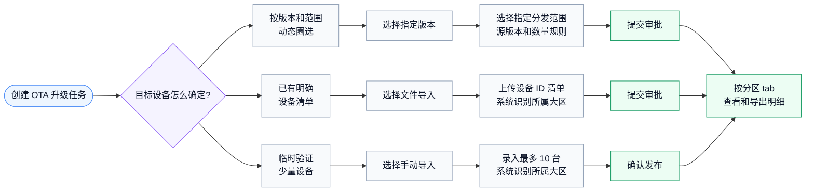

**一句话理解**：本期短期迭代把“人工按大区创建和复盘”调整为“按升级方式决定分发口径”，同时补齐草稿、审批、预览、分区明细、当前分区导出、中止中和复制重建等上线所需的闭环能力。

### 2.5 操作路径与重点关注

> **重点关注：新增任务必须走完整三步。**
>
> 新增任务的正式发布入口在 **预览发布** 步骤。只填写基本任务或策略配置后保存草稿时，任务只进入 **待发布**，不会进入审批、待执行或升级中。

> **重点关注：大区口径不要混用。**
>
> **指定版本** 需要人工选择 **指定分发范围**；**文件导入** 和 **手动导入** 创建时不选择大区，系统按设备 ID 识别设备所属大区并自动分发。设备所属大区只用于自动分发和详情复盘，不作为创建时的人工选择项。

> **重点关注：发布按钮决定后续流转。**
>
> **指定版本** 和 **文件导入** 在预览页单击 **提交审批**，审批通过后才会进入待执行或升级中；**手动导入** 在预览页单击 **确认发布**，无需审批，发布后根据任务时间进入待执行或升级中。

> **重点关注：明细和导出都按当前分区。**
>
> 升级明细不提供跨分区统一设备明细入口。页面当前选中哪个分区 tab，就查看和导出哪个分区的数据。

> **重点关注：结束任务不是立即把所有设备置为失败。**
>
> 仅 **升级中** 任务可结束；确认结束后任务先进入 **中止中**，系统停止新增匹配和新增下发，已下发设备继续回传最终结果，收敛后进入 **已结束**。

---

## 3 名词解释

| **名词** | **解释** |
| --- | --- |
| OTA 升级 | Over-The-Air 升级，即通过网络对设备进行远程固件更新。 |
| 升级任务 | 一次针对特定设备集合或动态匹配范围的固件升级操作。 |
| 基本任务 | 新增任务第一步，用于填写任务名称、目标固件版本、升级包、任务时间和升级说明。 |
| 策略配置 | 新增任务第二步，用于选择升级方式并配置对应的分发范围、设备清单或设备 ID。 |
| 预览发布 | 新增任务第三步，用于确认任务摘要、设备规模、异常明细和发布动作。 |
| 指定版本升级 | 根据指定分发范围、源版本和策略条件动态匹配设备的升级方式。 |
| 文件导入升级 | 通过上传设备清单确定目标设备的升级方式，适合已有明确设备列表的场景。 |
| 手动导入升级 | 通过手动录入设备 ID 确定目标设备的升级方式，单次最多 10 台。 |
| 源版本 | 设备升级前命中的当前固件版本，用于判断哪些设备可以升级到目标版本。 |
| 全量 | 指定版本升级的数量模式，表示系统在任务窗口内持续匹配符合范围、版本和策略条件的设备。 |
| 批量 | 指定版本升级的数量模式，表示按单批下发数量控制灰度节奏，可配合任务最大下发数量限制总量。 |
| 单批下发数量 | 批量模式下每轮最多下发的设备数量，对整个任务生效，不按分发范围分别计算。 |
| 任务最大下发数量 | 本任务累计最多下发的设备数量，达到后停止继续匹配新设备；不填写表示不限制。 |
| 指定分发范围 | 指定版本升级中由用户选择的执行范围，支持父级大区、中国子节点和多选范围。 |
| 设备所属大区 | 设备归属的执行大区，用于文件/手动任务自动分发和详情复盘展示。 |
| 策略条件 | 可选的业务匹配条件，例如设备标签、型号、渠道、客户、地区、设备分组等。 |
| 中止中 | 用户确认结束升级中任务后，系统停止新增匹配和新增下发，并等待已下发设备回执的过渡状态。 |
| 复制重建 | 基于终态任务复制配置重新创建任务，用于调整配置后再次发起升级。 |

---

## 4 前提条件

在使用本期优化后的 OTA 升级任务前，请确认以下条件已满足：

:::
您已拥有运维3.0平台账号，并具备 OTA 升级管理的操作权限。

已上传并发布至少一个可用于升级的目标固件版本。

如需使用差分升级，请确认设备所属产线支持差分升级，目标版本和基线版本已生成可用差分包。

已有注册设备，且设备支持 OTA 远程升级。

如需创建文件导入或手动导入任务，请提前准备设备 ID 清单，并确认设备 ID 格式正确。

如需创建指定版本任务，请提前确认升级覆盖范围、源版本和目标版本。
:::

---

## 5 查看升级任务列表

任务列表页是 OTA 升级任务的主入口，用于查看、筛选和管理所有已创建任务。

### 操作步骤

1. 登录运维3.0平台。

2. 在左侧导航栏中，选择 **OTA 升级** > **任务列表**。

3. 系统加载并展示全部升级任务。

4. 可通过任务名称、目标版本、升级方式、任务状态等条件定位目标任务。

### 页面字段说明

| **字段** | **说明** |
| --- | --- |
| 名称 | 展示任务名称、任务 ID 和必要状态标签。 |
| 升级方式 | 展示指定版本、文件导入或手动导入。 |
| 目标版本 | 展示本次任务升级到的固件版本。 |
| 升级包 | 展示整包或差分包。 |
| 升级规模 | 指定版本全量展示“全量”；批量、文件导入、手动导入展示设备数量。 |
| 任务时间 | 展示计划开始时间和结束时间。 |
| 状态 | 展示待发布、待审批、待执行、升级中、中止中、已完成、已结束、已驳回、已失效等状态。 |
| 创建人 | 展示任务创建人。 |
| 创建时间 | 展示任务创建时间。 |
| 操作 | 根据状态展示编辑、删除、详情、结束任务、复制重建等操作。 |

### 搜索与筛选

* **任务搜索**：输入任务名称或目标版本号，按回车或单击查询后筛选任务。
* **状态筛选**：选择任务状态后筛选对应状态任务。
* **升级方式筛选**：选择指定版本、文件导入或手动导入后筛选任务。
* **列设置**：可按页面支持范围调整列表展示字段。
* **分页查看**：任务较多时，通过分页控件查看后续任务。

### 快捷操作

| **任务状态** | **可操作项** | **说明** |
| --- | --- | --- |
| 待发布 | 编辑、删除、继续配置 / 提交发布 | 待发布为草稿态，可继续完善配置；提交发布前仍需通过页面校验。 |
| 待审批 | 详情 | 任务已提交审批，原配置不可编辑。 |
| 待执行 | 详情 | 任务已发布，等待计划开始时间。 |
| 升级中 | 详情、结束任务 | 任务正在匹配、下发或等待设备回执。 |
| 中止中 | 详情 | 系统正在收敛已下发设备的最终结果。 |
| 已完成 | 详情、复制重建 | 系统正常完成后的终态。 |
| 已结束 | 详情、复制重建 | 用户提前终止并完成收敛后的终态。 |
| 已驳回 | 详情、复制重建 | 审批未通过，原任务不可继续提交。 |
| 已失效 | 详情、复制重建 | 任务未进入可执行链路且时间窗口已不可用。 |

> **重点关注：列表里的待发布不是已发布。**
>
> 待发布任务仍是草稿态，可以编辑或删除。只有补齐配置并在预览发布页完成 **提交审批** 或 **确认发布** 后，任务才进入待审批、待执行或升级中。

---

## 6 新增升级任务

本期新增任务统一采用三步流程：**基本任务** > **策略配置** > **预览发布**。

#### 流程图（Mermaid）：新增任务三步创建与发布

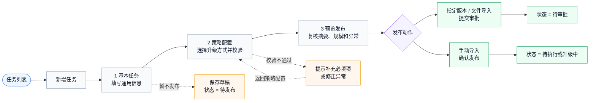

### 6.1 基本流程

```text
进入任务列表
  └─ 单击「新增任务」
      └─ 第一步：填写基本任务
          └─ 第二步：配置升级策略
              └─ 第三步：预览发布
                  ├─ 指定版本 / 文件导入：提交审批
                  └─ 手动导入：确认发布
```

> **重点关注：保存草稿和正式发布不是同一件事。**
>
> 单击 **保存草稿** 后，任务状态为 **待发布**，只表示配置被暂存。需要执行任务时，必须继续编辑待发布任务，补齐校验项并进入 **预览发布**，再按升级方式单击 **提交审批** 或 **确认发布**。

### 6.2 第一步：基本任务

基本任务用于填写所有升级方式共用的信息。

#### 页面截图：新增任务-基本任务（S02）


截图需确认页面中没有大区选择控件。

#### 操作步骤

1. 在任务列表页，单击 **新增任务**。

2. 在 **基本任务** 步骤填写任务名称、目标固件版本、升级包、任务时间和任务升级说明。

3. 确认信息无误后，单击 **下一步** 进入策略配置。

4. 如需暂不发布，可单击 **保存草稿**。

#### 页面字段说明

| **字段** | **是否必填** | **规则** | **说明** |
| --- | --- | --- | --- |
| 任务名称 | 是 | 1-64 个字符，不允许只输入空格 | 用于在列表和详情中识别任务。 |
| 目标固件版本 | 是 | 只能选择已上架或已生成升级包版本 | 设备将升级到该目标版本。 |
| 升级包 | 是 | 整包 / 差分包 | 差分包需满足对应产线和基线版本要求。 |
| 任务时间 | 是 | 开始时间不得早于当前时间，结束时间必须晚于开始时间 | 决定任务可执行窗口。 |
| 任务升级说明 | 是 | 1-500 个有效字符 | 用于说明升级目的、影响范围和注意事项。 |

**注意**：基本任务步骤不提供大区选择控件。

> **重点关注：这里不再选择任务所属大区。**
>
> 如果创建的是文件导入或手动导入任务，请不要在基本任务步骤寻找大区字段；系统会在策略配置校验设备 ID 后识别设备所属大区。若创建的是指定版本任务，请在第二步 **策略配置** 中选择 **指定分发范围**。

### 6.3 第二步：策略配置

策略配置用于选择升级方式，并填写对应的策略字段。

| **升级方式** | **创建规则** | **主要配置项** | **发布流转** |
| --- | --- | --- | --- |
| 指定版本 | 必须选择指定分发范围 | 指定分发范围、源版本、全量/批量、单批下发数量、任务最大下发数量 | 提交审批 |
| 文件导入 | 创建时不选择大区 | 设备清单文件、导入总数、可升级数、异常数 | 提交审批 |
| 手动导入 | 创建时不选择大区 | 设备 ID、源版本、设备所属大区、校验状态 | 确认发布 |

所有升级方式均可配置可选策略条件。策略条件默认关闭，未配置时不影响进入预览发布。开启策略条件后，可配置设备标签、设备型号、渠道、客户、地区、设备分组等业务条件；条件项仅用于业务匹配，不作为设备所属大区的发布拦截。预览发布和详情页需展示已配置条件，未配置时展示“未配置”或不展示条件明细。

> **重点关注：策略条件是在已选范围内进一步匹配。**
>
> 策略条件不会替代指定分发范围，也不会替代文件/手动导入的设备清单。即使策略条件中选择了地区，也不等同于“任务所属大区”校验，不应产生“设备不属于当前大区”的创建拦截。

### 6.4 第三步：预览发布

预览发布用于在正式提交前确认任务配置和设备可升级性。

#### 页面截图：预览发布（S06）


截图需确认发布按钮随升级方式变化：指定版本和文件导入为 **提交审批**，手动导入为 **确认发布**。

| **内容** | **展示说明** |
| --- | --- |
| 基本信息摘要 | 展示任务名称、目标版本、升级包、任务时间、升级说明。 |
| 策略摘要 | 展示升级方式、指定分发范围或自动按设备所属大区分发说明。 |
| 设备规模 | 指定版本展示全量或批量数量；文件/手动展示清单总数、可升级数、异常数。 |
| 异常明细 | 展示已是目标版本、差分包不可用、版本不匹配、设备不存在、设备离线等原因。 |
| 发布动作 | 指定版本和文件导入展示提交审批；手动导入展示确认发布。 |

> **重点关注：预览发布是最后一次上线前复核。**
>
> 发布前必须确认任务时间、升级包、指定分发范围或自动分发说明、可升级设备数、异常原因和策略条件。异常设备不会进入可升级设备数；如可升级设备数为 0，不应继续提交发布。

### 6.5 草稿规则

* 基本任务或策略配置过程中均可保存草稿。
* 草稿进入列表后状态为 **待发布**。
* 待发布任务支持编辑和删除。
* 再次编辑草稿时，系统回到保存时所在步骤。
* 切换升级方式时，仅保留基本任务信息，原升级方式下的私有配置需重新填写。

---

## 7 三种升级方式操作说明

### 7.1 指定版本升级

指定版本适用于根据分发范围、源版本和策略条件动态匹配设备的升级任务。

#### 流程图（Mermaid）：指定版本升级流程

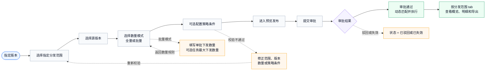

#### 页面截图：指定版本策略配置（S03）


#### 操作步骤

1. 在 **策略配置** 步骤选择 **指定版本**。

2. 选择一个或多个 **指定分发范围**。

3. 选择一个或多个源版本。

4. 选择数量模式：
   * **全量**：系统在任务窗口内持续匹配符合条件的设备。
   * **批量**：需填写单批下发数量，可选择填写任务最大下发数量。

5. 如需细化设备范围，可开启策略条件并配置条件项。

6. 单击 **下一步** 进入预览发布。

7. 确认任务摘要、范围和数量规则后，单击 **提交审批**。

#### 指定分发范围规则

| **范围类型** | **说明** |
| --- | --- |
| 父级大区 | 可选择中国、香港、法兰福克、硅谷等范围。 |
| 中国子节点 | 中国支持展开选择杭州、杭州低功耗、深圳、成都、上海（宠物）等子节点。 |
| 多选范围 | 支持同时选择多个父级大区或多个中国子节点。 |
| 父级覆盖 | 选择“中国”父级表示覆盖全部中国子节点。 |
| 部分选择 | 只选择部分中国子节点时，中国父级展示半选态。 |

> **重点关注：指定版本的范围必须先明确。**
>
> 指定版本是动态匹配任务，系统会在选定的指定分发范围内按源版本、目标版本和策略条件匹配设备。未选择指定分发范围，或误把策略条件中的地区当成分发范围，都会导致审批和执行口径不清。

#### 数量规则

| **字段** | **说明** | **默认值** |
| --- | --- | --- |
| 单批下发数量 | 每轮最多下发多少台，用于控制灰度节奏。 | 批量模式必填，需大于 0。 |
| 任务最大下发数量 | 本任务累计最多下发多少台，达到后停止继续匹配新设备。 | 不限制。 |

**注意**：

* 单批下发数量对整个任务生效，不按分发范围分别计算。
* 任务最大下发数量对整个任务生效，不按分发范围分别计算。
* 多个分发范围的实际消耗数量由设备满足条件和系统匹配顺序决定。
* 达到任务最大下发数量后，系统停止匹配新设备；已下发设备全部有最终结果后，任务可提前完成。

### 7.2 文件导入升级

文件导入适用于运营或测试人员已有明确设备清单的升级场景。

#### 流程图（Mermaid）：文件导入升级流程

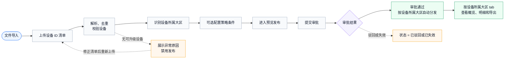

#### 页面截图：文件导入策略配置（S04）


#### 操作步骤

1. 在 **策略配置** 步骤选择 **文件导入**。

2. 上传包含设备 ID 的设备清单文件。

3. 等待系统解析、去重和校验设备。

4. 查看导入总数、可升级数、异常数和异常原因。

5. 如需细化设备范围，可配置可选策略条件。

6. 单击 **下一步** 进入预览发布。

7. 确认可升级设备不为 0 后，单击 **提交审批**。

#### 文件导入规则

| **规则** | **说明** |
| --- | --- |
| 大区选择 | 创建时不选择大区。 |
| 设备归属 | 系统根据设备 ID 识别设备所属大区。 |
| 自动分发 | 发布后按设备所属大区自动拆分并分发。 |
| 发布条件 | 必须上传设备清单，且存在可升级设备。 |
| 异常处理 | 异常设备展示原因，不纳入可升级设备数。 |

> **重点关注：文件导入看的是设备清单，不看人工选择的大区。**
>
> 上传文件后，系统会解析、去重、校验并识别每台设备的所属大区。若出现不可升级设备，应先处理文件格式、设备不存在、已是目标版本、差分包不可用或机型不兼容等原因，而不是切换大区重新创建。

#### 文件格式与校验规则

| **项目** | **规则** | **常见提示** |
| --- | --- | --- |
| 文件类型 | 支持页面模板规定的 CSV 或 Excel 文件。 | 请按页面模板准备设备清单。 |
| 设备 ID | 建议一行一个设备 ID；设备 ID 长度 1-64 个字符，仅支持字母、数字、中划线和下划线。 | 设备标识格式错误。 |
| 重复设备 | 系统自动去重，并展示去重后的设备数量。 | 已自动去重。 |
| 设备存在性 | 设备必须在平台中存在。 | 设备不存在。 |
| 目标版本 | 已是目标版本的设备不纳入可升级设备数。 | 已是目标版本。 |
| 差分包 | 差分升级时，设备当前版本必须存在匹配差分基线。 | 无可用差分包。 |
| 机型兼容 | 设备机型或硬件需与目标固件兼容。 | 机型不匹配或不满足升级条件。 |

**注意**：设备所属大区用于自动分发和详情复盘展示，不需要用户在创建任务时手动选择。

### 7.3 手动导入升级

手动导入适用于小规模、临时性、精确指定设备的升级场景。

#### 流程图（Mermaid）：手动导入升级流程

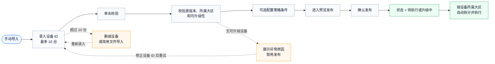

#### 页面截图：手动导入策略配置（S05）


#### 操作步骤

1. 在 **策略配置** 步骤选择 **手动导入**。

2. 在设备 ID 输入区域逐行输入或粘贴设备 ID。

3. 单击 **校验**，等待系统校验设备。

4. 查看设备源版本、设备所属大区、校验状态和异常原因。

5. 确认至少存在 1 台可升级设备。

6. 单击 **下一步** 进入预览发布。

7. 确认信息无误后，单击 **确认发布**。

#### 手动导入规则

| **规则** | **说明** |
| --- | --- |
| 大区选择 | 创建时不选择大区。 |
| 设备数量 | 单次最多录入 10 台设备。 |
| 设备重复 | 设备 ID 不允许重复。 |
| 审批规则 | 无需审批，确认发布后按任务时间进入待执行或升级中。 |
| 自动分发 | 发布后按设备所属大区自动拆分并执行。 |

> **重点关注：手动导入只适合小范围验证。**
>
> 手动导入最多 10 台设备，适用于临时验证或小批量定向升级。超过 10 台或需要批量导入时，应改用文件导入；手动导入确认发布后不走审批，请在预览页确认设备 ID、可升级数和异常原因无误。

#### 手动校验规则

| **校验项** | **规则** | **常见提示** |
| --- | --- | --- |
| 设备数量 | 单次至少 1 台，最多 10 台。 | 手动导入最多支持 10 台设备。 |
| 设备 ID | 长度 1-64 个字符，仅支持字母、数字、中划线和下划线。 | 设备标识格式错误。 |
| 重复设备 | 同一任务内不允许重复录入。 | 设备 ID 重复。 |
| 可升级性 | 设备需存在、未处于目标版本、机型兼容、差分包匹配。 | 按具体原因展示。 |

**注意**：手动导入适合小范围验证。若设备数量较多，请使用文件导入。

---

## 8 任务配置预览与发布

### 8.1 预览内容

预览发布页展示任务提交前的最终确认信息。

| **区域** | **说明** |
| --- | --- |
| 基本信息 | 任务名称、目标版本、升级包、任务时间、升级说明。 |
| 策略信息 | 升级方式、指定分发范围或自动分发说明、源版本、数量规则、策略条件。 |
| 设备规模 | 可升级设备数、异常设备数、全量或批量配置。 |
| 异常明细 | 展示不可升级设备及原因。 |
| 发布按钮 | 根据升级方式展示提交审批或确认发布。 |

### 8.2 发布动作

| **升级方式** | **发布动作** | **发布后状态** |
| --- | --- | --- |
| 指定版本 | 提交审批 | 待审批 |
| 文件导入 | 提交审批 | 待审批 |
| 手动导入 | 确认发布 | 待执行或升级中 |

> **重点关注：发布后状态由升级方式和任务时间共同决定。**
>
> 指定版本和文件导入必须先进入 **待审批**，审批通过后再按任务时间进入 **待执行** 或 **升级中**。手动导入无需审批，确认发布后直接按任务时间进入 **待执行** 或 **升级中**；如果确认发布或审批通过时尚未到开始时间，则先进入 **待执行**。

### 8.3 发布前检查

发布前请确认：

* 任务名称、目标版本、升级包、任务时间、升级说明已填写。
* 指定版本已选择至少一个指定分发范围和至少一个源版本。
* 指定版本批量模式下，单批下发数量大于 0。
* 若填写任务最大下发数量，该数量大于等于单批下发数量。
* 文件导入已上传设备清单，并存在可升级设备。
* 手动导入至少存在 1 台可升级设备，且不超过 10 台。
* 预览页异常原因已确认，异常设备不会进入可升级设备数。

---

## 9 查看任务详情与升级明细

任务详情页用于查看任务配置、审批流转、执行状态、升级明细和设备列表。

#### 流程图（Mermaid）：详情页分区明细查看流程

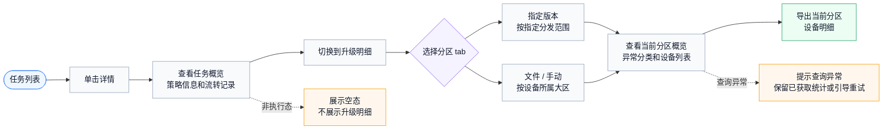

#### 页面截图：任务详情概览（S07）


#### 页面截图：升级明细分区视图（S08）


### 操作步骤

1. 在任务列表中找到目标任务。

2. 单击 **详情** 进入任务详情页。

3. 在 **任务概览** 中查看任务状态、任务时间、升级方式、策略信息和流转记录。

4. 切换至 **升级明细** 页签。

5. 根据升级方式选择对应分区 tab，查看当前分区的概览、异常分类、设备列表和导出结果。

### 详情页展示规则

| **升级方式** | **详情展示规则** |
| --- | --- |
| 指定版本 | 展示指定分发范围，并按分发范围或子节点拆分执行情况。 |
| 文件导入 | 展示自动按设备所属大区分发，并展示设备所属大区分布。 |
| 手动导入 | 展示自动按设备所属大区分发，并展示设备所属大区分布。 |

### 升级明细查看规则

| **内容** | **说明** |
| --- | --- |
| 分区 tab | 指定版本按指定分发范围展示；文件/手动按设备所属大区展示。 |
| 概览统计 | 展示当前选中分区的已匹配、已下发、成功、失败、升级中、成功率等数据。 |
| 异常分类 | 仅统计当前选中分区内的异常。 |
| 设备列表 | 仅展示当前选中分区内的设备。 |
| 导出 | 导出当前选中分区内的设备明细。 |

> **重点关注：不要把当前分区导出理解为全量导出。**
>
> 由于当前执行链路按分区返回设备明细，详情页不提供跨分区的统一设备明细入口。查看问题设备时，请先选择对应分区；导出文件只包含当前选中分区内的设备明细。

### 设备明细字段要求

| **字段** | **说明** |
| --- | --- |
| 设备 ID | 当前分区内的设备标识。 |
| 源版本 | 设备命中的升级前版本；文件/手动以校验或执行时读取结果为准。 |
| 目标版本 | 本次任务配置的目标固件版本。 |
| 设备所属大区 | 文件/手动任务的自动分发和复盘口径；指定版本展示当前分发范围对应大区。 |
| 实际下发大区 | 设备实际进入执行链路的大区或分区。 |
| 下发状态 | 待下发、已下发、未下发或对应页面状态。 |
| 升级状态 | 待升级、升级中、升级成功、升级失败、失败/中止等。 |
| 失败原因 | 升级失败或校验异常时展示具体原因。 |
| 最近上报时间 | 设备最近一次进度或结果上报时间。 |

### 刷新与查询异常

* 升级中和中止中任务应支持刷新进度统计和设备明细，具体刷新频率以页面实现为准。
* 边缘明细查询失败时，应展示查询异常或重试提示；查询异常不计入升级失败设备数。
* 导出结果与当前选中分区一致，不导出跨分区全量设备明细。

### 非执行态空态

| **任务状态** | **升级明细展示** |
| --- | --- |
| 待审批 | 展示待审批空态，不展示升级概览、异常分类和设备列表。 |
| 已驳回 | 展示已驳回空态，不展示升级概览、异常分类和设备列表。 |
| 已失效 | 展示已失效空态，不展示升级概览、异常分类和设备列表。 |
| 待执行 | 展示待执行空态，不展示升级概览、异常分类和设备列表。 |

---

## 10 结束升级任务与中止中状态

当升级中任务发现风险或需要提前停止继续下发时，可执行结束任务操作。

#### 页面截图：结束任务确认弹窗（S09）


#### 页面截图：中止中状态（S10）


### 操作权限

| **当前任务状态** | **是否展示结束任务** | **说明** |
| --- | --- | --- |
| 待发布 | 否 | 草稿可编辑或删除。 |
| 待审批 | 否 | 任务尚未允许执行。 |
| 待执行 | 否 | 尚未形成执行链路和设备下发记录。 |
| 升级中 | 是 | 可结束任务。 |
| 中止中 | 否 | 已进入收敛过程，避免重复操作。 |
| 已完成 | 否 | 终态，可复制重建。 |
| 已结束 | 否 | 终态，可复制重建。 |
| 已驳回 | 否 | 终态，可复制重建。 |
| 已失效 | 否 | 终态，可复制重建。 |

### 操作步骤

1. 在任务列表中找到状态为 **升级中** 的任务，单击 **详情**。

2. 在任务详情页单击 **结束任务**。

3. 阅读确认弹窗中的风险提示。

4. 确认后，系统停止新增匹配和新增下发。

5. 任务状态进入 **中止中**。

6. 等待已下发设备产生最终回执，或等待系统按超时规则完成收敛。

7. 收敛完成后，任务进入 **已结束**。

### 中止中状态说明

| **项目** | **说明** |
| --- | --- |
| 状态含义 | 用户已确认结束任务，系统正在停止新增匹配和新增下发。 |
| 设备表现 | 已下发设备仍可能处于升级中，并继续回传最终结果。 |
| 页面操作 | 仅允许查看详情，不再展示结束任务按钮。 |
| 退出条件 | 已下发设备全部产生最终结果，或达到超时收敛条件。 |
| 下一状态 | 已结束。 |

> **重点关注：结束任务属于不可恢复操作。**
>
> 确认结束后，任务进入 **中止中**，系统只停止新增匹配和新增下发；已下发设备继续回传最终结果。若需要重新升级，请在任务进入终态后使用复制重建或重新创建任务。

**产品口径声明**：本指南统一采用“结束任务后进入中止中，停止新增匹配和新增下发，已下发设备继续回传最终结果”的上线口径。如后续产品确认改为“待升级/升级中设备直接置失败”的中止语义，需要同步更新本章节、状态流转图、FAQ、测试用例和页面提示，不能两种口径并存。

---

## 11 任务状态流转说明

#### 流程图（Mermaid）：任务状态主链路

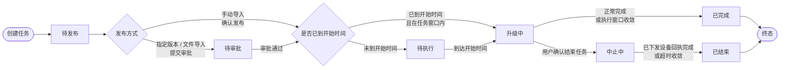

上图只展示正常发布、执行、主动结束的主链路。删除草稿、审批驳回、任务失效等例外流转见下表。

| **例外场景** | **触发条件** | **流转结果** |
| --- | --- | --- |
| 删除草稿 | 待发布任务被删除。 | 任务不再保留，不进入后续流转。 |
| 审批驳回 | 指定版本或文件导入提交审批后被驳回。 | 待审批 > 已驳回。 |
| 审批超时或窗口已过 | 审批未完成或审批通过时任务结束时间已过。 | 待审批 > 已失效。 |
| 待执行未启动即过期 | 任务未到开始时间前已发布，但结束时间已过且未启动执行。 | 待执行 > 已失效。 |
| 终态复用 | 已完成、已结束、已驳回、已失效任务需要再次发起。 | 不修改原任务，使用复制重建或重新创建任务。 |

### 状态说明

| **状态** | **业务含义** | **可操作项** |
| --- | --- | --- |
| 待发布 | 草稿态，任务未正式提交。 | 编辑、删除、继续配置 / 提交发布。 |
| 待审批 | 指定版本或文件导入已提交审批，尚未允许执行。 | 详情。 |
| 待执行 | 已发布，等待计划开始时间。 | 详情。 |
| 升级中 | 任务正在匹配、下发或等待设备回执。 | 详情、结束任务。 |
| 中止中 | 用户已确认结束任务，系统正在停止新增匹配和新增下发。 | 详情。 |
| 已完成 | 系统正常结束，任务不可再执行。 | 详情、复制重建。 |
| 已结束 | 用户提前终止并完成收敛后的终态。 | 详情、复制重建。 |
| 已驳回 | 审批未通过，任务不执行。 | 详情、复制重建。 |
| 已失效 | 任务未进入可执行链路且窗口已不可用。 | 详情、复制重建。 |

### 状态流转规则

* 待发布是唯一可编辑原任务配置的状态。
* 指定版本和文件导入提交后进入待审批。
* 手动导入无需审批，确认发布后按任务时间进入待执行或升级中。
* 审批通过时，若未到开始时间则进入待执行；若已处于任务时间窗口内则进入升级中；若结束时间已过则进入已失效。
* 升级中任务正常结束后进入已完成。
* 升级中任务由用户主动结束后先进入中止中，收敛完成后进入已结束。
* 已完成、已结束、已驳回、已失效均为终态，只允许查看详情和复制重建。

---

## 12 常见问题（Q&A）

**Q1：为什么文件导入和手动导入创建时不需要选择大区？**

文件导入和手动导入都基于明确设备 ID。系统会根据设备 ID 识别设备所属大区，并在发布后自动拆分到对应大区执行。用户只需要确认设备清单、可升级数和异常原因。

**Q2：为什么指定版本仍然需要选择指定分发范围？**

指定版本是动态匹配任务，需要在创建时明确本次升级覆盖的范围。系统会在选定范围内按源版本、目标版本和策略条件匹配设备。

**Q3：指定版本可以同时选择多个范围吗？**

可以。指定版本支持选择多个父级大区，也支持展开中国后选择一个或多个中国子节点。多个范围共用同一个任务最大下发数量。

**Q4：批量模式下，单批下发数量和任务最大下发数量有什么区别？**

单批下发数量用于控制每轮最多下发多少台。任务最大下发数量用于控制本任务累计最多下发多少台。任务最大下发数量可以不填，不填表示不限制。

**Q5：为什么详情页没有跨分区的统一设备明细入口？**

当前升级明细按分区返回设备数据。为了避免统计和明细口径不一致，页面按当前选中的分发范围或设备所属大区展示概览、异常、设备列表和导出结果。

**Q6：为什么待执行状态看不到结束任务按钮？**

待执行状态下任务尚未形成执行链路，也没有新增匹配或下发记录，因此不提供结束操作。任务开始执行并进入升级中后，才可结束任务。

**Q7：结束任务后为什么会先进入中止中？**

结束任务后，系统会立即停止新增匹配和新增下发，但已经下发的设备仍可能继续回传升级结果。中止中用于等待这些设备产生最终结果或等待系统超时收敛。

**Q8：中止中可以再次单击结束任务吗？**

不可以。中止中表示系统已经接受结束操作并正在收敛，页面只允许查看详情，避免重复操作。

**Q9：审批被驳回后还能修改原任务重新提交吗？**

不能。已驳回是终态，原任务不可编辑或重新提交。如需再次升级，请使用复制重建或重新创建任务。

**Q10：已完成和已结束有什么区别？**

已完成表示任务按系统规则正常结束。已结束表示用户提前终止任务，并在中止中完成收敛后进入终态。两者都不可恢复，只能查看详情或复制重建。


**Q11：差分升级为什么没有可选版本或可升级设备？**

通常是当前产线不支持差分升级、目标版本没有生成成功的差分包、设备当前版本与差分包基线版本不匹配，或设备机型不满足升级条件。请先确认产线、目标版本、基线版本和差分包状态；不确定时建议改用整包升级。

**Q12：为什么异常原因里不再出现“设备不属于当前大区”？**

本期文件导入和手动导入创建时不再选择大区，系统会根据设备 ID 识别设备所属大区并自动分发。设备所属大区用于执行拆分和详情复盘，不作为创建时的区域拦截原因。

**Q13：明细查询失败是否代表设备升级失败？**

不是。明细查询失败表示当前分区的明细数据暂时无法获取，不等于设备升级失败。请刷新或稍后重试，设备失败数以升级状态和失败原因统计为准。

**Q14：流程图和页面截图有什么区别？**

流程图统一使用 Mermaid 图源码，说明业务流转和状态关系；页面截图用于展示真实页面控件、字段、按钮和弹窗。上线交付时两者都需要，不能用流程图替代页面截图。
